# 윈드서핑과 스쿠버다이빙하러 보라카이 나 홀로 여행

지난 겨울 필리핀 보라카이로 여행을 갔다.

나의 선호 여행지는 태국.

그런데 방콕행 비행기표는 땡처리로 나오는 표도 없이 비쌌다.

필리핀을 좋아하지 않는데, 그냥 비행기표가 제일 싼 보라카이로 했다.

보라카이 2번째 여행이다.

윈드서핑과 스쿠버다이빙만 하기로 했다.

혼자 가는 여행이라 숙박비가 아까웠다.

그래서 6인실 게스트하우스를 예약했다.

아침 7시50 세부퍼시픽 비행기라 3시반에 일어나 인천공항으로 향했다.

세부퍼시픽 항공은 아무리 저가항공사라지만 너무 서비스가 안 좋다.

내부 시설도 낡고, 물도 주지 않더군.

비행기 타면 승무원이 하는 것은 신라면 파는 것에만 열중이더군.

\- 11:00 경 목적지 칼리보공항 근처

보라카이 섬으로 들어가는 교통편을 서비스하는 South west를 이용하기로 하고, 출발전에 예약했다.

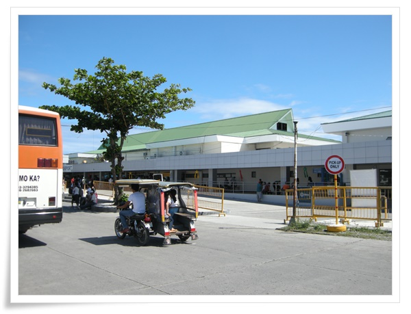

\- 갈리보공항

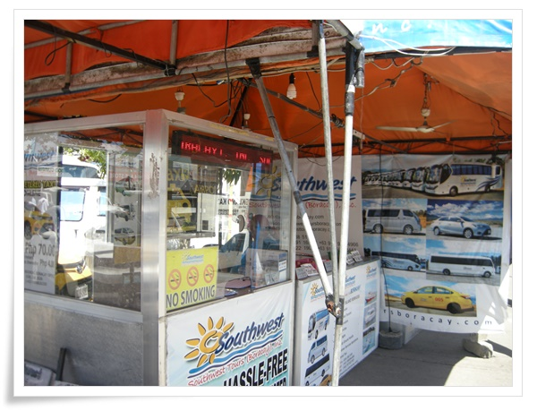

\- 칼리보공항을 나서니 이 southwest 마크가 보여 이쪽으로 가서 기다렸는데, 버스 타는 곳은 여기가 아니었다.

버스 타는 곳은 공항 출구 바로 앞이었다.

\- 15인승 미니버스를 타고 선착장으로 가는 중.

\- 중간에 휴게소도 들르는데, 여기도 southwest에서 운영하는 곳이더군.

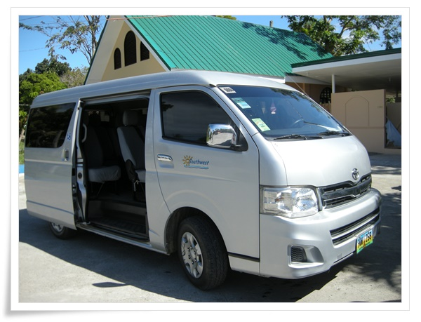

\- 내가 탄 15인승 승합차.  작은 차라 아무래도 불편했다.

아까 장소를 잘못 찾아 시간만 허비하지 않았어도 그래도 편안한 45인승 버스를 탈 수 있었는데 말이다.

\- 칼리보 선착장 도착.

southwest 직원이 군데군데 다 있었다.

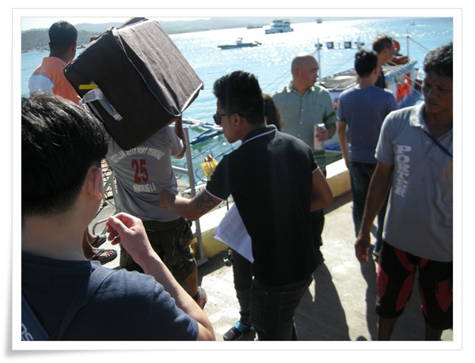

\- 배를 탈려고 한다.

저 짐을 실어주는 포터들은 짐 2개당 1달러를 받는다.

거부의사를 명확히 해야 한다.

그리고 이용할 경우 잔돈도 반드시 있어야 한다.

보라카이에서 나올 때 만난 한 가족은 1달러짜리가 없어 20달러를 줬다고 한다.

거슬러달라고 했는데도 거스름돈 없다는 거짓말로 당했다고 하더군.

\- 보라카이로 들어가는 southwest 전용 배.

뜨거운 날씨에, 에어콘 없이 선내, 그리고 구명조끼까지 입고 있으니 무척 더웠다.

\- 내가 탄 배와 같은 배.  Southwest가 꽤나 큰 회사인가 보다.

배, 버스도, 직원도 많고 말이다.

\- 보라카이 선착장 도착.

여기서 숙소로 가는 버스를 탄다.

여기도 역시 southwest 직원이 상주하면서 차 태운다.

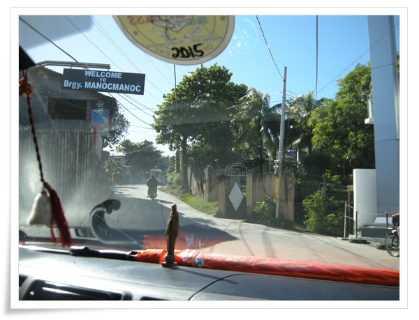

\- 미니버스 타고 숙소로 가는길.

내 숙소는 중심가에 있는 YB Hostel.

\- 중심가 도착.

\- 그리고 숙소 도착.  YB hostel.

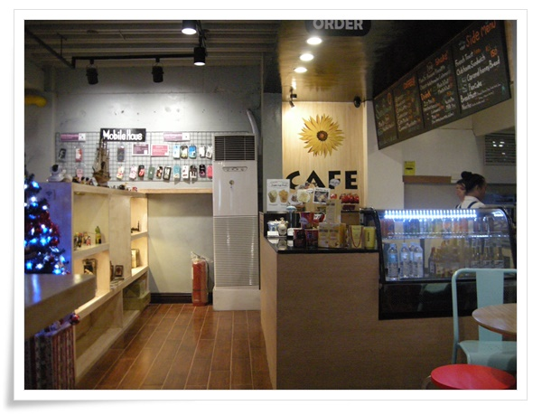

- 1층은 Sun flower 카페.

사장은 한국사람이라고 하며, 1층 WiFi가 제법 빠르다.

\- 새벽에 일어나, 아침, 점심도 안 먹은 터라 허기져, 식사부터 했다.

망고쉐이크와 프렌치토스트 200페소

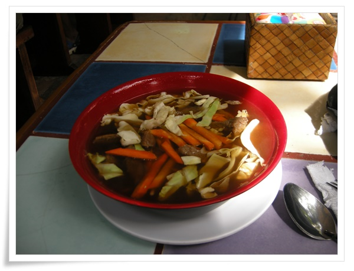

\- 시장의 smoke 식당에서 다음날 점심으로 먹은 소기면.

이 식당이 맛있다고 소개되어 있었는데, 맛있기는 개뿔.

정말 맛이 없었다.

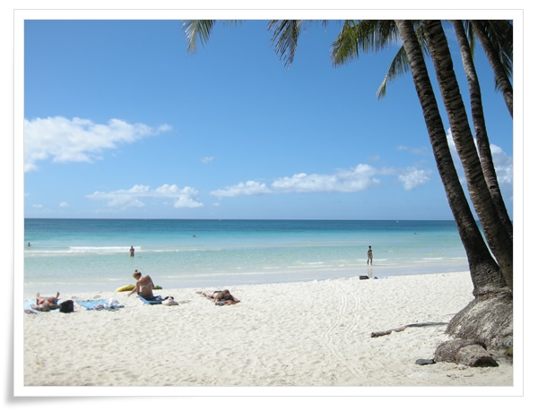

\- 보라카이 해별.

여행온 기분이 난다.

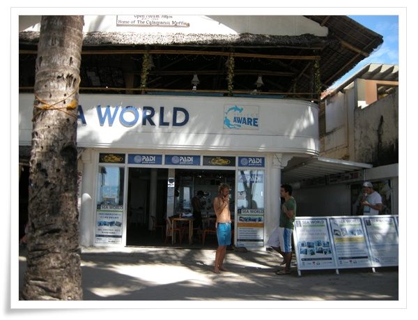

\- 이번 여행의 목적 중 하나인 스쿠버 다이빙을 하기 위해 예전 강습 받았던 Sea World로 찾아갔다.

기록을 보더니, 다이빙은 오랫동안 안했다고 리빌드 교육을 받아야 한다고 했다.

교육비는 18만원.

내용은 오전, 오후 각각 산소통 1통씩.

너무 비싸다.

\- 숙소로 들어가는 길에 망고스틴을 발견하고 1kg을 거금 450페소나 주고 샀는데, 상태는 영 불량했다.

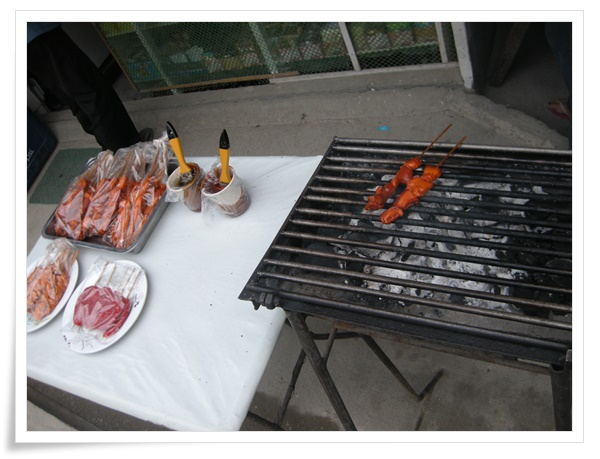

\- 길거나 가다가 돼지고기 꼬지 2개 사 먹었다.

각각 20페소.

꼬치는 맛있다.

역시 나는 그냥 길거리 음식 스타일이다.

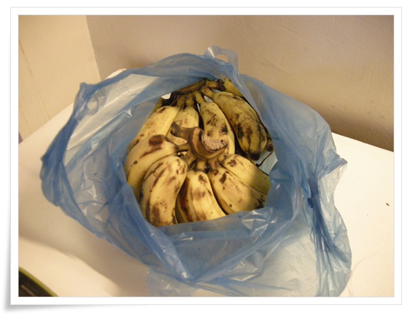

\- 싼 가격의 바나나를 샀는데, 이건 영 맛이 없었다.

\- 내 숙소.  6인실 도미토리.

첫날만 세명이서 쓰고, 그 다음부터는 나 혼자 썼다.

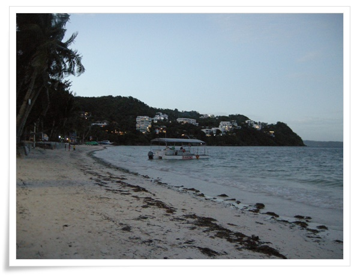

\- 밤에 할일이 없어 보라카이 탐사도 떠났다.

화이트비치 반대편 해변을 통해 쭉 걷기.

\- 원주민들이 사는 동네에서는 야밤에 농구 경기도 하더군.

다음 날부터 스쿠버 다이빙을 했다.

Fun diving 1회당 1800페소.  즉 5만원정도 하는 가격이다.

이틀동안 총 4회 펀다이빙했다.

다이빙은 역시 재미 있다.

물속에 들어가 무중력을 느끼며 유영하는 느낌이 정말 좋았다.

윈드서핑하는 곳은 어디인지를 찾아보러 다시 뒷편 해변가로 갔다.

\- 바람이 제법 불어 카이트 즐기는 사람이 많았다.

이쪽은 죄다 백인들이다.

\- 윈드서핑 발견.

이렇게 렌트하는 가게는 있는데 윈드서핑이 인기가 없는지 타는 사람은 없었다.

가격은 90분에 1,200페소.  즉 1시간반에 3만원정도 된다.

위치를 알았는데, 다음부터 타기로 했다.

\- 보라카이의 초등학교.

\- 길거리 음식점.  길거리 음식을 좋아하기는 해도 필리핀 음식의 비쥬얼은 영 맛있게 생기지 못했다.

-그냥 나는 바나나튀김이 제일 나은 것 같다.

매번 길거리 나갈 때마다 바나나튀김 먹으며 돌아다닌다.

윈드서핑 시작.

\- 장비를 빌린다.  저 아저씨가 주인인듯 하다.

나이를 먹어 체력이 떨어져서 그런지, 아님 이 정도 바람에 탈 만한 실력이 못 되서 그런지 90 타는게 꽤나 힘들었다.

그래도 바람을 타고 물위를 사르륵 미끄러져 나가는 느낌만큼이 상쾌하기 그지 없다.

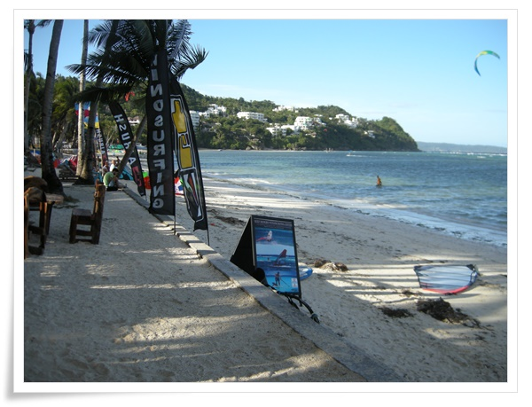

\- 카이트 샵들과 단하나 위드서핑 샵이 있는 서쪽 해변.

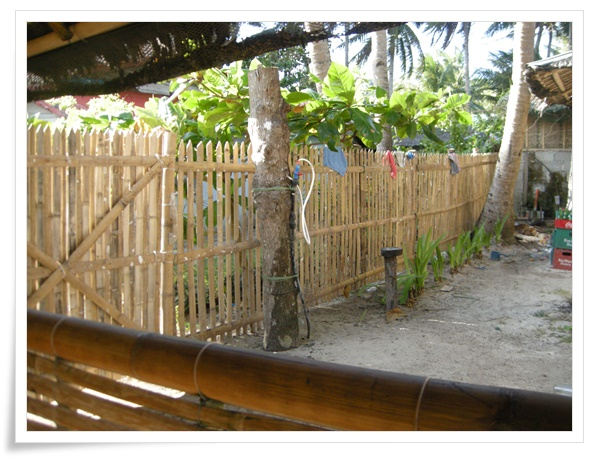

\- 샤워는 저 나무에 호스를 묶어 놓은 것을 통해 샤워한다.

서울로 가는 비행기는 새벽 2시 비행기.

southwest에서 pickup하는 시각이 오후 7시라서,  12시 게스트하우스 체크아웃하고, 마지막 윈드서핑을 즐겼다.

그리고 그 다음 별로 시원하지 않은 마시지 한번 받고, 카페에서 인터넷질.

보라카이가 섬이다 보니 교통편은 영 불편하고 힘들다.

버스타고 선착장가고, 선착장에서 배타고, 다시 버스타고 공항으로..

버스 대합실보다 못한 칼리보 공항은 비행기 연착까지 겹쳐 더더욱 힘들었다.

