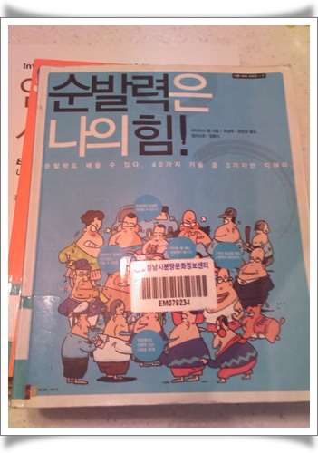

# 대화의 순발력도 키울 수 있을까?  

대화에 있어 순발력이 내가 참 느린 편이다.

갑작스런 질문, 말싸움의 시초 등에서 타이밍을 잡지 못해, 나중에 후회하는 일이 많은 편이다.

"그럴때 이런 말로 쏘아 붙여줘야 하는데, 왜 이 대답을 생각못했지.."라는 식으로...

말이란가, 타이밍이 아주 중요하여, 제때 반격하지 못하면, 효과가 거의 없다.

어쩔것인가, 머리 회전이 느린 탓인데 하며 체념했다.

그런데, 이런 순발력을 키워주는 책도 다 있더군.

이번에 빌린 책 "순발력은 나의 힘".

도서관 대출회원증을 만들고 나니, 보고 싶은 책들이 점점 더 늘어나더군.

마치 꼬리에 꼬리를 무는 식이다.

이제 1/3 읽고 있다.

상황별로 어떻게 반격하고 대꾸하는지가 설명되어 있더군.

그중 한 기법이 '한차원 높게 질문하기'인데,

"판사가 오면 일어서 주시겠습니까" 라는 요청에

"그게 진실을 찾는데 도움이 되나요?" 라는 되질문 기법이 있더군.

읽어서 나도 순발력을 키워봐야겠다

