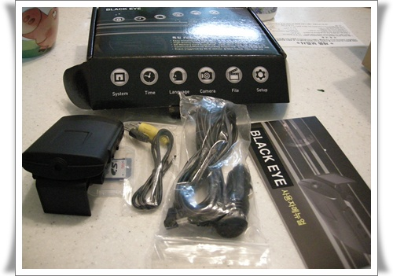
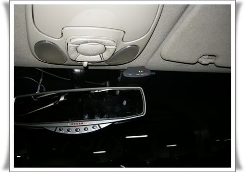

# 블랙아이 제일 싼 블랙박스 이용 소감

요즘 뉴스를 통해 블랙박스의 필요성에 많이 나오기에, 거기에 얇은 귀가 팔랑거려 하나 샀다.

[뽐뿌에 올라와 있는 제일 싼 블랙박스](http://www.ppomppu.co.kr/zboard/view.php?id=ppomppu&page=8&sn1=&divpage=7&sn=off&ss=on&sc=off&select_arrange=headnum&desc=asc&no=35910) 를 샀다.

제품명이 블랙아이인데, 인터넷에 사용기를 찾을 수 없더군.

블랙박스 대중화 시작이 아마도 올해인 것 같고, 내년되면 네비+블랙박스+하이패스 통합 된 걸로 나올 것 같아, 그 동안 쓸 용도로 제일 싼 걸로 골랐다.   가격은 69,000원에 배송비 2,500원 들었다.

단촐한 구성품.

룸미러 우축에 달았다.

성능은 안타깝게도 그냥 그 가격만 하다.

일반적으로 쓸만한 블랙박스 가격이 10만원대후반에서 부터 시작하는 거니,..

블랙아이 주간촬영 화면

블랙아이 야간촬영 화면

주간은 볼만했으나, 야간은 거의 판독 불가더군.  차량 불빛밖에 안 보이니, 야간에는 조심해야겠군.

싸긴 하지만, 싼 게 비지떡이긴 하다.  별 기대는 안했지만, 그래도 좀 실망스럽긴 하다.

