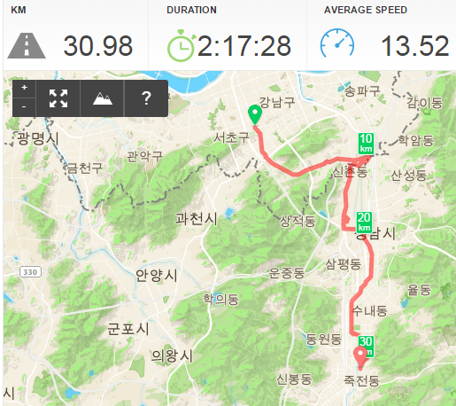

# 뱅뱅사거리에서 분당까지 자전거타고 퇴근

자전거를 가지고 출근했으니, 퇴근을 해야 한다.

회사에 세워놓은지 일주일만에 자전거로 퇴글을 했다.

왔던 길 그대로가 좋긴 한데, 똑같은 길로만 가면 재미없어 다른 경로로 가 봤다.

아래가 나의 자전거 퇴근 경로.  무려 2시간 17분이 걸렸다.

저녁 8시반에 출발하여, 집에 도착하니 밤 11시.  힘들더군.

이 경로의 힘든 점.

1\. 양재IC사거리까지 인도로 가는동안 길이 썩 안전하지 않음.

2\. 양재IC사거리에서 서울어린이병원까지의 오르막길.  자전거 끌고 올라가 힘들다.

3\. 서울어린이병원에서 헌인릉까지의 내리막길 인도가 사람 왕래가 없는 길이라 어둡고, 좁다.  그리고 도중에 자전거로 갈 수 있는 길이 끊겼다.

4\. 신촌동에서 바로 탄천내려가는 길을 못 찾았다. 그래서 서울공항을 돌아가느라 헤맸다.

