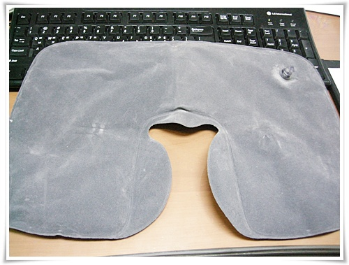
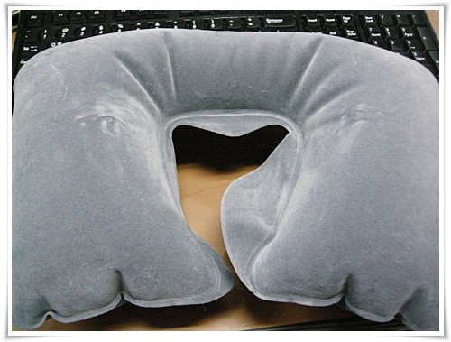

# 목베게하고 출근하기

[하루의 4시간 이상을 출퇴근에 사용](../9364023.html) 하는 생활을 1년 반 넘게 하다보니, 이제는 목이 아프더군.

버스에서 잘려고 해서, 큰 머리의 무게를 감당치 못해 목이 뻐근해 잠을 제대로 잘 수가 없었다.

집안을 뒤지다 보니, 목베게가 나오더군.

몇년전 한창 출장을 많이 다닐 때, 비행기에서 할려고 산 것이다.

바람을 불어 넣는 식.

정작 비행기에서는 유용하지 못했다.

이코노니석이 뒤로 젖혀지는 게 작기 때문에, 저걸 하면 오히려 목이 앞으로 더 쏠려 불편했다.

그래서 몇년째 처박에 놓기만 했었다.

이렇게 바람을 불어넣어, 목에 두른다음 버스에서 잠을 청하니, 개운하더군.

출근길은 사람들이 다 잠을 자서 이렇게 하고, 퇴근길은 안한다.

안자는 사람이 많이 저걸 하기가 좀 폼이 안나서..

