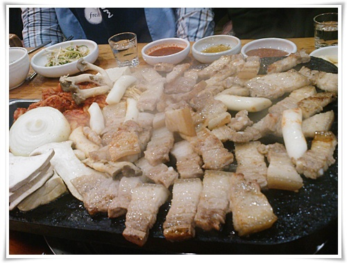

# 탐라도야지 오겹살

좀 이른감이 있는 뉴젠 OB송년모임.

장소는 교대 근처에 있는 탐라도야지.

주종목이 오겹살이고, 이 오겹살외 다른 것을 먹는 사람은 이번에 처음 봤다.

내가 소고기 보다는 돼지고기를 좋아하는 편이다.

돼지고기집 중에서는 이 식당이 내게 가장 맛있더군.

오겹살도 많이 올랐군.

몇년전에는 1인분에 6천원이었는데, 꾸준히 천원씩 오르더니, 이제는 만원이다.

오겹살도 맛있지만, 콜레스테롤 가득한 돼지기름에 볶은밥도 일품이다.

사장님이 되신 포레스트옹을 오기를 다들 기다렸지만, 포레스트는 10시가 되도록 오지 않았다.

