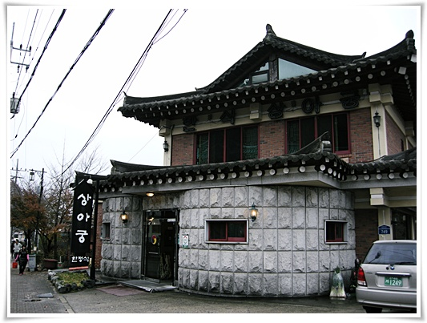
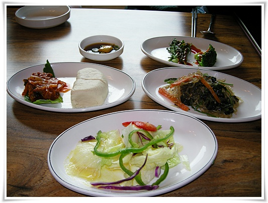
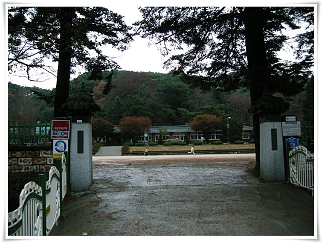
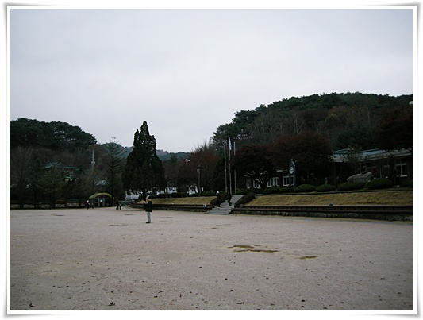
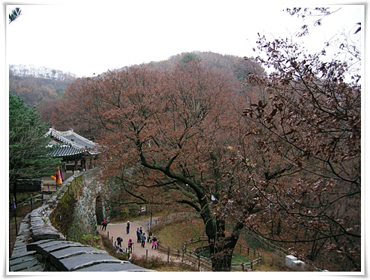

# 비오는 늦가을 남한산성

비만 안왔으면 단풍이 절정이었을텐데 하는 아쉬움으로 남한산성에 갔다.

일요일 점심때쯤 출발한터라, 바로 식당부터 갔다.

식당은 광주방면에 있는 상아궁.

점심정식이 만원인데, 그럭저럭 괜찮게 나왔다.

남한산성이 그래도 유원지인 걸 생각하면, 제법 저렴한 가격이었다.

이런식으로 나왔다.  한정식인데, 만원치고는 좋았다.

맛도 정갈했다.

식사후 바로 앞에 있는 남한산성초등학교에 가 봤다.

최근 MBC 방송을 탄 이후 더욱 유명해진 학교라고 한다.

폐교가 결정되었는데, 교사와 학부모들의 노력으로 정규학교인데도 거의 대안학교같이 운영을 하고 있다고 하는군.

그래서 이 학교로 전학오고 싶어하는 사람이 줄을 섰다는 곳이다.

초등학교 학교 정문.

학교 위치 자체는 좋은데, 남한산성자체가 완전 유원지라서 학교하고 안 어울리긴 했다.

넓다란 운동장과, 넓은 하늘.

산 정상에 있는 학교라 그런가 하늘이 정말 넓다.

이런 학교에 다니고 나면, 나중에 유년시절의 기억이 많이 남겠다.

비가 그치긴 했지만, 간간히 이슬비처럼 내려 산책하기에는 좋은 날씨였다.

남문. 수어장대도 많이 깨끗해졌더군.(6년전에 비해..)

