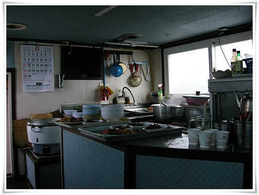
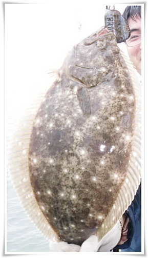

# 바다낚시에서 처음 잡아 본 광어

취미라기보다는 거의 연중 행사 수준인 [바다 낚시](../6166758.html "").

낚시광은 아니지만, 내게 있어 낚시의 재미는 물론 고기를 잡아 먹는 것이 가장 크겠고,

그 다음으로 낚시대를 드리우고 멍하니 있는 그 순간이기도 하다.

아무생각이 가만이 있는다는게 쉽지 않다.

그 무념무상을 위해 불교의 스님들은 참선을 하는 거겠지.

그런데 낚시하다보면 그냥 먼 바다를 아무 생각이 몇시간이고 바라보게 된다.

한달 전부터 갈려고 했었는데, 토요일만 되면 비와 풍랑주의보에 계속 미루어오다가 지난 토요일 갔다.

새벽 02시 기상하여 아래와 같이 움직였다.

02:50 몽촌토성역 도착하여 같이 가기로 한 일행을 태우고 인천으로 향함

03:00 인천 남동항 도착

03:00 ~ 03:30 1인당 승선요금 7만원 지불하고, 미끼와 추, 바늘을 사고 배에 탐

03:40 ~ 04:00 아침식사로 배에서 끓여주는 라면 먹음

04:00 ~ 07:00 덕적도 인근 낚시 포인트까지 이동할 동안 선실에서 취침

07:00 ~ 12:00 오전 낚시

12:00 ~ 12:30 점심식사

12:30 ~ 15:30 오후 낚시

15:30 ~ 17:00 남동항으로 복귀

17:00 ~ 19:00 서울로 복귀

배에 마련된 주방.  이곳에서 잡은 고기를 회를 떠주고, 식사때 밥도 주고 한다.

점심은 위처럼 나온다.  여기에 매운탕이 나온다.  매운탕의 재료는 오전에 회를 뜬 고기로 하기 때문에 오전에 고기가 안 잡히는 날이면 매운탕 대신 칼국수가 나오는 불상사가 터지기도 한다.

이날 내가 잡은 것중 제일 큰 광어.

