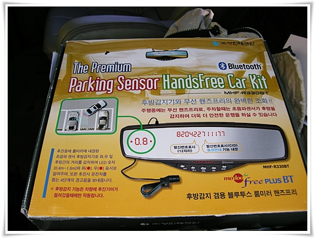
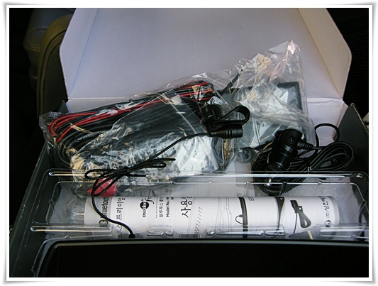
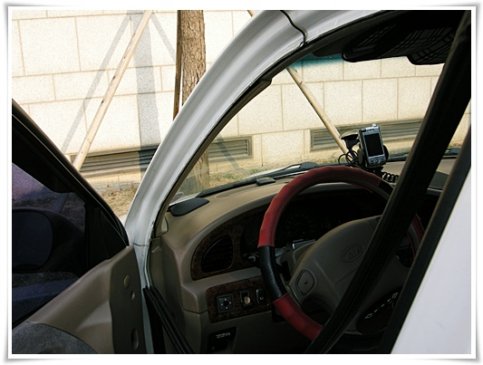
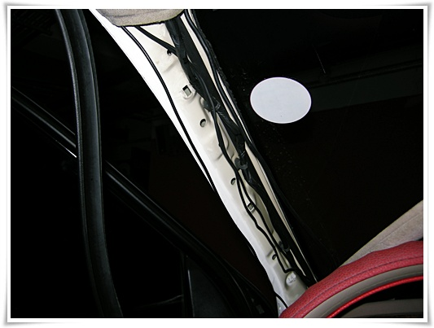
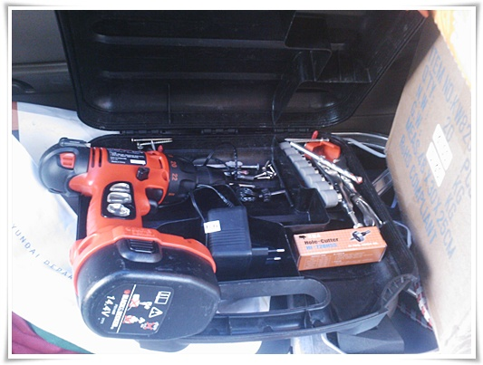
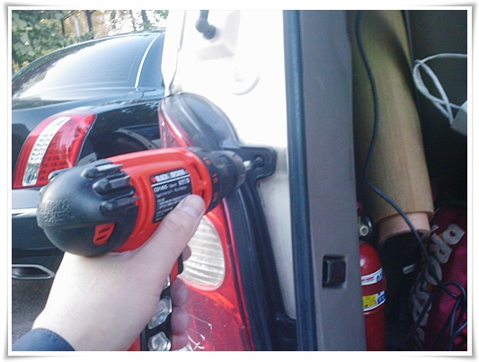

# 후방감지기 설치 시도

동함이에게서 받은 후방감지기

받은지 2주만에 설치해보기로 했다.

10년만 젊었어도, 파닥파닥 설치했었을 텐데, 귀차니스트가 되고 나니, 영 엄두가 안 나더군.

계속 뒤트렁크에 싣고 다니다, 설치해보기로 했다.

껍질을 여니, 아래와 같이 전선들이 잔뜩나온다.

설명서는 이미 여러번 읽었지만, 작업 시작이 좀 귀찮았던 점은, 차에다 구멍도 뚫고 전기배선도 해야 한다는 점 때문이었다.

표시기는 룸미러에 설치하고, 전원을 시거잭에서 잘 연결해야 하고, 표시기와 뒷범퍼에 달 센서와에서 안보이게 잘 배선을 연결을 해야 하는데, 그 "잘"이 쉬울 것 같지는 않더군.

먼저 문과 천정사이에 들어가는 고무를 벗겨냈다.

이건 그냥 짝 뜯어내니 되더군.

그리고 나서 A필러를 뜯어내려고 하는데, 안 뜯어지더군.

틈새로 보니 뭔가 클립같은 것이 보이긴 하는데, 어떤 구조인지 모르겠더군.

그래서 저 상태에서 다시 원복했다.

그리고 나중 인터넷으로 A 필러 뜯는 방법을 검색해봤다.

뜯는 방법은 "남의 차"라고 생각하고 확 뜯으라는 것이더군.

A 필러 확 뜯어재끼니, 뜯어지더군.

그렇게 해서 1단계 핸즈프리 기능까지는 성공.

그 다음은 난이도 있는, 후방센서 작업

전동드릴을 열였다.  구멍을 21mm로 똟어야 했기에 21mm 홀쏘도 샀다.

전동드리라이버로 후미등을 분해하기 시작.

후방감지센서 전원을 후미등에서 따와야 하기 때문이다.

볼트가 2개있어, 2개 다 풀었는데도 잘 안 빠지더군.

그래서 이것도 힘으로 확 뜯었더니, 안쪽의 뭐가 부러졌다.

이런 제길..

그 다음으로 진행은, 의욕저하로 다음 기회로 하기로 하고, 덮어뒀다.

