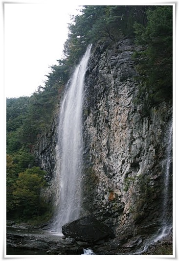
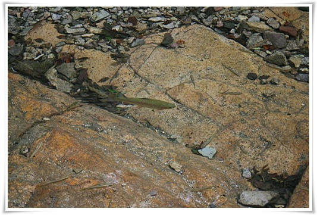
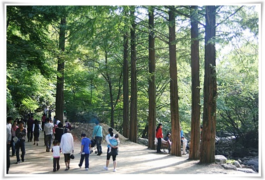

# 강천산 때이른 단풍구경

지난 일요일 전라도 순창에 있는 강천산으로 때이른 단풍구경을 갔다.

물론 단풍이 들 시기는 전혀 아니었다.

그냥 전주 간 김에 들른 곳이다.

강천산은 전주시민들이 자주 가는 산이라고 한다.  서울 사람들이 북한산이나 청계산을 주로 가는 것처럼..

남한인구의 반이 수도권에 있다 보니, 그 밑의 지방에는 정말 사람이 없다.

들에도 없고, 논 밭에도 없고..

그러다 강천산군립공원에 도착하니, 사람들이 여기 다 모여있었구라는 생각이 들더군.

강천산이 호남의 소금강이라더니, 과연 그 말을 괜히 붙힌 것은 아니더군.

강천산 입구에는 메사퀘이어 길이 쭉 있었다.  담양의 그 길처럼,.

이건 강천산 초입에 있는 병풍폭포.  꽤 근사할 걸이라고 생각했었는데 인공폭포란다.

강천산 계곡에 있는 송어떼.

강천산의 가장 놀라운 점이 바로 계곡이었다.

정말 물이 깨끗했다.  더 놀라운 점은 그 깨끗한 물에 송어떼가 그리도 많다는 점이다.

눈으로 보기에도 물이 너무 깨끗해, 흡사 물고기가 그냥 공중에 날고 있는 듯한 착각마저 들 지경이었다.

강천계곡의 송어떼가 왜이리 많나 했더니, 몇년전 송어치어를 몇만마리 풀어놨다더군.

그 치어들이 바다로 갔다가 다시 회귀한 것이다.

양재천과 탄천과 잉어떼만 보다가 송어떼를 가까이서 보니 제법 신기했다

강천산 등산길.

애도 있고 해서 정상까지는 올라갈 생각도 안하고, 그냥 강천사까지만 올라갔다.

올라가는 길은 그냥 산책길이었다.

아주 평탄하니, 경치도 좋고..

아마도 다음주가 강천산의 단풍 절정이 되겠군.

