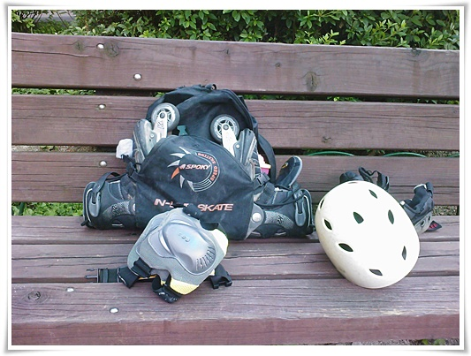
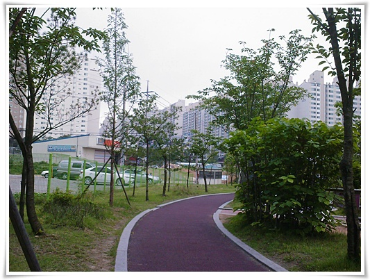
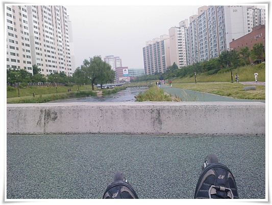

# 간만의 인라인으로 저질체력 바닥나다

인라인을 꺼내들었다.

2000 ~ 2002년 경이 인라인 대유행이었지.

그때는 매주 한강에서 인라인을 탔었는데, 이제는 이 인라인을 꺼내 본 지도 1~2년은 된 것 같다.

집 앞 공원에서 인라인으로 갈아 신기.

저 K2 velocity 인라인과 헬멧은 친구 동함에게 샀나(얻어나?)했던 것이다.  그러고 보니 10년된 인라인이군.

코스는 분당 탄천을 따라, 밑으로 가기.

가는 동안, 인라인을 타는 사람은 딱 세명 봤다.  정말 인기가 완전히 없어졌더군.

반환점 \- 용인시 풍덕천의 무슨 지역난방공사 앞이다.

여기까지가 4km밖에 안되는 거리인데, 죽는 줄 알았다.

성내에서 여의도까지 1시간반에 질주했던 왕년의 시절을 이제 추억속의 시기밖에 안되나 싶다.

그 4km를 갔는데도, 허리와 발목은 끊어질 듯 아프고, 땀을 비오듯 쏟아지고, 입에서는 단내까지 나더군.

이런 저질체력..

다시 시작점으로 돌아와 쉬는 중.

역시 운동은 꾸준히 했어야 하나 싶다.  1년만에 이렇게 바닥을 드러내버리다니.. 쩝.

