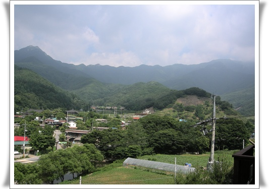
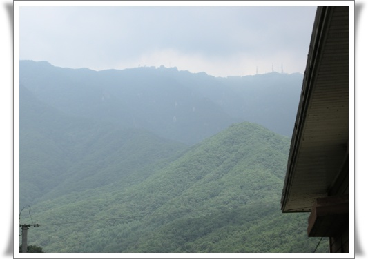
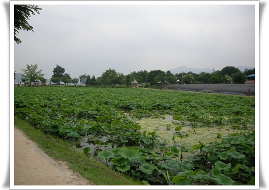

# 워크샵으로 간 용문산과 두물머리

회사 워크샵으로 간 용문산리조트콘도.

방 두개 빌려 40만원이었으니, 방 하나에 20만원이군.

개인적으로는 펜션으로는 놀러 가 본 적이 없어, 비싼 가격으로 생각된다.

양평군 용문면.

내가 초등학교 5학년을 다닌 곳이다.

1985년의 용문은 참 추운 동네였다.

겨울이면, 개울가 얼음을 깨고, 물을 길어 세수를 했던 기억이 난다.

몇년전 다시 찾은 그 곳은 참 많이 변했더군.  아무래도 서울에서 얼마 안 떨어진 곳이라, 완전 펜션과 음식점 촌으로 바뀌어 예전 모습을 찾기 힘들었다.

펜션에서 바라 본 풍경.

저 앞 산이 용문산이다.

어렸을 때 토요일만 되면 자연보호 활동이라고 하여 저 산에 올라가 쓰레기 주웠었는데...

워크샵이므로, 사람들이 새벽 4시까지 술을 마셨고, 기상은 아침 10시나 되어서 했다.

용문에 왔으니, 용문산이라도 함 올라가봤음 싶었는데,.. 쩝.

퇴실후, 서울로 복귀하며서 들른 두물머리.

연꽃이 무럭무럭 자라고 있군.  가을 연꽃이 피면 멋있을 것 같군.

