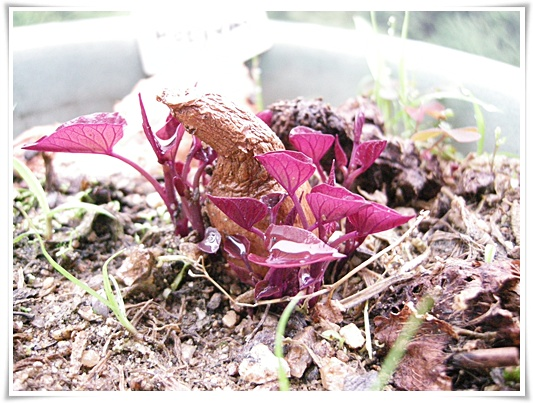
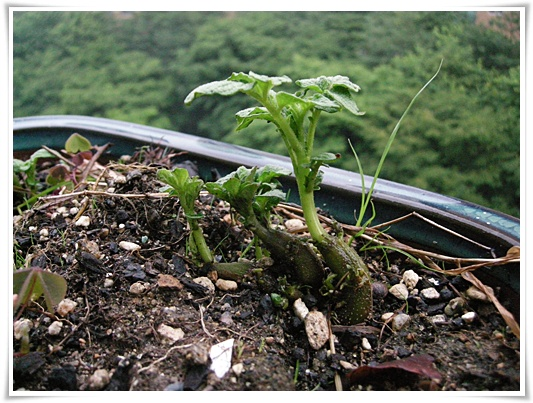

# 화분에 심은 감자와 고구마 

싹이 터 못먹게 된 감자와 고구마를 베란다 화분에 심었다.

며칠 물 주고, 비 좀 맞았더니, 제법 많이 자랐다.

이게 고구마.  잎이 붉으스름한게 나름 이쁘군.

이건 감자.

원래 감자 눈만 떼어서 하나씩 심어야 하는 것이지만, 살겠다고 저렇게 삐집고 나온 눈들 중 나머지를 버리기엔 내가 워낙 인정이 많은 터라,그냥 다 살려뒀다.

식물을 키우다 보면, 단독주택이 참 부럽긴 하다.

