# 캄보디아 여행 2/4 - 현지 1일차 반띠아이쓰레이와 스마일오프앙코르

호텔 check in을 하고 나니 새벽 2시야 방에 들어갈 수 있었다.

서둘러 짐을 풀고 잠자리에 들었지만, 바뀐 잠자리에 적응못하고 깨어 있는 채로 아침을 맞았다.

이번 숙소는 Angkor Holiday Hotel.

준특급호텔이라고 하는데, 별 갯수는 모르겠다.

모이는 시각이 8시 반이라, 7시반에 딸내미 깨워 식당으로 갔다.

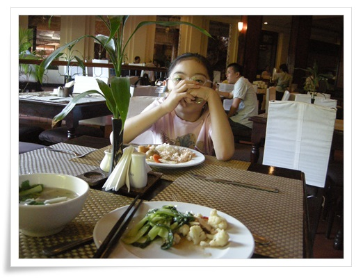

\- 호텔 식당.

부페이고, 맛은 우리나라보다는 중국입맛에 맞춘 듯 해 보였다.

그리 맛있지도, 맛없지도 않는 그럭저럭..

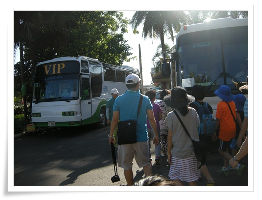

-8시반 버스 탑승.

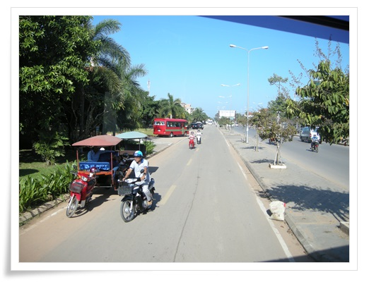

\- 버스는 6번 국도 서쪽방면으로 좌회전을 한다.

도로에 신호등이 거의 없어 불안불안하긴 한데, 별 사고는 없다.

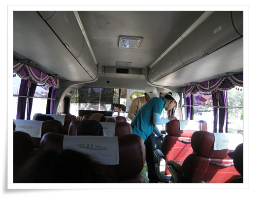

\- 34인승 리무진 버스

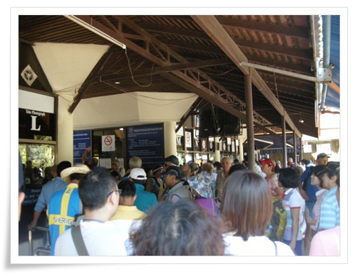

\- 매표소로 갔다.

사람들도 북적북적댄다.

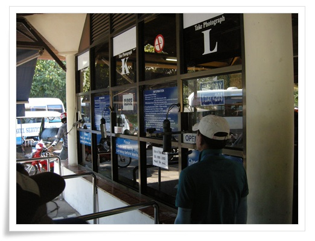

\- 입장권에 들어갈 사진을 찍는다.

9년전 왔을 때에는 사진을 가져와 붙이는 방식이었는데, 많이 편해졌군.

입장권 수령후, 첫 목적지 반띠아이쓰레이로 향했다.

앙코르왓 북쪽에 위치한 곳이라 30분간 이동했다.

도로가 좁아, 기껏해야 시속 30~40km 정도로 가는 듯 했다.

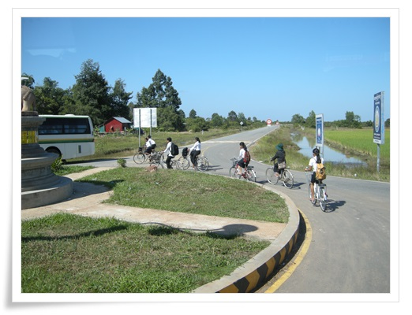

\- 자전거 타고 등교하는 듯한 학생들

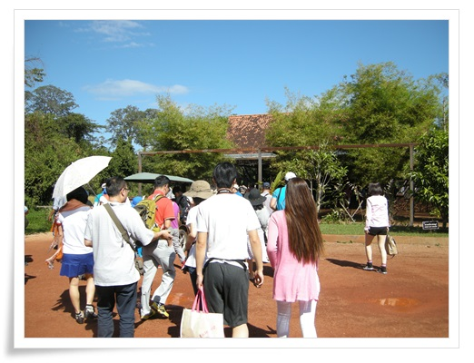

\- 반띠아이쓰레이에 도착했다.

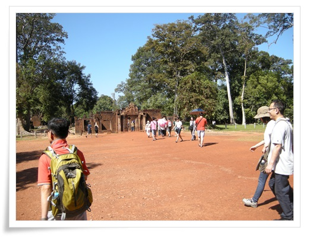

\- 프랑스 문호인 앙드레말로가 밀반출하다 걸린 압사라조각이 원위치된 곳이다.

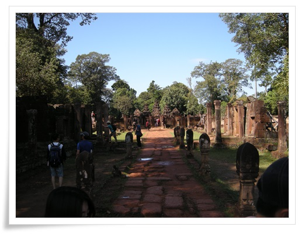

\- 반띠아이쓰레이로 들어간다.

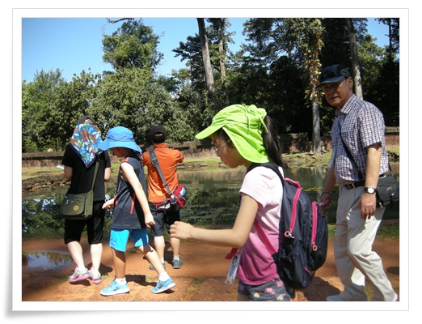

\- 같은 일정의 일행들.  애들은 딸내미 포함 총 세명.

\- 반띠아이쓰레이에서 가장 정교한 문양.

저 삼각형이 수미산을 의미한다고 한다.

\- 내부 모습.

9년전 봤을 때에 비해 색깔이 많이 탁해졌다.

그 때는 붉은 색으로 예뻤는데,..

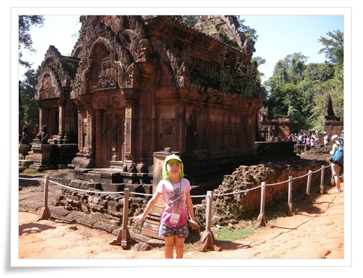

\- 지붕에 풀들도 많이 자라고 있다.

관리가 더 부실해진 것인지..

다음 목적지는 롤로스 유적지.

앙코르문명의 초기 유적지라고 한다.

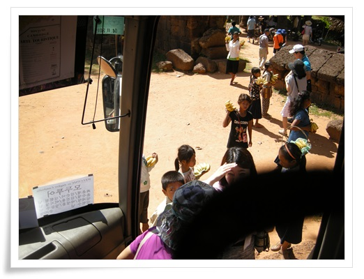

\- 버스에 사람들이 내리기를 기다리는 앙코르아이들.

바나나한송이 1$, 조잡한 엽서 1$ 가 주 판매물이다.

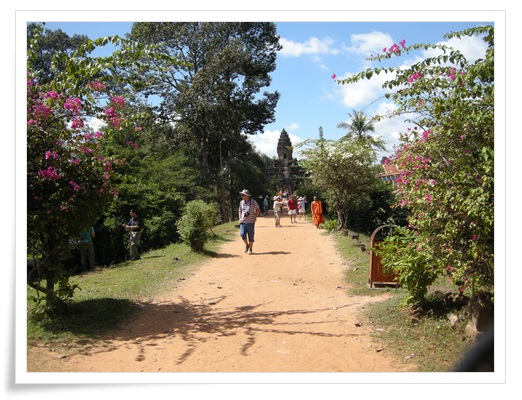

\- 롤로스 사원으로 들어가는 길

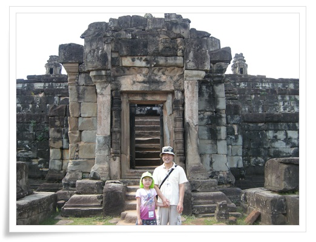

\- 롤로스 들어가는 문 앞에서 사진 한장.

들어가는 문은 안쪽으로 들어갈 수록 좁아진다.

좁아지는 이유를 가이드가 설명해 줬는데 기억이 안 나는군.

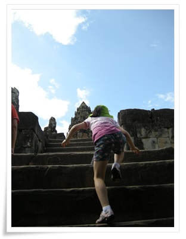

\- 계단은 가파른 편이라, 이렇게 올라간다.

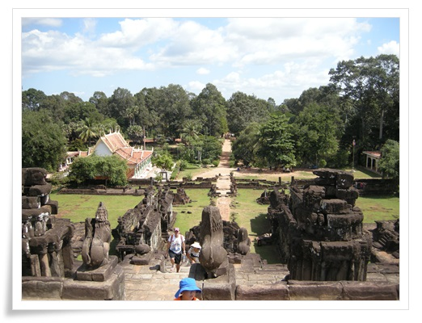

\- 올라가선 본 풍경

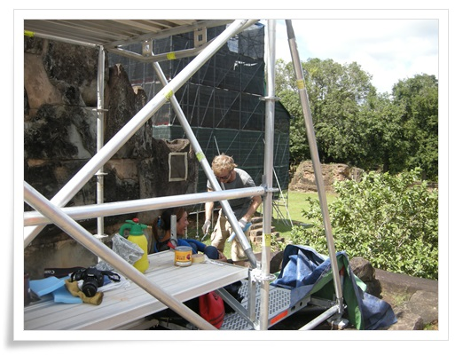

\- 이 유적은 유럽 나라에서 복원중이다.

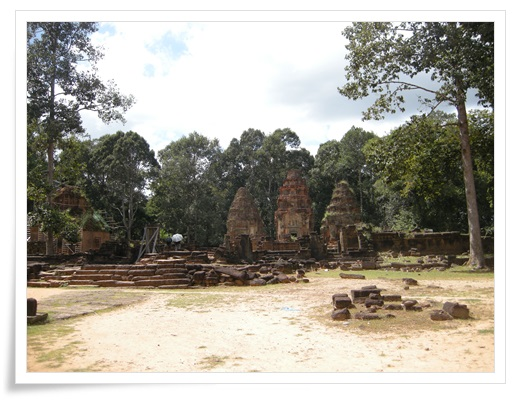

\- 또다른 롤로스 유적.

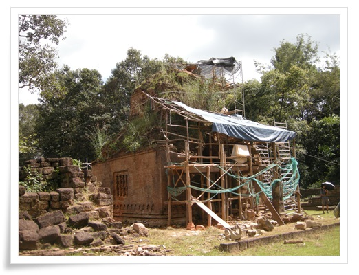

\- 여기도 복원작업중

롤로스 유적지를 관람하고, 점심식사를 하기 위해 다시 씨엠립시내로 돌아왔다.

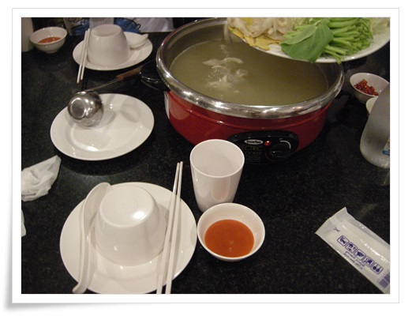

\- 점심 메뉴는 닭고기 수키

캄보디아는 미나리가 잘 자라, 채소중 미나리가 많았다.

좋아하는 미나리라 많이 먹었다.

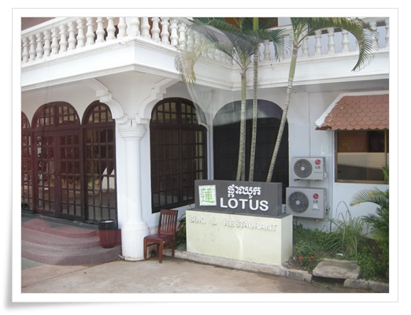

\- 점심 먹은 식당.  식당이름이 LOTUS인가 보다.

한국인이 운영하는 식당이다.

\- 식사후 1시간동안 호텔에서의 휴식 시간이 주어져, 그 시간 딸내미는 수영장에서 물놀이했다.

오후 일정은 담낙스파에서 전신안마

안마는 어른만 해당되는데다 내가 안마를 별로 안 좋아해서 안하고 딸내미와 놀기로 했다.

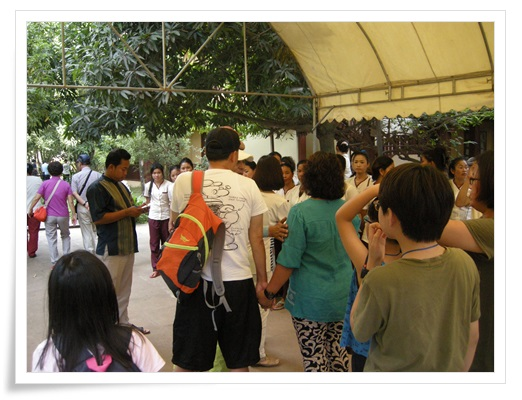

\- 안마장 입장하는 일행들.

주인은 한국인이고, 저 안마요원들이 쭉 서서 호명을 기다리는 방식이었다.

가이드는 안마후 팁은 2~3$만 주라고 안내했다.

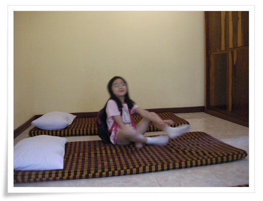

\- 나는 딸내미와 빈방에 들어와 쉬었다.

1시간 정도 방에서만 노니 심심하여 밖으로 나갔다.

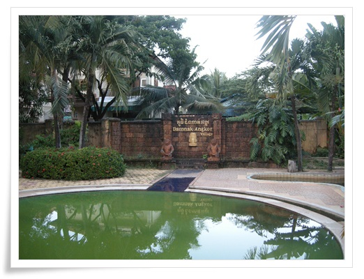

\- 내부 시설.

정식 명칭이 Damnak Angkor Village이군.  근데 관리가 제대로 안되는지 물도 탁하고 후줄근했다.

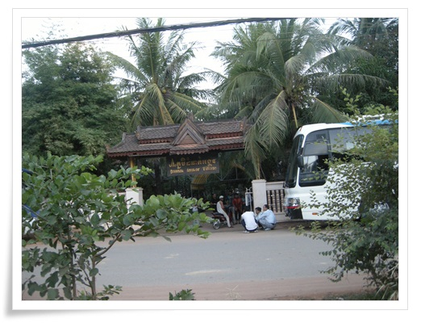

\- 밖으로 나왔다.

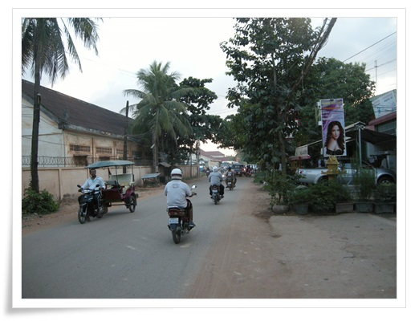

\- 처음으로 개인자유시간인 셈이다.

시내 탐험에 나섰다.

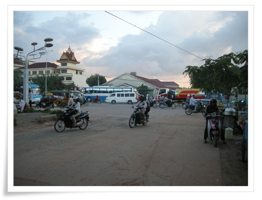

\- 9년전에 비해 도로도 포장되었고, 건물도 많아지긴 했다.

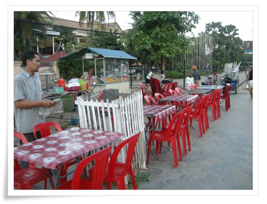

\- 오후가 되니 저녁 영업을 시작하는 노점들이 거리에 들어서기 시작한다.

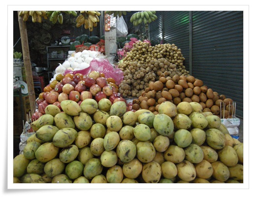

\- 이번 여행의 주목적이기도 한 열대과일을 사기 위해 과일가게에 왔다.

망고스틴 있냐고 물어보니, 철이 아니라고 한다.

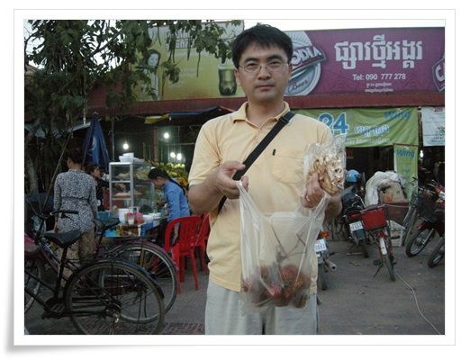

\- 바나나칩과 람부탄 0.5kg 샀다.  각각 1달러.

람부탄은 딸래미와 10분만에 다 까서 먹었다.

역시 현지에서 먹는 람부탄이 맛있긴 하다.

저녁일정은 Smile of Angkor라는 공연 관람이다.

저녁식사도 그 공연장에 있는 부페에서 먹는 거다.

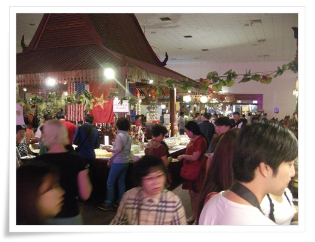

\- 공연장에 있는 부페.

한식, 중식, 캄보디아식으로 구성되어 있는데 별로 맛은 없었다.

사람도 많아 북적였다.

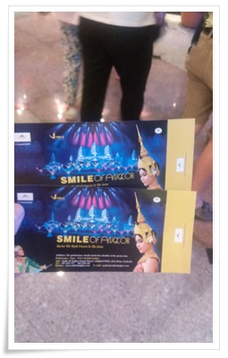

\- 식사후 공연을 보기 위해 티겟 수령

공연은 앙코르의 역사와 힌두신화를 테마로 것인데, 별로 재미는 없었다.

티켓비용이 20$정도 한다는데, 그 정도 볼만하지는 않았다.

\- 공연 끝나고 전 출연진 나와 인사하고 있다.

관람객 구성을 보니, 다들 우리나라와 중국 관람객 뿐인 것 같다.

앙코르왓에서 봤던 그 많은 서양인들은 안 보이더군.

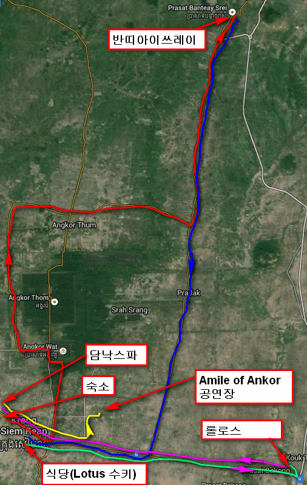

\- 첫째날 이동경로

첫째날 시간대별 한 일

07:40 ~ 08:00 호텔부페 아침식사

08:30 ~ 08:40 버스 탑승 & 앙코르왓 매표소로 이동

08:40 ~ 09:00 일일입장권 발권

09:00 ~ 09:30 반떼이쓰레이로 이동

09:30 ~ 11:30 반떼이쓰레이 관람

11:30 ~ 12:00 롤로스 유적지로 이동

12:00 ~ 13:00 롤로스 유적지 관람

13:00 ~ 13:30 시내 식당으로 이동

13:30 ~ 14:00 점심 - 수키

14:10 ~ 14:20 호텔 복귀 (가이드/기사 fee $40-나 + $30$-딸, 선택관광비 $70 + $70)

14:30 ~ 15:30 딸내미 호텔 수영장에서 물놀이, 나는 다른 관광객&가이드와 맥주

15:45 ~ 15:50 담낙스파로 이동

16:00 ~ 17:00 담낙스파 빈방에서 딸내미와 공놀이

17:00 ~ 17:50 딸내미 손잡고 시내 길거리 구경 ( 바나나칩 1$, 람부탄 0.5kg 1$ 구매 )

18:10 ~ 18:30 Smile of Angkor 공연장으로 이동

18:30 ~ 19:20 Smile of Angkor 부페에서 저녁식사

19:30 ~ 21:00 Smile of Angkor 공연 관람

21:10 ~ 21:40 숙소 복귀 (복귀 중 편의점 들러 콜라 & 어포 구입 $3.2)

총 216$(246,400원) 썼다.

