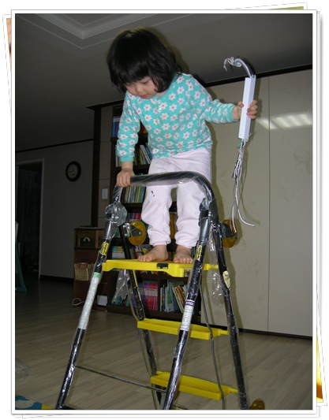

# 간만에 영접한 지름신 - 남자의 로망 만능 변신 카트

[뽐뿌게시판](http://www.ppomppu.co.kr/zboard/view.php?id=ppomppu&page=6&sn1=&divpage=5&sn=off&ss=on&sc=on&select_arrange=headnum&desc=asc&no=24836) 에서 급뽐뿌를 받고 산 3단 변신 만능 카트를 샀다.

모든 지름과 마찬가지로 선지름후합리화

사고나서 산 이유를 구성해봤다.

가끔 많은 짐을 옮길 때까 있다.  처가집이라도 갔다 오고 나면, 차 가득히 실려 있는 물품을 집으로 옮기느라, 여러번 왔다 갔다 한다.  그 불편을 없애고자, 이미 1년전 카트를 질렀다.  뭐 큰 불편없이 사용하고는 있지만, 좀 더 큰 이 걸 보고 나니 마음이 동요되었다.

이게 쇼핑몰에 올라온 변신 모습.  저 변신 모습을 보고 가슴이 두근거렸다.

게다가, 사다리로도 변신을 하지 않던가..  1년에 몇번 필요한 거고, 꼭 없어도 의자를 이용해서도 가능하지만, 사다리가 있으면 일단 폼이 나지 않을까..

포장을 뜯고, 사다리부터 변신을 해 봤다.  사다리로 해 놓으니, 역시나 딸래미가 먼저 올라가 조명 공사하겠다면서 형광등 안정기를 들고 올라가는군.

