# 별 감흥없이 보낸 그곳, 달라스

시애틀에서 국내선을 타고 장장 3시간을 날아간 달라스.

국내선인데 3시간이나 걸리다니,. 땅덩어리가 크긴 크다.

이번에 빌린 차는 크라이슬러의 PT 크루즈.

전형적인 외제차처럼 생겼다.

우리나라에는 젊은애들이 외제차임을 과시하기 위해 주로 타는 차인것 같은데, 타보니 꽝이다.

승차감 안 좋음. 그냥 내 차 갤로퍼랑 별 차이 없어 보였다. 그리고 미국차, 게다가 휘발유 차임에도 왜 그리 안 나가던지.

악셀레이터를 밟으면, 엔진음은 슈퍼카 소리인데, 속도계는 제자리다.

앞으로 우리나라 도로에서 PT크루즈를 보면 비웃어줄테다.

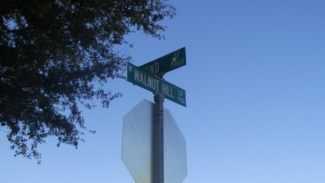

숙소가 있는 walnut hill 거리. 호도 언덕 거리란 뜻인가보다.

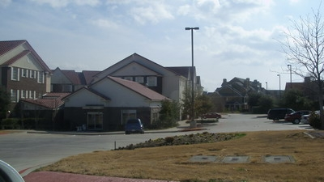

달라스에서 열흘을 묵은 여인숙 Marriot Towne Place. 뭔뜻인지 모르겠다.

정말 열악한 시애틀의 여인숙에서 와서 그런가 시설이 정말 좋았다.

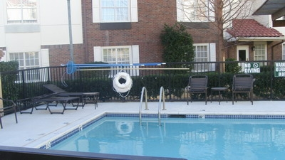

여인숙이 수영장도 있다. 헌데 물은 찬물이고, 낙엽도 많이 가라앉아 있어 여름까지는 그냥 전시용인가 보다.

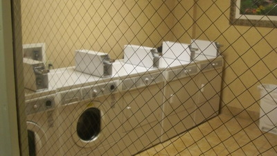

세탁기도 있다. 별도 비용없이 이용할 수 있다. 건조기도 같이 있어 1시간면 빨래와 건조까지 다 마친다.

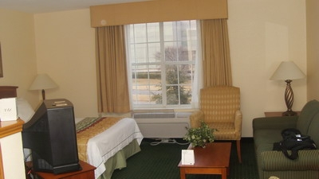

내 방. 괜찮다.

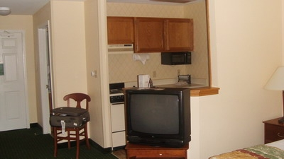

방에 부엌도 있다. 아마 장기투숙객용 여인숙이라서 그런가 보다.

매일같이 비만 오는 우울한 도시 시애틀에 있다 와서 그런가 환한 날씨가 괜찮았다.

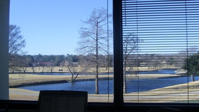

달라스에 있는 동안은 이 사무실에서 일했다. 앞에 골프장이 있는 사무실.

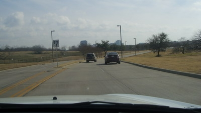

달라스는 참 도시가 건조하다. 물론 여기가 도심은 아닌 외관 Irving 지역이라 더 그러겠지만,..

그냥 띄엄띄엄 건물 있고, 산은 안보이고, 쭉 평지.

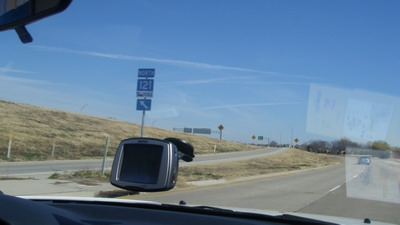

시애틀에서 사용하던 같은 종류의 GPS인데도 이곳에서 맨날 틀린 위치만 알려준다.

월마트를 찍고 갔는데, 이상한 SAMS mart로 인도하지 않나,

베니건스를 찍고 갔는데, 베니건스는 아예 안보이고,.

달라스가 그래도 미국내에서 유명한 것은 바로 쇼핑이라고 한다.

다른 주에 비해서 세금이 싸다는 그 이유다.

시애틀에서도 느꼈지만, 미국 상점들 정말 많다. 그리고 종류도 무지 많다.

그렇게 많은 상점과 물건들이 있다는 것은 그 만큼 사람들이 산다는 것인데, 땅덩이리에 비해 그리 많지 않은 인구가 그렇게 많이 사재끼는 것을 생각하면 역시 과소비의 나라답다.

쇼핑의 천국 미국답게, 마트를 답보한다.

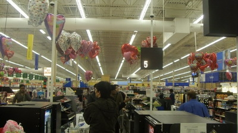

처음간 곳은 월마트. 우리나라에서 못버티고 철수한 매장인데, 미국은 꽤 장사가 잘 되나 보다.

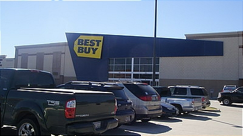

그다음 가 본 곳이 BEST BUY. 우리나라 하이마트랑 비슷한 곳인데, 들어가고 나서 실망했다.

뭘로 싸지도, 다양한 물건이 있지도 않은 그냥 하이마트 수준이었다.

내가 가장 감격한 마트. 바로 홈디포. 이 상점에 들어가고 나서 미국이란 나라에 살아보고픈 충동을 처음 느꼈다.

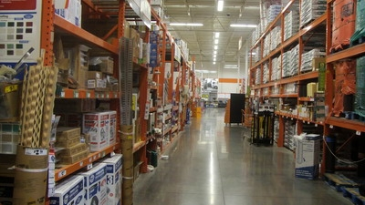

주로 파는 것은, 공구류, 페인트, 선반, 가구재료, 자동차정비 재료 등등 온갖 공구와 잡동사니들은 다 모여있었다.

그중 가장 사고 싶었던 것은 150달러짜리 작업용 선반. 드릴과 각종 공구장착을 할 수 있게끔 만들어진 작업대였다.

비행기에 갖고 탈 수만 있었다면 바로 질렀을 제품이었다.

그렇게 달라스에서 열흘을 보냈다.

일은?

별로 기억을 되살리고 싶지가 않군.

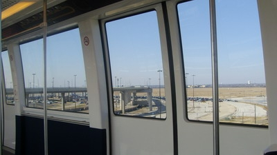

달라스공항에서 비행기 기다리는 동안 타면 Sky Line. 터미널사이를 무인전동차가 데려다주는 것인데, 한바퀴 도는데 20분정도 걸렸다.

달라스에서 한국까지 오는 시간. 14시간. 맞바람이라서 그런가 상당히 오래 걸렸다. 이제까지의 비행시간 중 최장시간.

지겨워 죽는 줄 알았다.

달라스에서 지른 것. 무전기와 4in1 턴테이블.

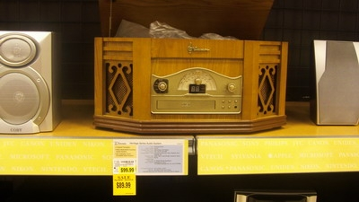

그중 4in1 턴테이블. 6만원주고 샀다.

기능은 턴테이블, 라디오, 카세트, CD.

가격대성능 아주 만족스럽다.

