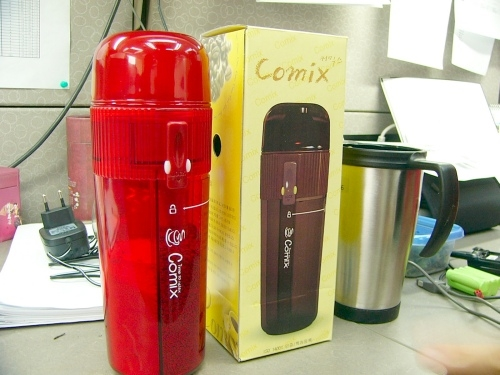

# 커피믹스 제조기 커믹스

새로 산 장난감.

이름하여 **커믹스**

원두커피는 좋아하지 않는다.

좋아하는 것은 자판기 커피. 그 중에서도 국립극장의 자판기가 제일 맛있더군.

그 다음이 봉지커피. 커피믹스라고 불리는 것들이다.

사무실엔 안타깝게도 봉지커피가 없다.

그냥 커피, 크림, 설탕 이렇게 따로따로 병에 담아져 알아서 타 먹어야 한다.

아무리, 봉지커피 맛을 내려해봐도, 번번히 실패였다.

그러다가 사게된것이 바로 저 봉지커피 제조기.

저 제품의 존재여부는 동함이가 알려줬다.

주옥선씨에게서 배송료포함 9,800원에 샀다.

하루만에 배달되더군.

**Made in Corea** 다.

특허등록까지 했다는군. 특허인증이 날 지는 잘 모르겠다.

검색엔진에서 커믹스 혹은 커피믹스 제조기라고 찾으면, 저 제품만 나온다.

국내 벤처 기술이 낳은 쾌거지. ㅋㅋ

회사에 배달오고 나서, 팀 사람들과 시음회를 했다.

맛은 맥심모카커피믹스와 동일한 맛이다.

성공적인 지름이었다.

[null](../6166678.html#6166678_1)

