# 앙코르와트 3일차

6월 23일 목요일.

캄보디아에서의 4일차, 앙코르와트 3일차.

혼자다.

같이 다니던 대학생 커플은 태국으로 떠났고, 마지막 관광을 나 혼자 하는 거다.

이제껏 앙코르와트 여행을 너무 쉽게 했다.

툭툭을 타고 다니다 보니, 내가 원하는 대로 가는 것이기는 해도, 어느정도의 제약이 있었다.

그 제약을 해소하고자 자전거로 타고 돌아다니기로 했다.

지도를 보니, 숙소에서 왕코드와트까지는 15km 정도되는 거리.

한시간 정도면 갈 수 있는 거리더군.

숙소에서 자전거를 빌렸다.

하루에 1달러.

기어없는 허름한 자전거에, 자물쇠하나.

05시 40분.자전거를 타고 앙코르와트로 향했다.

-시엠립 시내.툭툭을 타고 갈때랑, 이렇게 자전거로 직접 내가 운전하고 갈때랑 느낌이 다르다.

-시엠립을 빠져나갈때쯤에 아침을 먹기 위해, 노점상을 들렀다.

가격은 2000리엘. 저 바게트빵에서 돼지고기와 양념을 넣어 주는 거다.

빵을 비닐봉지에 담고 일단 출발.

-거리에 자주보이는 홍보간판. 무슨 의미인지는 잘은 모르겠지만, 뭐 총가지고 노는 것은 위험하다라는 것 같다.

-자전거로 가니, 이렇게 바로 옆을 지나가는 캄보디아 소녀들도 근거리에서 볼 수가 있군..

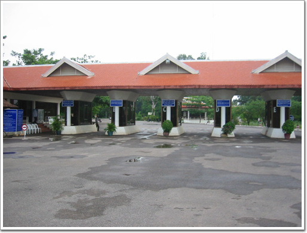

-자전거로 온 앙코르와트 유적지 입구

마지막 날이고 하여, 앙코르와트를 다시 한번 보기로 하고, 앙코르와트에 다시 들어갔다.

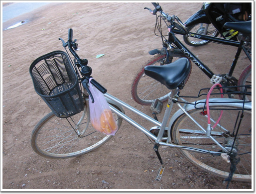

-자전차는 입구에 이렇게 주차해 놓고.. 빵은 들고 들어갔다.

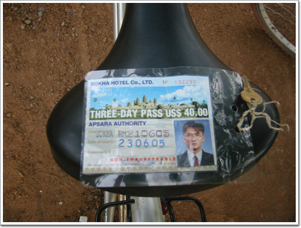

-앙코르와트 유적 3일 패스. 저렇게 생긴 것을 들고 다녀야 한다.

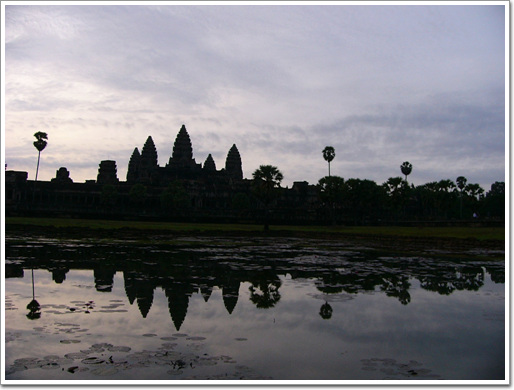

-사진에서 많이 보던 구도.호수에 비친 왕코르와트

06시 50분.

왕코르와트에서 다음 목적지 프레아칸으로 향했다.

프레아칸은 바이욘의 북쪽에 있는 사원이다.

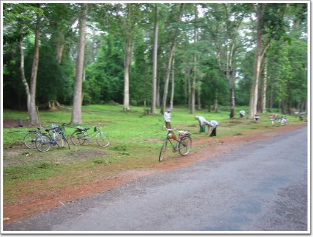

-바이욘에서는 풀베기가 한창이다.

-바이욘 북문을 통과할 때, 해자에서는 고기 잡는 듯한 사람이 보인다.

-바이욘 북문.

-바이욘에서 나가는 길이다. 역시 '젖의 바다 휘젓기'가 도열해 있다.

-바이욘북문에서 프레야 칸으로 가는 길은 한적했다.

특히 자전거로 가니, 귀가로 들리는 바람소리와, 밀림의 나무 향기 등이 그대로 느껴지는 것이 좋았다.

-프레아칸입구에 자전거를 주차하고 들어간다.

-프레아칸입구.

이 사원도 역시 12세기에 지어진 것으로 자야바르만 7세가 아버지를 위해서 지은 사원이라고 하더군.

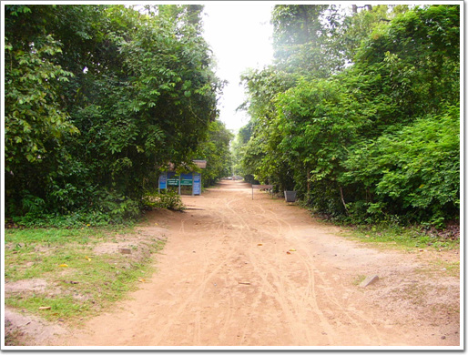

\- 입구를 통과하고 나면, 곧장 사원 내부가 나오는 게 아니라, 밀림을 좀 가야한다.

\- 밀림 옆에는 아직 복원을 기다리는 유적이 있다.

이런 길로 가보고 싶은 욕구를 느낀다.

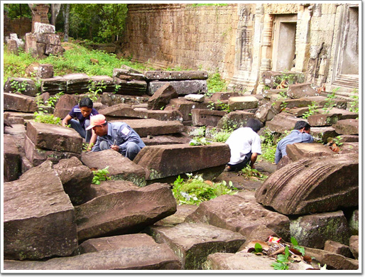

\- 여기도 한창 풀뽑기 작업중.

\- 무너진 사원벽.

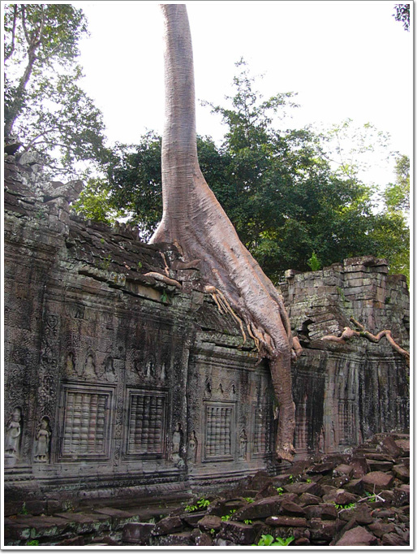

\- 거대한 공룡모양 나무가 사원벽을 짓밟고 있는 모습이 무서워보이기까지 한다.

\- 공룡 모양 나무앞에서 잠시 쉰다.

\- 입구로 다시 나오니, 유해교반을 복원하는 중이군.

\- 복원하는 모습을 직접 보니, 역시 그리 쉽지 않은 작업이군.

아직까지 복원을 다 못한 이유를 알 수 있을 것 같다.

\- 프레아칸으로 프레삿칸으로 이동하는 중.

도로를 말끔이 청소하는 인부들.

가난한 캄보디아이지만 이 왕코르와트라는 훌륭한 유산으로 인해,

덕분에 많은 일자리가 있다는 것이 다행이다.

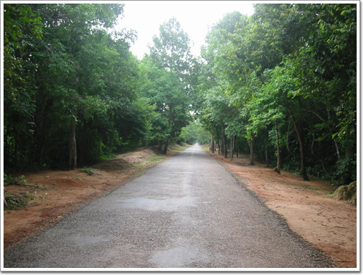

\- 사람들이 그리 많이 찾지 않는 곳인지, 한적하다.

특히 자전거로 가니, 밀림의 향기와, 바람을 온 몸으로 느낄 수 있어 더욱 좋았다.

\- 프레삿칸으로 가는 길은 비포장.

내가 좋아하는 길이지..

\- 비포장을 조금 가니, 초원이 펼쳐져 있다.

\- 옆에 프레삿칸이 있었지만, 이 길은 끝은 어딘가 싶어 계속 갔다.

한 20여분 가도, 길이 끝이 안보여, 다시 돌렸다.

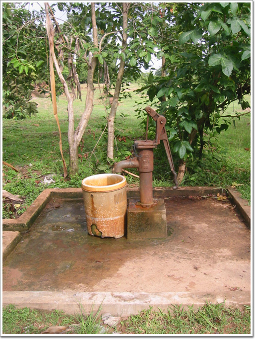

\- 프레삿칸의 유일하게 제대로 된 시설.

복원될려면 아직 차례가 많이 남았나 보다.

프레삿칸에 이어 다음으로 간 니크삐안.

\- 니크삐안의 입구에는 역시 관광객들을 기다리는 상점들이 쭉 모여있다.

그런데 관광객이 나 혼자군.

\- 원래 저수지 중간에 있었던 사원인데, 지금은 물이 없어, 이렇게 모습이다.

\- 역시 풀뽑는 사람.

프레삿칸에 이어, 크롤코와 타솜으로 갔다. 유적들이 계속 모여 있다.

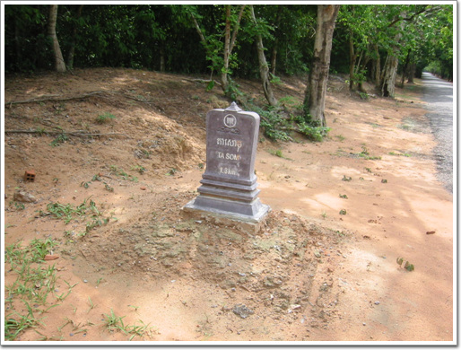

\- 타송까지 1.5 km.

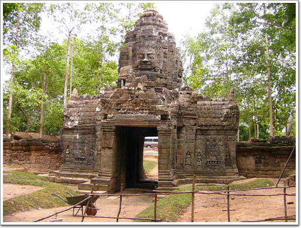

\- 타솜 입구. 참파속을 물리친 후, 왕이 아버지를 기리기 위해 만든 사원이라고 한다.

복원중인지, 입구로 들어올 수 없고, 옆 허물어진 벽으로 돌아 와야 했다.

\- 타솜 벽면의 풍만한 압살라. 천년을 저 벽속에서 있었겠군.

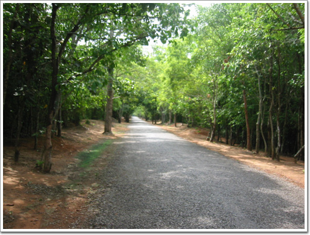

\- 동메논으로 가는 길. 자전거만이 느낄 수 있는 이 여유로움.

\- 가다가, 이렇게 아무데도 멈추고 쉴 수도 있다.

\- 도중에 이런 샛길도 보이는데, 한번 가보고는 싶은데, 괜히 갔다니 탈진할까봐 입맛만 다시고 포기.

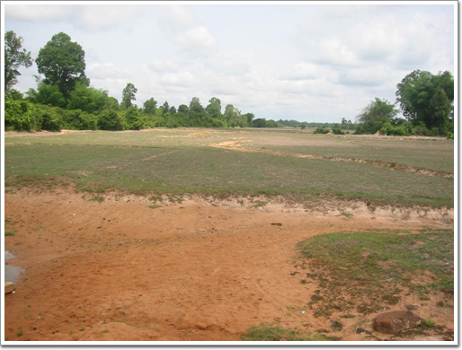

\- 아마도 농사를 짓고 있는 경작된 흔적이 보이는 토지다.

\- 동메논이다. 프레룹과 비슷하게 생겨 찾아보니, 프레룹보다 9년전에 생긴 유적이라 한다.

\- 이곳에서 관광객이 몇명 보인다.

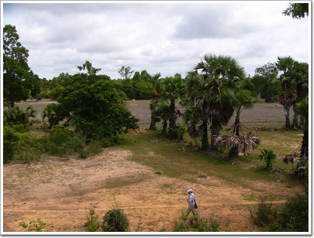

\- 좋은 사진 구도를 위해 땡볕에 밑에까지 내려간 관광객.

\- 이곳에 나비가 많았다.

여러나비가 날라다니는 모습이 환상적이었는데,

막상 정지사진으로 보니, 내가 보던 모습으로 안 느껴지는군.

\- 이건 우리나라에서도 많이 보던 나비같은데..

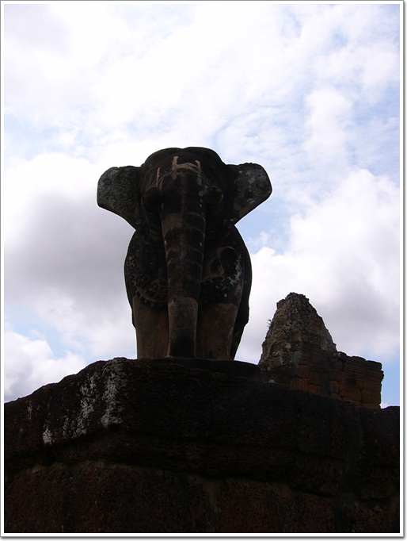

\- 동메논의 코끼리상.

앙코르와트가 불교유적임에도 불구하고 코끼리 보기가 힘들었는데, 코끼리가 여기에 있었군.

\- 사진전공 커플이 여기서 다시 만났다.

자전거로 돌아다니고 있는 나를 보며, 훌륭한 체력을 지녔다고 칭찬해준다.

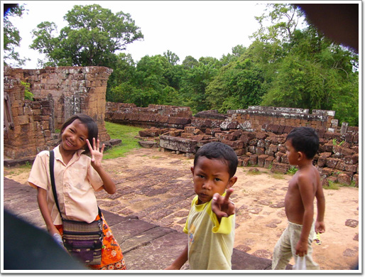

\- 동메논에서 만난 앙코르의 아이들.

내게 다가와 볼펜있으면 주라.

나 학교가는데 볼펜이 필요하다.

밴드있느냐 물어보며, 가지고 있던 밴드를 보여주며 있으면 달라고 하더군.

우리나라돈 300원도 꺼내면서 이것을 캄보디아 돈으로 바꿔주라고도 하며 유창한 영어실력을 발휘하더군.

내가 먹고 있는 매운맛버터구이오징이를 주었더니, 좋아하면서 이렇게 사진 포즈까지 취하더군.

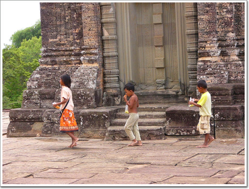

\- 내게 얻을 것을 얻었는데 다음 타겟을 향해 가는 모양이다.

저 세명이 남매인가 보다.

누나로 보이는 여자애가 뭔가 획득하면 뒤의 두명의 동생들에게 나눠주고 그러더군.

바이욘 북쪽 지역의 유적을 다 보고, 바이욘으로 들어가기로 했다.

\- 이 애들은 학교에 다니는 애들인가 보다.

교복을 입고 하교중인 것 같다.

\- 바이욘까지 3km. 현재 위치는 스라스랭.

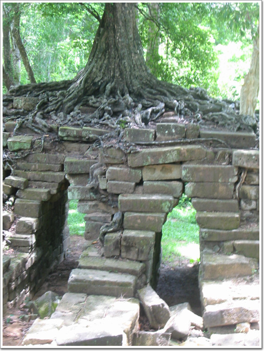

\- 가는 길에는 유적을 깔고 있는 나무들이 보인다.

이젠 하도 많이 봐서 그런지 무뎌지는군.

\- 이곳은 크레인까지 동원하여 한창 복원중이군..

\- 통마논.

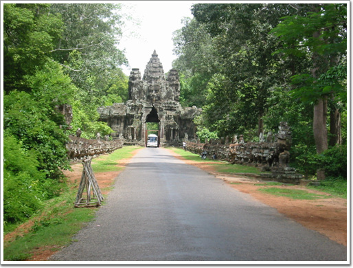

\- 앙코르톰 동문.

승리의 문이라 한다.

\- 바이욘앞에서 코코넛으로 몸에 수분 보충중.

코코넛의 비린맛으로 그리 좋아하지는 않지만, 그래도 이게 제일 몸의 수분 보충이 제일 잘 되는 것 같긴 하다.

\- 3일간의 앙코르 관람을 마치고 시엠립 숙소로 복귀한다.

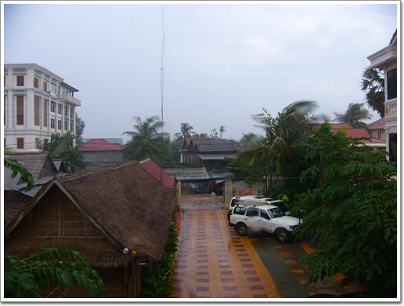

\- 숙소에서 들어오고 나니, 비가 온다.

어찌나 더운 날씨인지, 비가 와도 전혀 시원하지는 않다.

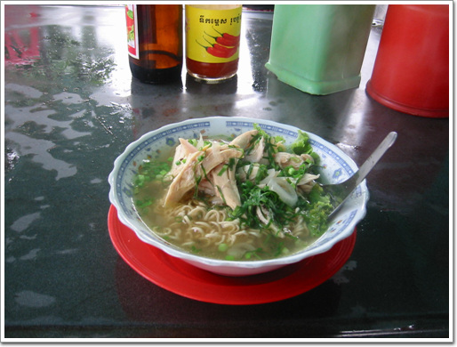

\- 점심은 노점에서 치킨누들.

그냥 라면모양보고 손가락을 가리키니 이것을 주더군.

아주 맛있었다.

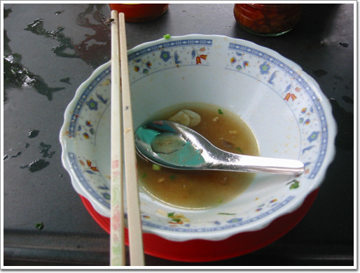

\- 국물까지 싹싹. 아 맛있는 것..

\- 밥도 먹었으니, 이제 시엠립 시내 정찰.

비오고 나면 길은 진흙으로 바뀐다.

자전거로 타고 있으니 이런 길도 아주 편안하군.

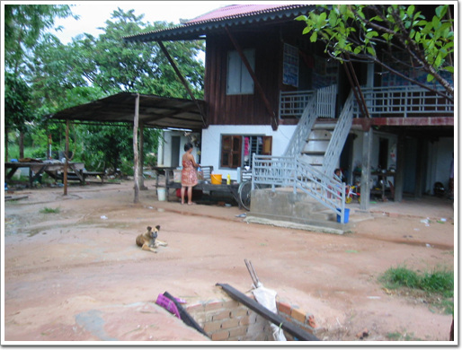

\- 시엠립의 집.

아직은 옛날식 집이지만,

지금과 같이 발전하는 속도면 이런 집도 다 사라지고,

세계 어디를 가나 보이는 획일적인 모습으로 바뀌겠지..

\- 시엠립이 어찌나 좁은지, 20분만 가니, 그냥 시골이 나와버리는군..

\- 다시 시내로 들어왔다.

\- 많이 보이던 오픈카. 아마 수제차같은데, 나도 한번 타보고 싶어지는군.

하루종일은 자전거로 돌아다녔다.

솔직히 힘들긴 하다.

안그래도 더운 날씨인데, 특히 안장에 앉아 페달을 돌리다 보니, 안장과 닿는 살 부분이 땀과 축축한 옷과의 마찰로 그리 편안하지는 않지만, 그래도 자전거 투어 꼭 해 볼만한 것이었다.

#### 6/23(목) - 지출액 : 26,125

- 05:00 기상
- 05:40 ~ 06:30 자전거로 앙코르와트로 이동(대여로 1$는 chek out시 계산)
- 06:00 길거리에서 2,000R 짜리 빵 구매
- 06:30 ~ 06:40 앙코르와트 사진 촬영
- 06:40 ~ 06:50 아침식사 - 아침에 산 빵
- 06:50 ~ 07:30 앙코르와트->프레아칸
- 07:30 ~ 08:20 프레아칸 구경
- 08:20 ~ 08:40 프레삿 xx 구경
- 08:40 ~ 09:10 프레삿 -> 니크삐안
- 09:10 ~ 09:30 니크삐안 구경
- 09:30 ~ 09:50 크롤코 구경
- 09:50 ~ 10:10 크롤코->타솜
- 10:10 ~ 10:20 타솜구경
- 10:20 ~ 10:40 타솜->동메본
- 10:40 ~ 11:10 동메본 구경
- 11:10 ~ 11:40 동메본->톰마논
- 11:40 ~ 12:00 톰마논->승리의 문
- 12:10 ~ 12:15 바이욘 앞 매점에서 코코넛 1$
- 12:15 ~ 13:00 숙소로 복귀
- 13:00 ~ 15:30 숙소에서 샤워 및 휴식 ( 비가 많이와 잠잠해지기를 기다림 )
- 15:30 ~ 16:00 우산들고 나가 망고 4Kg(4$)와 치킨누들(3,000R) 먹고 옴
- 16:00 ~ 18:20 자전거타고 시내 구경, 올드마켓에서 와트모형 3개 9$ 구매
- 18:20 ~ 19:00 숙소에서 휴식
- 19:00 ~ 19:10 식당으로 이동
- 19:10 ~ 21:30 사진전공 커플과 저녁식사 ( 스테이크, 볶음밥, 샥스핀, 맥주 6$ - 18/3 )
- 21:30 ~ 21:40 식당->숙소 ( 이동중 압살라담배 10개 구매 2.5$ )
- 21:30 ~ 22:50 샤워 및 빨래

