# 앙코르와트 1일차

앙코르와트 사원은 특히 새벽에 해뜨는 일출이 가장 명장면이라고 들었다.

그래서 관광 1일차에 이 일출을 보기로 했다.

05:00 기상.

시계를 잘못 맞춰놨는데도 이 시간에 눈이 떠졌다.

한국과의 시간차가 2시간이라, 한국시각 07시.

저절로 일어날 만한 시각이군.

숙소에서 앙코르와트까지는 10여킬로미터.

교통수단은 툭툭.

2명 기준 하루 요금이 8$인데, 나는 대학생커플과 같이 움직이기로 하여 세명이라 9$로 하였다.

요금자체는 어느정도 흥정이 되는 것 같기도 하더군.

길거리에 나가서 툭툭을 잡으면 보통 두배 부른다.

같이 왔었던 사진전공 커플은 이전에 오토바이택시로 알던 사람을 만나 하루 7$로 했다는군.

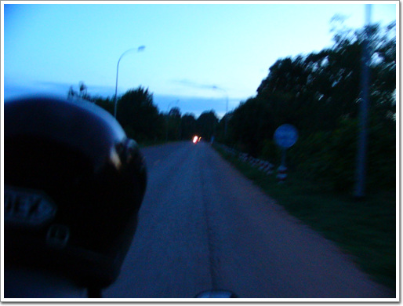

\- 05:30 앙코르와트를 향해 출발. 해가 곧 뜰 참이군.

\- 앙코르와트 유적지 매표소. 하루 20$, 3일 40$ 길래 3일 40$ 짜리 티켓을 끊었다.

06:00 앙코르와트 입구 도착. 벌써 해가 뜨고 있군.

\- 우기라 구름이 조금 해를 가렸다.

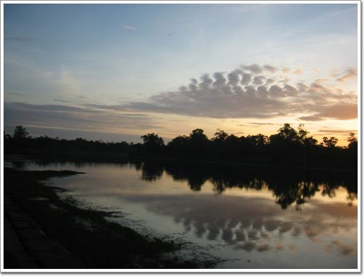

\- 사원 주위를 감싸고 있는 해자라고 하는 인공 호수위에 비치는 맑은 하늘이 인상적이었다.

\- 여행기에서 그렇게 많이 봤었던 모습. 왕코르와트

\- 모든 유적지 입구에는 관리원이 있어, 이렇게 티켓을 검사한다.

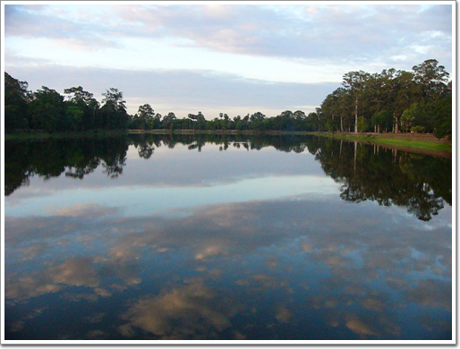

\- 해자에 비친 하늘. 본래의 하늘보다 물에 하늘에 오히려 더 나은 듯..

\- 사원의 문을 지나자 길게 본당으로 이어진 길이 있고, 길 좌우로 기다란 뱀이 지키고 있다.

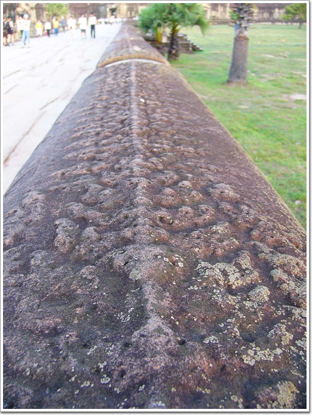

\- 뱀의 긴 등허리는 일일히 다 조각이 되어 있었다.

\- 아마 앙코르와트 복원전부터 있었을 나무. 나무 위가 조금 이상하길래 유심히 살펴보니,

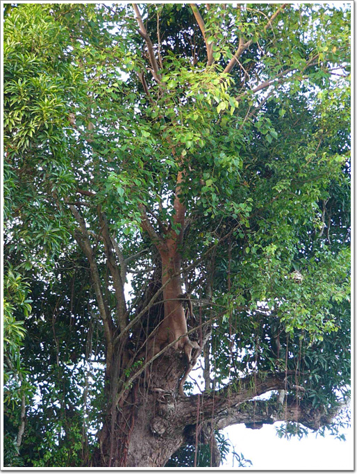

\- 나무 상단에 다른 나무가 뿌리를 박고 자라고 있군. 무서운 나무다.

\- 앙코르와트사원 2층으로 가는 계단. 우기임에도 오전에는 꽤 맑은 날씨다.

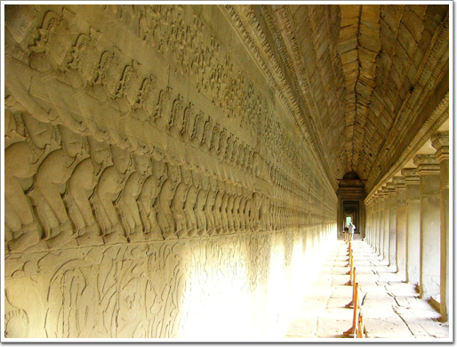

\- 사원의 모든 벽에는 이렇게 부조가 세밀히 조각되어 있었다.

이 부조는 '젖의 바다 휘젖기'라는 힌두신화란다.

태초에는 신들도 영원한 생명을 갖지 못하고 있었는데,

신들과 악마가 상호 동맹을 맞고 생명의 원친인 젖의 바다를 휘저어 불로장생약을 만들었다는 내용이라는군.

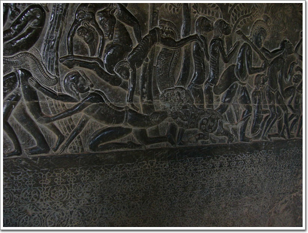

\- 다른 쪽 벽에는 힌두교에서 말하는 지옥이 그려져있다.

다리를 물어뜯는 사자라든가 몽둥이로 두들겨 맞는 사람들의 모습이 보이는군.

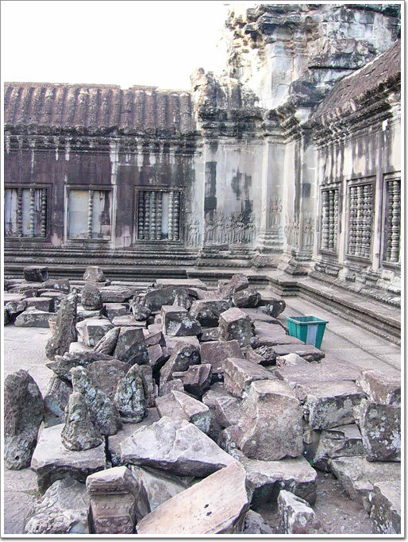

\- 가장 잘 복원되었을 유적임에도 불구하고 아직 제 자리를 잡지 못한채 기다리고 있는 조각들이 널부러져 있다.

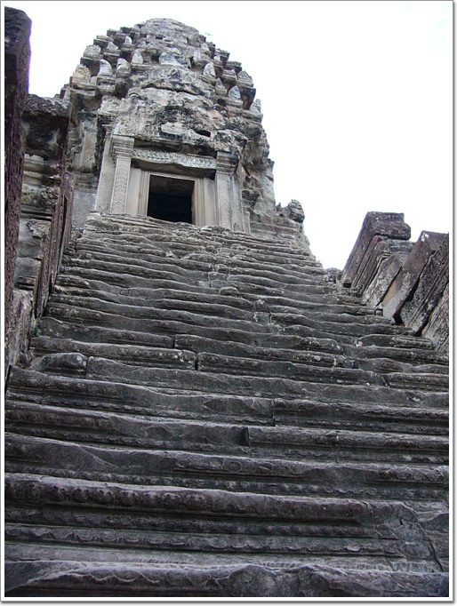

\- 앙코르와트의 중심 3층으로 올라가는 길. 신의 보폭으로 만든 계단이라 상당히 가파르다.

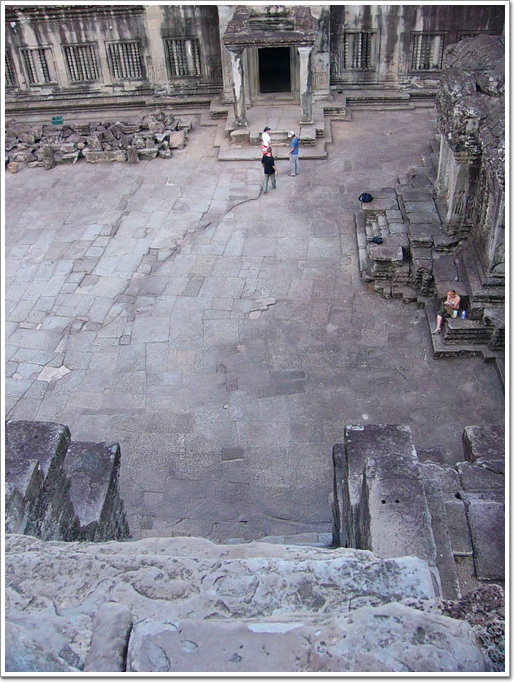

\- 위에서 봐도 거의 밑이 바로 보인다.

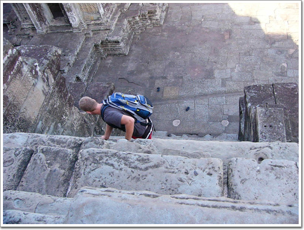

\- 올라가거나 내려갈때도 대부분 이렇게 네발로 오르내린다.

\- 사원의 각 귀퉁이에 있는 부처상. 이 상이 가장 온전한 모습으로 잘 보존되어 있는 듯하다.

\- 8시가 되어 복원작업 시작하러 출근한 사람들.

앙코르와트를 본 후 다음으로 간 곳은 앙코르 톰.

앙코르톰은 우리나라로 치면 경복궁정도 되는 것 같다.

왕궁에 그에 딸린 여러 시설들이 있는 곳이다.

\- 앙코르톰의 남쪽 문. 다리 주위로 '젖의 바다'를 휘저으러 뱀을 잡고 있는 신들과 악마들이 있다.

\- 앙코르와트와는 달리 이곳의 해자는 물이 말라 있었다.

\- 4면체의 얼굴을 가진 남문.

08:40 남문을 통과한 후 우리가 간 곳은 아침을 먹기 위해 식당.

\- 시원한 수박쥬스 1$. 덥고 목마를땐 이 이상 더 좋은 게 없다.

\- 아침식사 빵과 오믈렛. 가격은 1.5$

\- 내가 타고 온 툭툭. 오토바이는 자랑스런 메이드인코이라 대림 씨티100.

아침식사를 한 후 다시 관람을 시작했다.

09:30 비이욘부터 구경 시작.

\- 여러개의 얼굴이 있는 바이욘. 신들의 신전이다. 사원중에 이 사원이 가장 웅장한 것 같다.

\- 이 역시 다 복원되지 못한 채 무너져 있는 벽면

\- 앙코르의 미소라 불리는 얼굴. 바이욘의 요소 곳곳에 이 얼굴이 그윽한 미소를 보내고 있었다.

\- 바이욘 구경후 다음으로 간 바푸온.

시바신에서 바쳐진 사원으로, 내부의 부조가 멋지다고 하던데, 현재 공사중으로 내부로는 들어갈 수 없었다.

구경할 것이 많기에 열심히 부지런히 돌아다녔다. 다음은 피미아나까스. 바푸온에서 5분 정도 걸으면 있었다.

\- 머리 9개 달린 뱀여신이 살았다는 전설이 있는 피미아나까스. 꼭대기에 누가 앉아 있다 보니,.

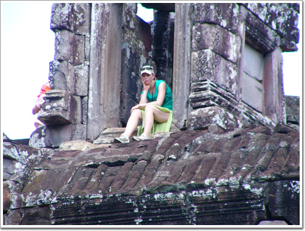

\- 이 여인이 앉아 있군.

왕은 인간의 여인과 잠자리를 하기 전 반드시 이 뱀여신과 동침하여야면 죽지 않을 수 있었다고 한다.

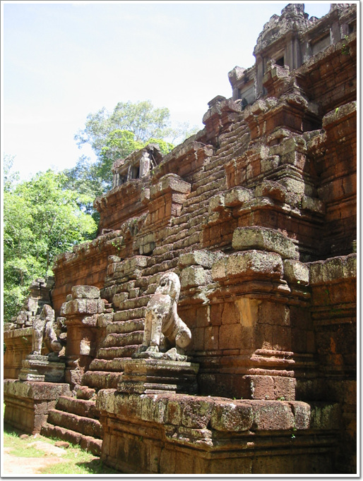

\- 매일 밤이면 어두컴컴한 밤중에 이 가파른 계단을 오르내렸다는 것을 미루어짐작하건데, 크메르제국의 왕은 뛰어난 야간시력을 가졌음을 알 수 있다.

\- 여기서 다시 만난 사진전공 커플. 이곳저곳을 찍느라 바삐들 움직인다.

\- 꽤나 특이한 여자. 저런 포즈로 30여분을 서있더군. 전생이 뱀여신이였나?

\- 다음은 프레아 빨리라이.

불교사원으로 부처님을 모셨던 사원이라 한다.

사원보다 더 커버린 나무가 이곳이 밀림이구나를 느끼게 해준다.

\- 사원에 뿌리를 박고 있는 나무들이 이렇게 빨간 글씨로 번호를 매겨 관리를 하나 보다.

\- 캄보디아에서의 군것질. 이번에 파인애플.

1$다.

태국에 비해서 싼 편은 아니다.

파인애플 군것질로 원기회복을 한 후, 테라스쪽으로 갔다.

\- 왕이 전투지휘검열을 했다고 하는 단상이다.

\- 단상에서 빼곡히 조각이 되어 있군.

저 앞의 여인을 보니 아까 피미아나까스에서 30여분간 서 있던 여인이로군.

짐꾼을 샀는지, 자기는 빈손으로 다니고, 옆에 한 남자가 가방을 메고 따라다니더군.

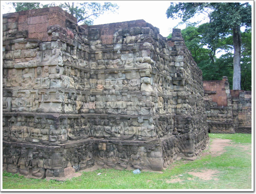

\- 단상에 조각된 부처상들.

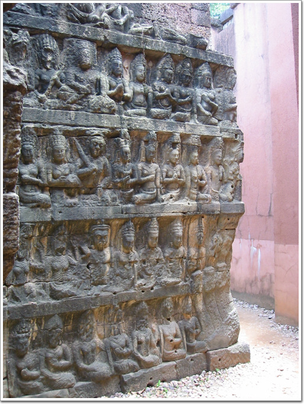

\- 이 역시 상당히 정교하게 조각이 되어 있다.

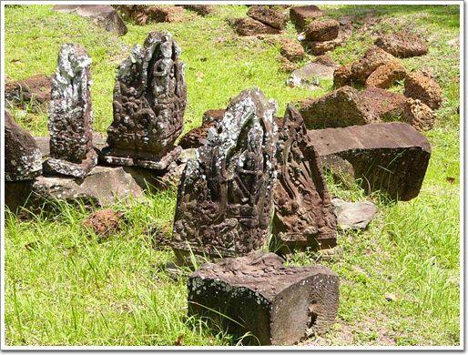

\- 여기 잔디밭에서도 널부러져있는 유적들. 발에 채이는게 유적이다.

\- 단상에서 정면에서 보였던 탑.

프라삿 수오르 프랏이라고 하는 것인데, 숲을 배경으로 12개가 나란히 서 있다.

크메르제국시절 이곳을 찾았던 원나라 사신 주달관 기록에 의하면,

이것은 재판정으로 원고와 피고를 각각의 탑에 감금하여 며칠 후,

나왔을 때 아픈 쪽이 유죄라고 하였다고 한다.

참으로 명쾌한 판결이 아닐 수 없다.

대학생커플과 다시 만나기로 한 시각이 14시.

접선 장소 식당앞으로 가니, 대학생커플은 벌써 지쳤는지 그만 보고 숙소로 가자고 하더군.

요즘 젊은 사람의 체력이 많이 약해졌다는 말이 거짓은 아니었군.

반나절 보고, 벌써 뻗다니.. 쯧쯧.

어르고 달래, 숙소가서 샤워만 하고 나와 다시 구경하자고 말하고, 우선 숙소로 같이 갔다.

15:30 숙소에서 샤워와 기타 휴식을 취한후, 다시 앙코르와트 유적지로 향했다.

곧 해가 저물시각이라, 유적은 두개만 보기로 했다.

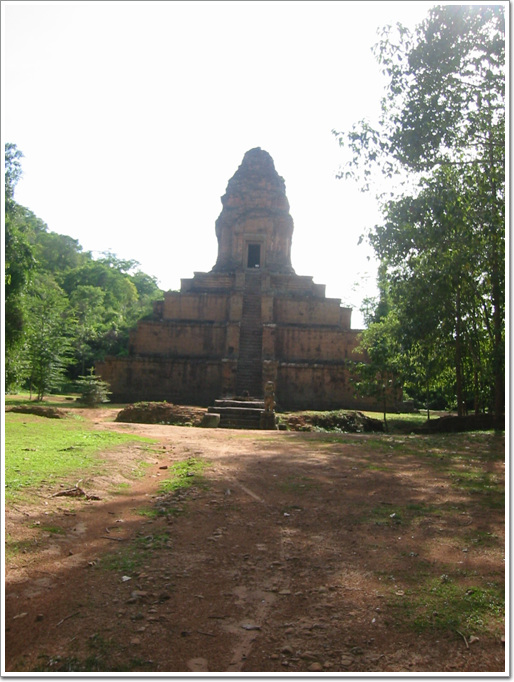

\- 바이욘 앞의 피라미드형 사원. 이곳은 그리 유명하지 않아서인가, 사람은 없었다.

17:00 석양으로 유명한 프놈바켕에 올랐다.

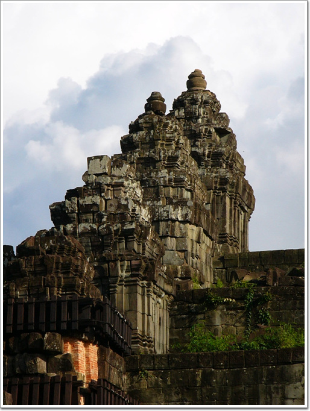

\- 프놈바켕. 이 사원은 앙코르와트유적지에서 가장 높은 언덕에 위치하고 있다.

\- 이 언덕에 오르니, 이쁜 꽃들도 있고,

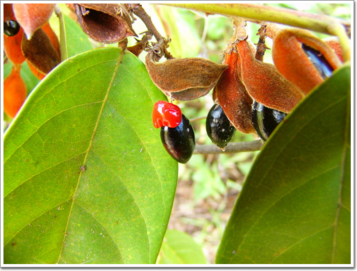

\- 먹음직스런 열매도 있군.

\- 다른 곳과 마찬가지로 올라는길 자체는 그리 평탄하지는 않았다. 이길이 가장 험한 길.

\- 프놈바켕은 코끼리로도 올라갈 수 있다. 올라가는데 10$. 꽤 비싸군.

\- 계단을 오를때는 마찬가지로 네발로.

\- 정성에 오르니, 아침에 봤던 앙코르와트 사원이 한눈에 내려다 보이는군.

\- 석양을 보러 올라왔느데, 불길하게 검은 구름이 몰려온다.

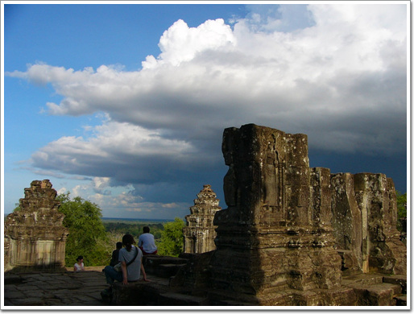

\- 점점다가오는 모습이 심상치는 않다.

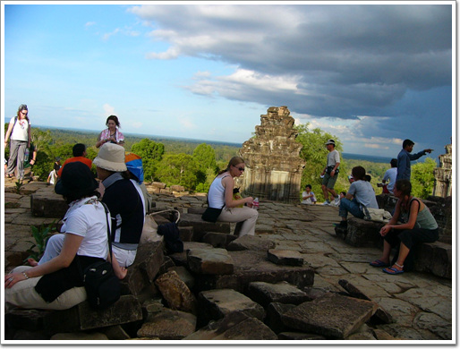

\- 석양으로 가장 유명한 곳이라 해가 저물 시각이 가까울수록 사람이 늘어난다.

\- 석양을 기다리는 여인1

\- 여인2, 3

\- 구름이 다가옴에 석양을 못 보는게 아닌가 걱정하는 사람들.

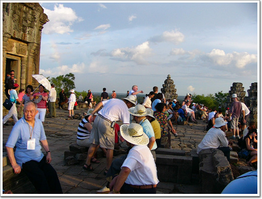

\- 이제 해지기 카운트다운. 자리도 그늘에서 일어나 서쪽으로 갔다.

\- 내가 앉은 자리. 정 서쪽 방향

\- 구름에 해지는 모습은 볼 수 없었지만, 그래도 우기에 이정도라도 어딘가..

\- 다들 석양을 향해 셔터를 연신 눌러댄다.

\- 깜깜해지면 그나마 내려오기조차 힘든 계단을 서둘러 열심히 내려가는군.

\- 프놈바켕을 내려간다. 왕코르와트 1일차도 이걸로 끝.

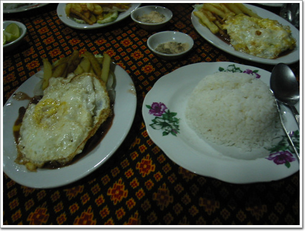

\- 저녁은 숙소에서 소고기 덮밥을 먹었다. 1.5$인데 상당히 맛있었다.

어제샀던 망고스틴가 람부탄에 어제 다 먹어치웠기에, 또 망고스틴을 사러 갔다.

이번에 산 것은 4Kg.

좀 여유있게 먹을 수 있겠다.

#### 6/21(화) - 지출 64,625원

- 05:00 기상
- 05:30 ~ 05:50 앙코르와트로 이동 ( 툭툭 ), 3일입장권 40$
- 06:00 ~ 07:30 앙코르와트 구경
- 07:30 ~ 08:30 늦게 나오는 커플 기다림
- 08:30 ~ 08:40 앙코르톰으로 이동
- 08:40 ~ 09:30 아침식사 ( 수박쥬스 1$, 오믈렛 1.5$ )
- 09:30 ~ 14:00 바이욘->바푸온->삐미아나까스->왕실연못->쁘레야->팔리라이왕->멤쁘레남->이중성벽->라이왕과 코끼리 테스트->쁘라삿 수오르 쁘랏(탑) 관람
- 14:00 ~ 14:30 숙소로 이동 ( 커플이 구경 그만하겠다고 함 )
- 14:30 ~ 15:30 샤워 및 휴식
- 15:30 ~ 16:00 숙소->앙코르톰
- 16:00 ~ 16:30 바이욘 앞 피라미드 구경
- 16:30 ~ 17:00 프놈바껭에 오름
- 17:00 ~ 18:10 프놈바껭 구경 및 석양을 기다림
- 18:30 ~ 19:00 앙코르톰->숙소 ( 툭툭 비 - 9$ )
- 19:00 ~ 20:00 숙소 식당에서 저녁식사 ( 수박쥬스 1$, 소고기덮밥 1.5$ )
- 20:00 ~ 20:40 물 2개(2.75$)와 망고스틴 2Kg(2$) 구입
- 20:40 ~ 22:00 빨래 및 샤워
- 22:30 취침

