# 성남시립식물원으로 단풍 구경

단풍구경의 절정의 시기.

멀리 강원도까지 단풍 구경가기는 힘들고 하여 근처로 단풍 놀이 가려 했다.

목적 장소는 남한산성.

나 같은 생각을 가진 사람이 한 둘이 아니었다.

남한산성 올라가는 근처부터 차가 정체였다.

한 20분 정도 도로위에 있다가, 차를 돌렸다.

성남시립식물원으로 갔다.

차는 은행근린공원쪽 주차했다.

성남시에 살면서도 성남구시가지는 거의 가 본 일이 없었다.

구시가지에 대한 생각은 조정래의 '한강'과, 임미리의 '경기 동부' 책을 보고 나서 많이 바뀌게 되었다.

60년대 후반 도시철거민 12만명의 힘든 삶과, 박정희정권 최초의 지역 봉기인 8.10 광주대단지 사건.

아직도 그 때의 난개발 흔적과, 산 중턱까지 집들이 위치한 것을 보며 다시 그 책들을 읽었을 때의 느낌이 생각난다.

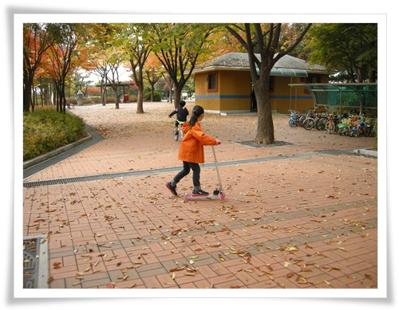

\- 은행근린공원.

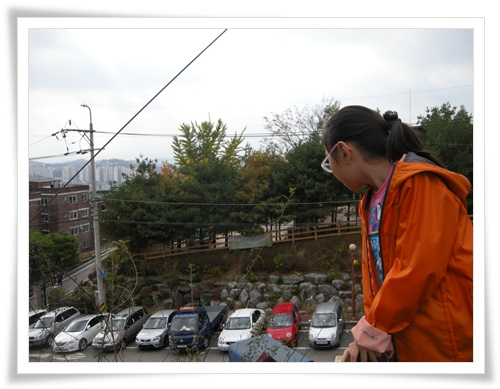

\- 은행공원에서 바라본 저 앞이 성남시립식물원.

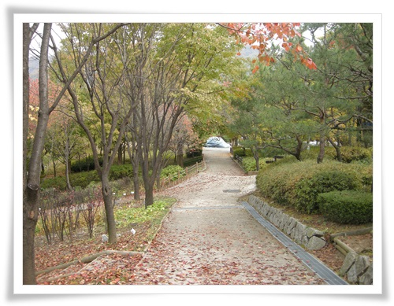

\- 한적하니 좋다.

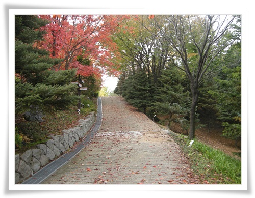

\- 단풍도 들어, 오히려 남한산성보다 여기 오길 잘 했다는 생각이 든다.

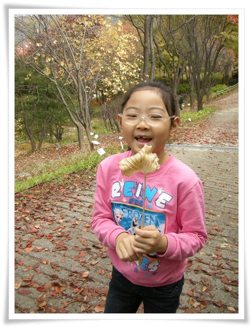

\- 시들어빠진 풀잎 쥐어 들고 좋아하는 딸내미.

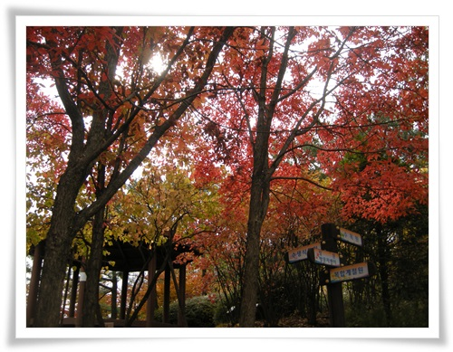

\- 여기는 단풍이 제대로 들ㅇㅆ다.

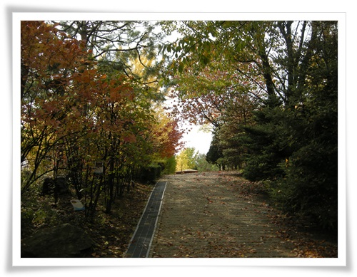

\- 정상쪽으로 가는 길.

\- 노란 은행잎과, 붉은 단풍, 그리고 맑은 가을 하늘이다.

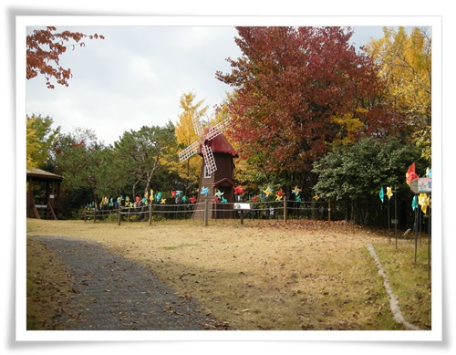

\- 식물원 중앙 매 높은 곳에 있는 풍차.

가을이라서 더 운치있어 보인다.

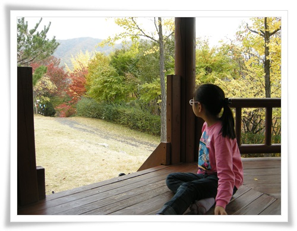

\- 정자에 앉아, 멀리 남한산성을 본다.

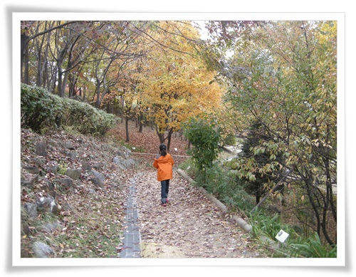

\- 낙옆쌓은 길 산책.

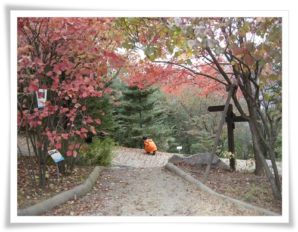

\- 길고양이 하나 발견하고서 구경하고 있는 딸내미.

\- 아담한 호수.

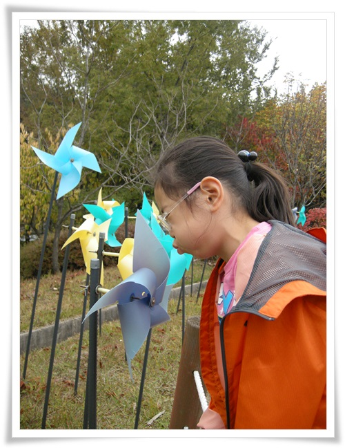

\- 큰 바람개비를 입바람만으로 불어보려 시도하는 딸내미.

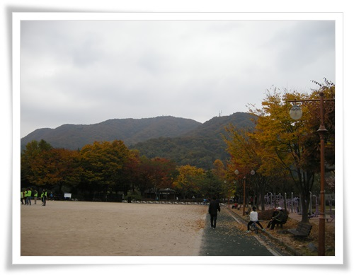

\- 다시 남한산성이 보이는 공원으로 와 차 쪽으로 가는 중.

