# 문배마을 가다

5월. 1년중 제일 놀기 좋은 달이라 할 수 있을 것이다. 밝은 초록색으로 푸르른 달이라, 숲으로 가고 싶은 달이다.

어디로 놀러가볼까 하다가 결정한 곳이 문배마을.

위치는 경강역와 강촌리조트 뒷쯤에 있는 마을이다.

문배마을 가는 길은, 임도로 비포장도로라 운전하는 재미가 있는 길이다.

이번 여행의 멤버, 수열과 상민.

수열은 새벽까지 술마시다 아침 6시 반에 나에게 픽업되어 내 차에 태워졌다.

가는 길은 그냥 경춘국도로만 가면 심심할까봐, 양평군 옥천면에서 설악면으로 넘어가는 유명산길을 택했다.

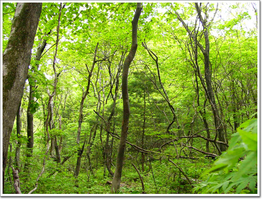

\- 유명산과 용문산 중간지점. 나뭇잎 빛깔이 이쁘다.

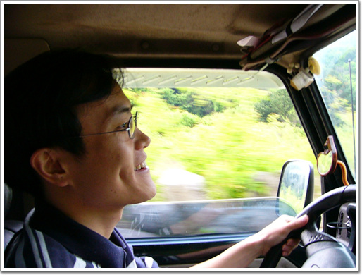

\- 상민에게 내 범퍼카 운전대를 잡게 하는 영광을 주었다. 신나하는 상민.

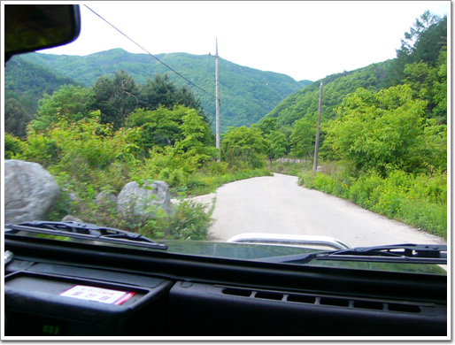

\- 어비계곡을 통해 설악면으로 가는 시골길.

역시 움직일 때는 아침 일찍 움직여야 한다. 아침 8시라 그런지 한가롭다.

설악면으로 나와 경강역으로 향했다.

경강역. 지난 겨울 거의 매주 오다시피 한 곳이다. 스키장 강촌리조트가 있기 때문이다.

스키장 올 때마다 경강역 뒷길로 주욱 올라가보고 싶었는데, 그러다 차 막히는 시간대에 서울 오르는 길을 택할 까봐, 그냥 서울로 오곤 했었다.

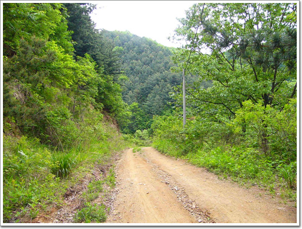

\- 임도다. 봄철 입산 통제기간이 5월 15부로 끝나 다행히 이 도로를 이용할 수있었다.

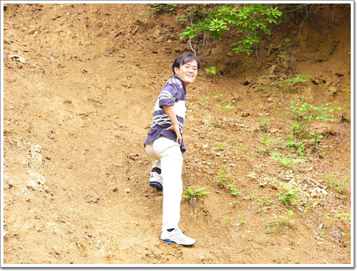

\- 복학생 상민. 엉덩이 쭉 내밀고 '나만의 센스!'를 외치는군.

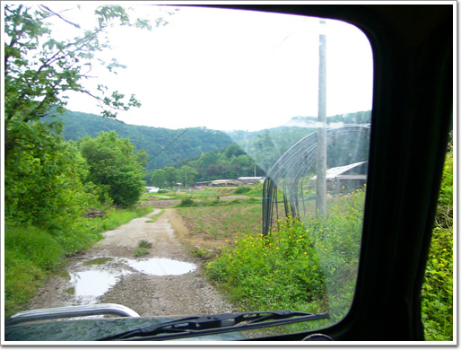

\- 한치령을 넘어 가정리로 왔다.

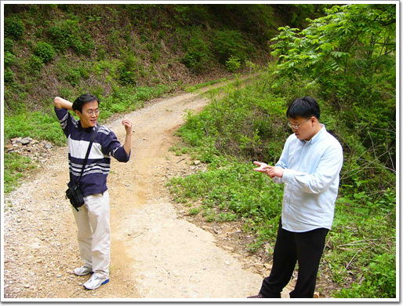

\- 다시 한치령에서 문배마을을 가는 길.

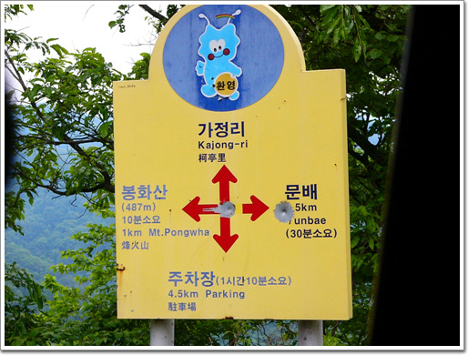

\- 산악자전거 도로로 주로 이용되어 표지판이 잘 되어 있다.

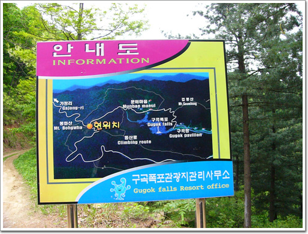

\- 안내도를 보니, 문배마을이 얼마 남지 않았다.

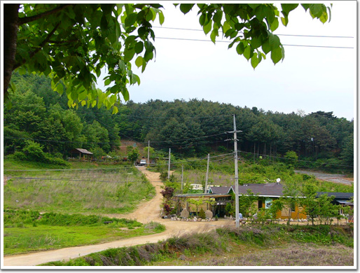

\- 문배마을 도착. 동네의 풍경이 좋다.

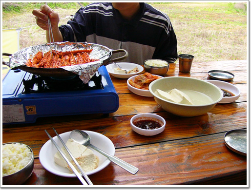

\- 식당에 앉아 점심을 먹는 중. 더덕구이 10,000. 순두부 5,000, 산나물지짐 5,000, 밥 세공기 3천원. 싼 가격은 아니다.

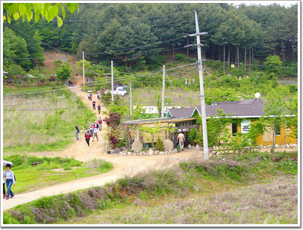

\- 밥을 먹고 있는데, 저 앞산에서 등산객이 계속 나온다. 식당 종업원에게 물어보니, 저 길로 20여분 가면 구곡폭포가 나온다는군.

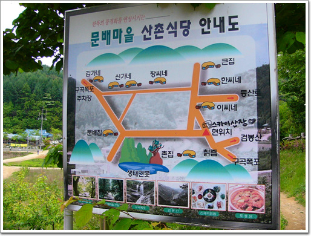

\- 문배마을 안내도. 동네 모든 집이 다 식당이다. 처음에는 이렇게 많아 장사가 될까 싶었는데, 점심때가 가까워오니, 사람들이 떼거지로 오더군.

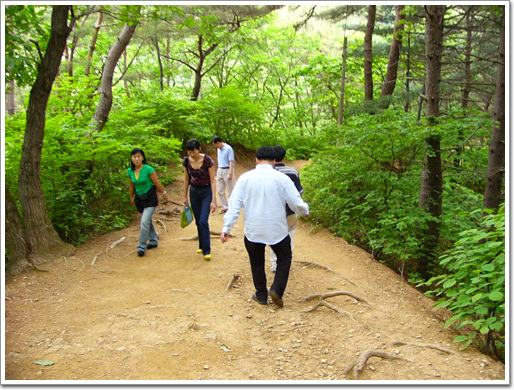

\- 구곡폭포 가는 길. 문배마을 높이 구곡포포보다 낮기 때문에, 이렇게 내려간다.

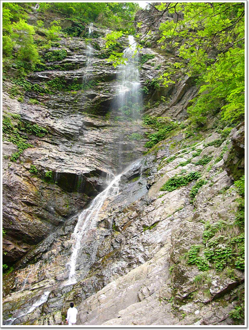

\- 구곡폰포에 3년만에 와본다.

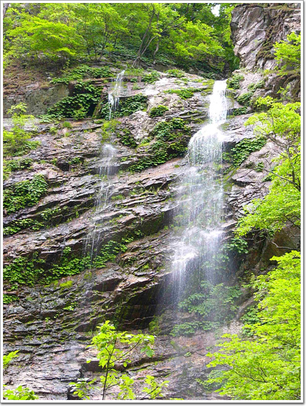

\- 물은 그다지 많은 편은 아니다.

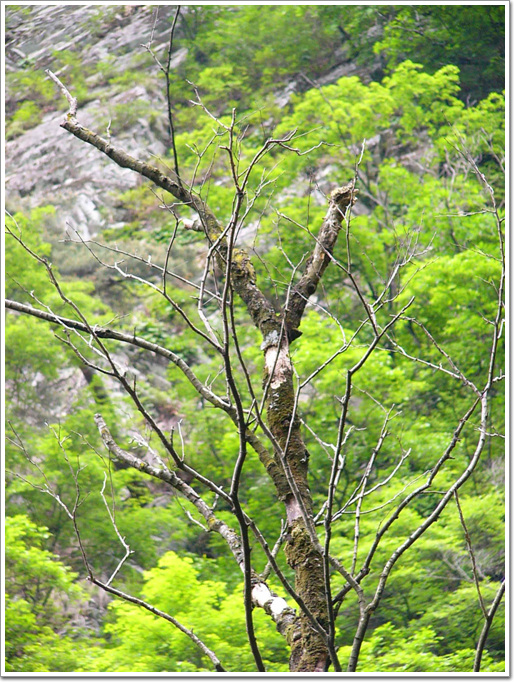

\- 중간에 서 있는 나무도 오히려 폭포보다도 괜찮게 생겼다.

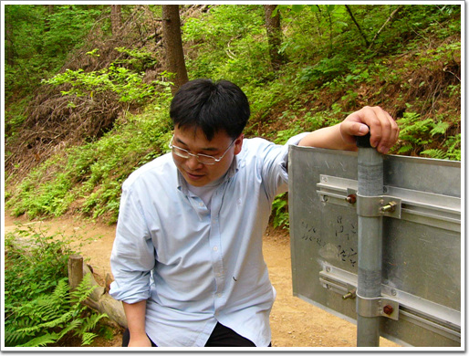

\- 힘들어하는 수열. 하긴 힘들겠지. 밤새 술마셨지, 잠은 못잤지..

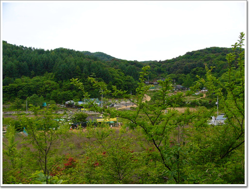

\- 구곡폭포를 보고 다시 문배마을로 돌아왔다.

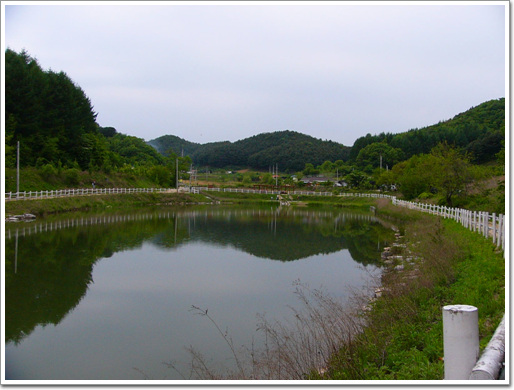

\- 문배마을에 있는 저수지. 갈수기에는 이 물을 흘려, 구곡폭포에 물이 흐르게 한다는군.

[null](../6166766.html#6166766_1)

