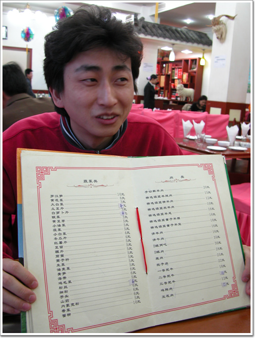
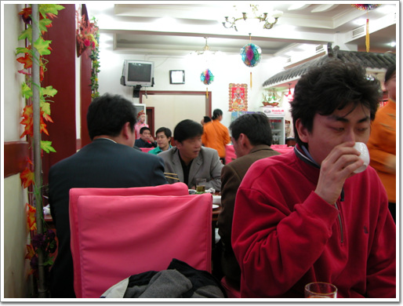
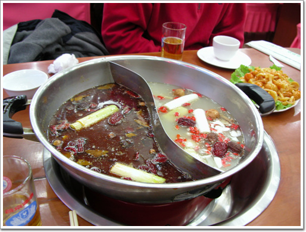
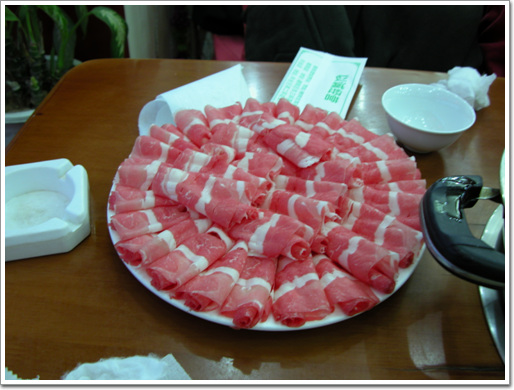
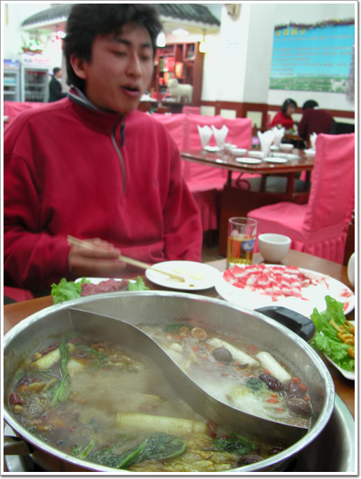
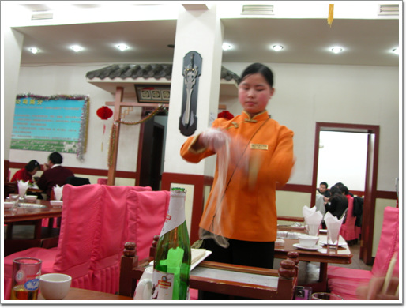
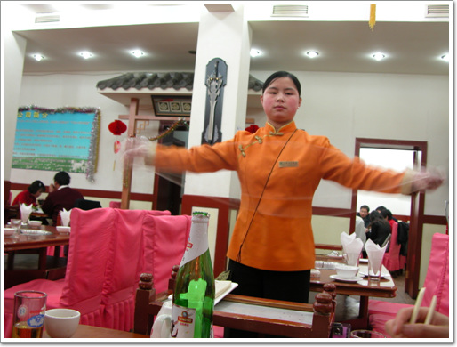
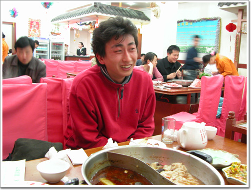
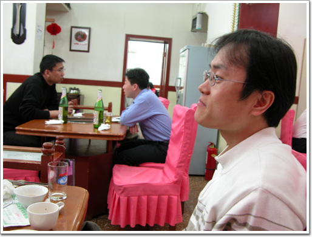

# 중국식 샤브샤브 훠궈

중국의 4대요리중 하나. 훠궈. 중국식 샤브샤브이다.

우리나에서는 비싸 감히 시도조차 할 수 없는 음식이다.

이걸 먹어보고자 그리 사람들을 선동하였는데, 개척정신 제로의 폴팀의 반대로 폴팀이 있는 동안은 전혀 먹어보질 못하다가, 폴팀이 미리 귀국하고, 심상민과 이재형, 그리고 나 이렇게 세명만 남아있는 목요일이 절호의 찬스였다.

회사 근처의 훠궈집으로 들어갔다.

혹시나 영어메뉴가 있을까하여 영어메뉴 있냐고 물어봤는데, 없단다.

그래 바로 이거다. 현지인들만을 상대하는 바로 이런 식당이 내가 원하는 바였다.

이제부터 안되는 중국어와 손짓발짓 섞어가며 음식 시키기 시작.

\- 중국온지 열흘만에 폐인이된 재형씨. 그림, 영어도 없어 한문이 가득한 메뉴에 놀란 이재형.

\- 고개를 들어, 다른 사람들이 어떻게 먹는지를 살펴보았다. 다들 맛있어 보이는 것을 먹더군.

한 주문에 10여분을 소요한 끝에, 결국 주문 들어갔고, 국물부터 나왔다.

\- 휘궈 시작. 크다. 온갖 한약재가 다 들어가 있는 그릇. 왼쪽이 매운 쪽, 오른쪽이 순한쪽.

\- 1등급 소고기 요리. 2인분을 시켰다.

\- 자 이제 국물도 끓기 시작하여, 고기 넣고 먹기 시작.

\- 면을 시키니, 즉석에서 면을 뽑아준다.

\- 훠궈에 반한 이재형.

\- 역시 훠궈에 아주 만족한 심상민.

3명이서 먹어 150원(우리돈2만원) 가량이 나왔다. 너무 많아 다 먹지는 못하고, 조금 남긴 상태다.

또 먹고 싶다.

[null](../6166816.html#6166816_1)

