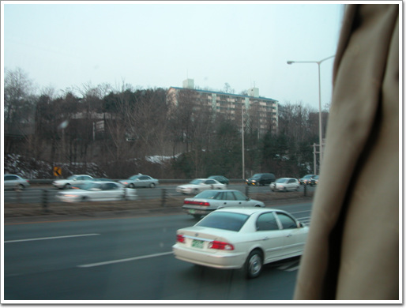
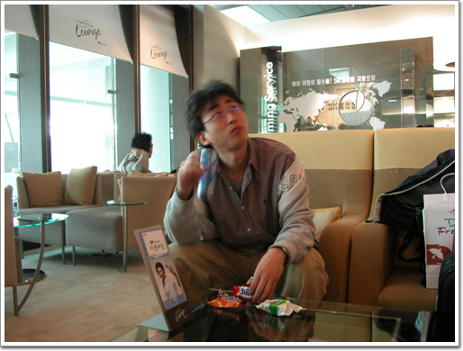
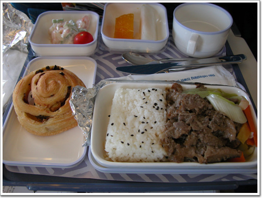
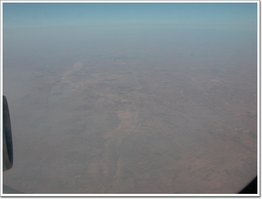
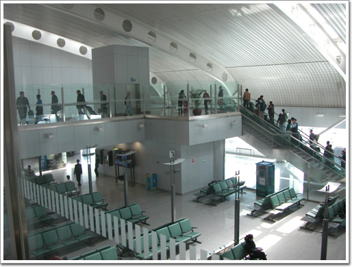
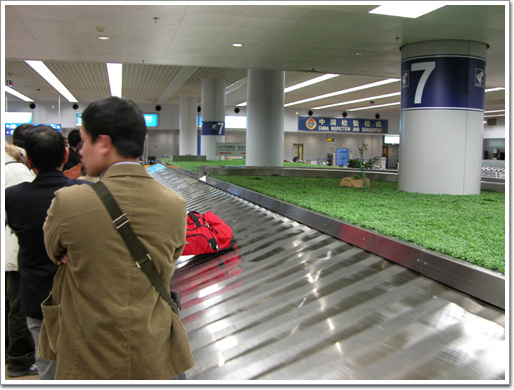
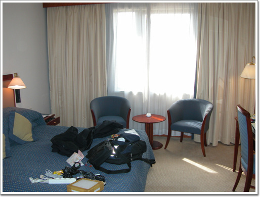
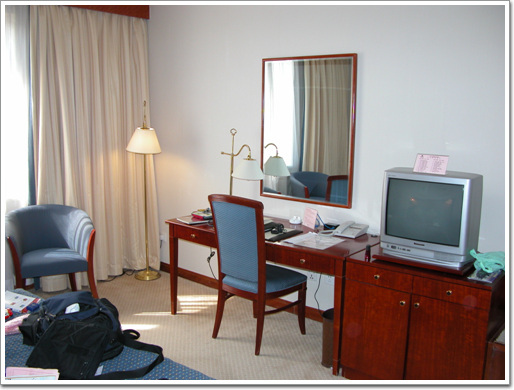
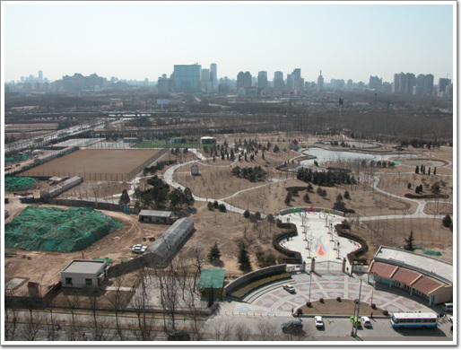

# 두번째 온 북경

1년만의 중국 출장이다.

한창 중국어를 공부했을 때는 중국 출장 갈 일이 없더니만, 중국어공부 8개월하다, 중국출장을 안가길래 그만두었더니, 다시 중국 출장이군.

이번 출장은 북경. 1년만의 북경이다.

환율은 중국돈 1원 130원. 1년전에 150원이었는데, 많이 내렸군..

\- 공항버스를 타고 올림픽대로를 달리는 중.

\- 공항 검색대를 통과하고 나니, 같이 간 이재형씨도 도착하였다 하여 기다리고 있다.

\- 핸드폰 멤버쉽 카드 리더스 카드를 유일하게 사용하는 곳 SK 라운지.

비행기는 10시반 출발의 대한항공. 대한항공 괜찮지..

\- 내가 제일 좋아하는 10만피트 상공의 스카이라운지.

\- 꽤나 가까운 중국. 비행기 타서, 밥먹고, 커피먹고 하면 어느새 중국 상공이다.

\- 북경 공항에 도착하여..

\- 짐을 찾으려 기다리는 중. 예전에 한번 짐이 바뀐 적이 있었기에, 항상 이 순간이 긴장된다. 혹시나 누가 집어가면 어쩌나 하는 마음에..

\- 내가 묵은 호텔. Rosedale호텔. 중국발음으로 뽀리쥬디엔. 1833호.

\- 제법 괜찮다.

\- 창 밖으로 보이는 풍경. 공원이긴 한데, 좀 황량하군.

[null](../6166822.html#6166822_1)

