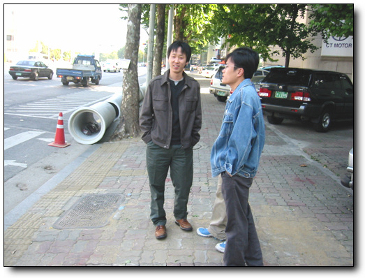
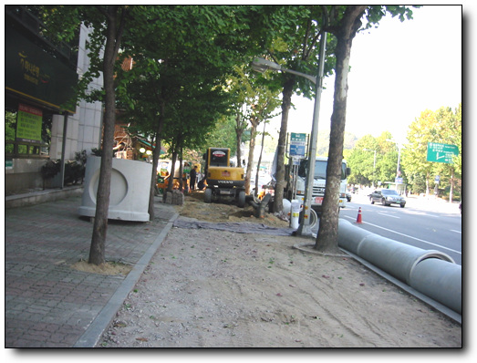
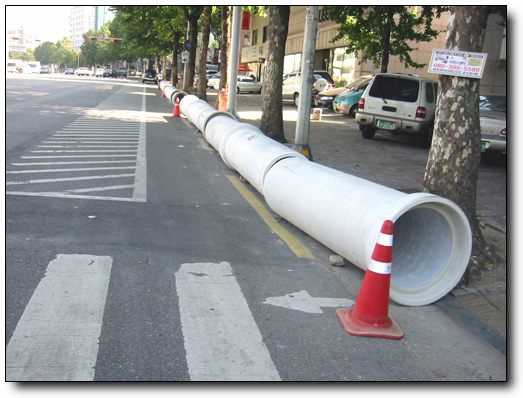

# 연말맞이 보도블럭 공사

\- 점심 먹으러 가는 길

회사 앞 보도블럭이 파헤쳐지고 있다. 올 해 들어, 이 보도들럭은 서너번 파헤쳐졌다 메워졌다 하는 것 같다.

특히 10월 말이 되더니, 회사가 있는 이 반포동 일대는 온통 보도블럭 공사다.

올해가 가기 전 예산이 다 소모하려는 것인가?

\- 이건 하수도관 공사인가?

\- 길게 늘여진 관이 공사할 길이를 말해준다.

뭐 예산 소모용이 아닌, 실제 절실한 공사일 지도 모르지.

근데, 왜 일년에 서너번씩이나 팠다 메웠다를 반복하는 걸까? 한번에 다 하면 편할텐데..

[null](../6166837.html#6166837_1)

