# 리스본 바이루알뚜와 파두

리스본의 서쪽 언덕지역인 바이루알뚜.레스토랑과 극장등 문화예술 장소들이 많이 모여있는 곳이라고 한다.우리로 치면 혜화동 대학로 같은 곳일려나?

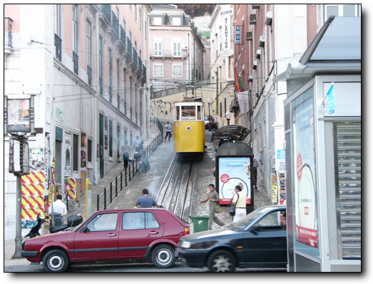

-여기서 엘레바도르라고 하는 전차를 타고 올라간다

-이게 엘레바도레 안.뭐 그냥 이런게 다니는구나 하는 정도.

-좀 오래 올라갈 줄 알았는데, 한 100미터 올라간 게 전부다.

-지대가 높다보니 여기서도 시내 전경이 다 보이는군.

-좀 더 가야 바이루알뚜 지역이 나오나 보다.

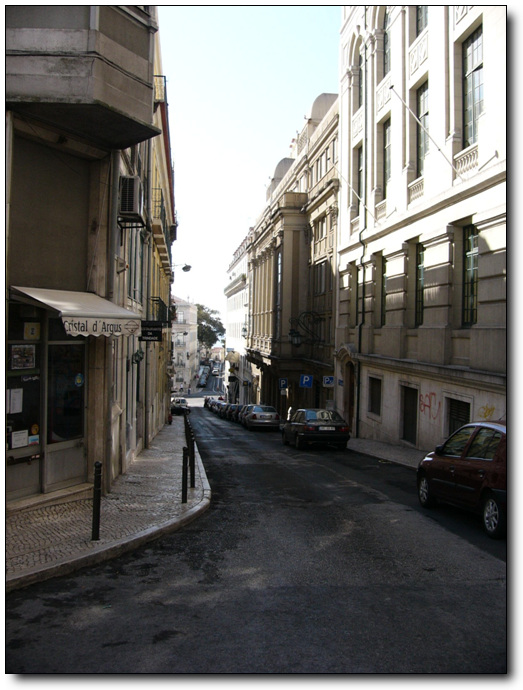

-좁은 골목이 오르락내리락 한다.

-눈만 쌓인다면 보드 타기 좋은 슬로프다.

-로께성당이라고 유명한 성당이라고 하는데, 나에게는 별 의미없는 장소군.

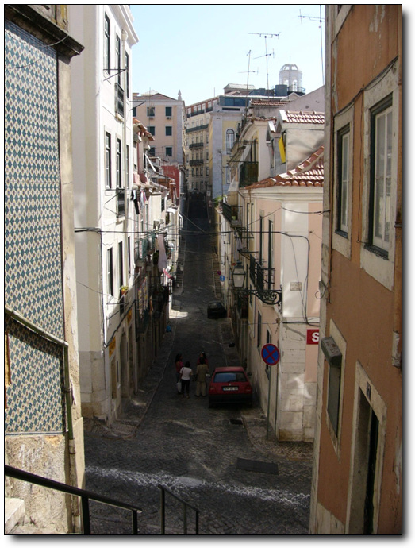

-이 좁은 골목에도 주차된 차들은 항상 있군.

-쌍둥이 자매인가 보다.

-포르투갈 여자들의 평상시 옷차림은 저렇다.더운 날씨다 보니 시원스럽게 하고 다닌다.

-이건 공중 식수대인가 보다.

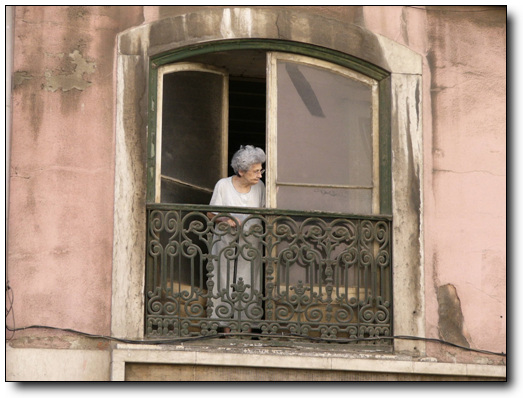

-밖에 뭔일이 있나 빼꼼히 밖을 쳐다보니 할머니

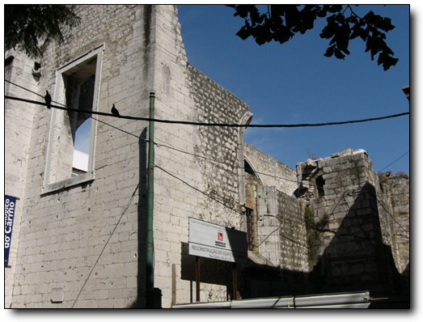

-대지진으로 무너져내린 성당도 여기에 있군.

-경찰청 건물인가?보초를 서고 있군.

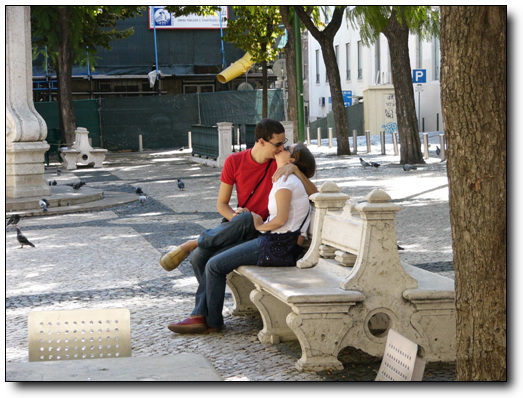

-아니 벌건 대낮에 애정행각을?하지만 이 정도는 이미 서울에서도 구경 할 수 있는 거지..

-기념품 가게가 보여 한번 구경을 해 봤다.

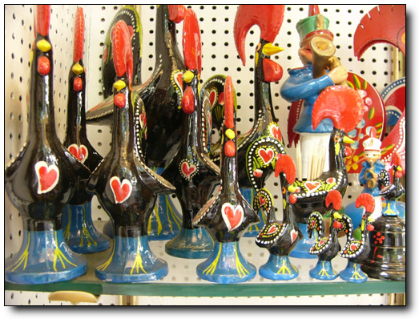

-이게 포르투갈의 유일한 특색있는 기념품이다.가격은 무지 비싸다.천원을 해도 살까말까 하는 것을, 무려 6~12유로나 한다.만원 안팎이다.

바이루알뚜 지역을 샅샅이 뒤졌지만, 별 다른 볼거리는 안보이더군.

포르투갈의 대표적인 민요 파두.

포르투갈 가이드에, “파두는 재즈나 플라멩고만큼 많이 알려지지는 안았지만 더할나위 억이 매력적이다.떠나버린 사랑과 잃어버린 영화를 그리워하는 구슬픈 노래를 듣고 있노라면 격정과 삼념에 휩싸이게된다.파두를 등지 않고 리스본을 떠나면 못내 아쉬움이 남으니 꼭 들어보라”이렇게 설명을 해 놓았다.결론부터 말하면 이 문장은 현란한 과장법이었다.

음악과 예술을 사랑하는 나.많은 돈을 파두에 들이기로 했다.

파두를 듣기 위해서는 디너쇼처럼, 파두 레스토랑에서 저녁을 먹으면서 들어야 한다.

그게 좀 걸렸다.혼자서 하기에는 좀 껄끄러운 것들이 주변에 많다.요즘 혼자 밥 먹는 것에 대해 인터넷에서 조그마한 이슈가 되어 있던데, 혼자서 디너쇼 구경하는 게 상당히 날 망설이게 했다.이럴 때 아내가 절실하게 생각난다.같이 있으면, 별 고민없이 보러가면 될텐데..

아는 파두레스토랑이 없기에, 관광안내소에서 물어보았다.

-안내 데스크.여기서 지도들도 얻을 수 있다.

추천 받은 곳은 바이루알뚜 지역에 있는 Adeo MesQui 라는 식당이다.그것을 찾아 다섰다.

-지도를 들고 찾아 나선다.이 길인가?

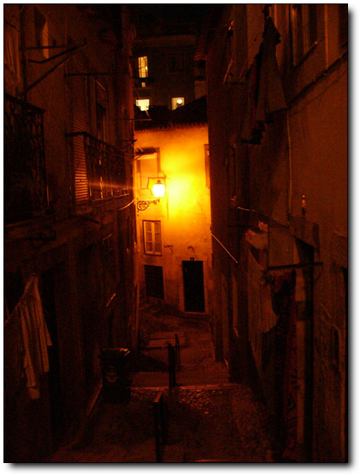

-아니, 이 길던가?밤이라 헷갈린다.

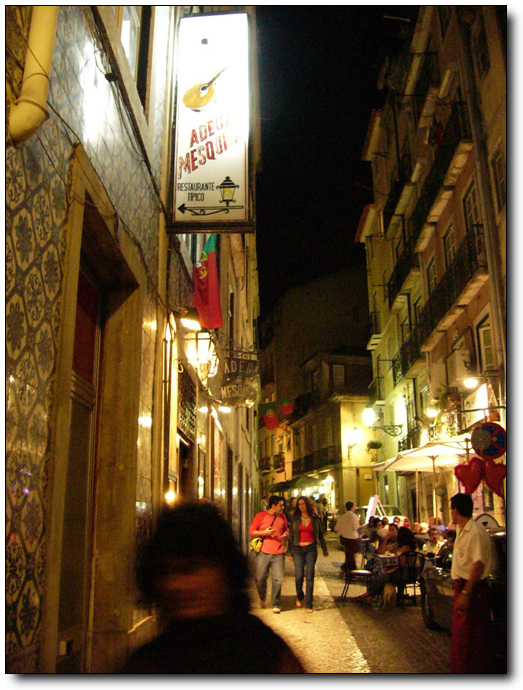

-동물적인 방향감각으로 조금밖에 안 헤매고 찾았다.

-문 앞에 지배인으로 보이는 사람이 손님은 맞고 있군.

들어갔다.혼자냐고 물어보더군.그래 나 혼자다라고 했다.역시 식당에 혼자 오는 사람은 드물구나.

-생각보다도 조그맣다.한 100명 정도 수용가능한 식당이다.일본인 단체관광객과 다른 유럽의 단체관광객들이 있고..

-다른 곳에 한쌍의 남녀

-또 다른 저 구석탱이한 한 쌍.아 나 말고도 혼자 온 사람이 있군

-자리에 앉으니 빵부터 먼저 주더군.나중에 저 빵값도 따로 받더군.한 조각밖에 안 먹었는데..

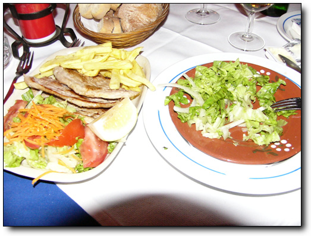

-나의 저녁.돼지고기와 샐러드, 그리고 와인.이게 무려 35유로. 5만원짜리다.

맛은?꽝이다.이게 추천할 만한 파두레스토랑 맞나?

-와인 300cc 짜리 한병도 시켰다.돈이 아까워 저걸 4/5 나 먹었는데, 그 다음날 숙취로 죽는 줄 알았다.너무 약주를 과하게 했다.

-처음 입장한 사람은 포르투갈 전통 댄싱팀.

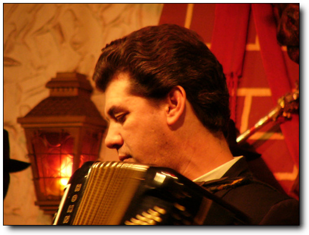

-잘생긴 아저씨가 연주를 하고

-두 쌍의 남녀가 춤을 춘다.춤은 그저 그렇다.

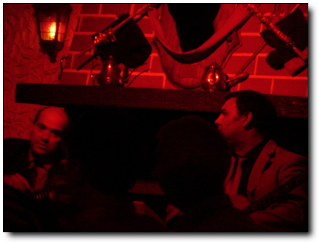

-다음으로 두명의 기타리스트와

-여자 가수 등장.

파두를 시작한다.왠지 내 취향엔 안 맞다.난 소리가 청명한게 좋은데, 좀 탁하다.

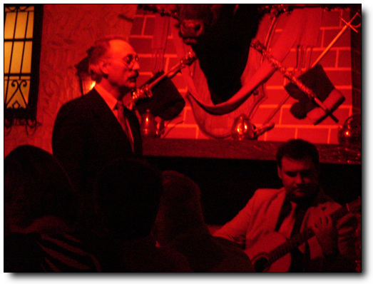

-다음으로 아저씨 등장.성량은 무지 풍부하더군.하지만 음악 성향이 나에게 맞지 않았어인가 그다지 가슴에 와 닿지는 않는다.

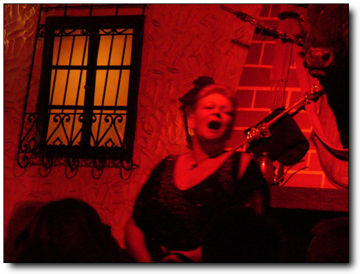

-네번째 공연하는 할머니.

볼때까지 몰랐는데, 이 사람들이 다 파두 가수인 것 같았다.우리나라 판소리하는 사람들이 일반적인 공연에서는 수요가 없어 명절때나, 아니면 국악공연하는 레스토랑에서 노래부르는 것 처럼, 여기의 파두 가수들도 레스토랑에서 노래를 부르는 거였다.

암튼, 실제 전문 파두 가수인 것 까지는 좋은데,각기 자기 노래가 끝날때마다 자기 음반을 판매하러 테이블을 돌아다니는 것은 좀 전문적이지 못해 보였다.

-일본인 관광객들에게 CD 판매하는 모습

-이 할아버지는 CD한 장 팔았다.

-다음 약간의 시간 후에, 처음의 팀 출현.총 4개 팀이 계속 돌아가는 시스템인가 보다.

파두를 듣고 난 소감.우리 귀에 덜 익숙한 이유도 있겠지만, 우리 정서에 그리 와 닿는 장르는 아닌 듯 하다.그리고 파두 레스토랑이 저녁 식사를 하지 않고 파두만 보지 않을 경우에는 별도의 요금을 지불하게끔 되어 있는데, 차리리 저녁을 안 먹는게 나을 뻔 했다.입맛의 차이로 치부하기에는 음식이 별로였다.

[null](../6166842.html#6166842_1)

