# 리스본의 최대 번화가 로시우 광장

리스본.별로 안 크다.서울의 두 개 합쳐놓은 정도다.

리스본 안내 책자를 봤다.

리스본은 번화가인 로시우와바이샤 지구,

대항해시대의 중심였던벨렘지구,

서민주택가가 모여있는 알파마지구,

그리고 지대가 높은 곳에 있는 바이루알뚜 지구 이 네 군데를 보면 된다고 하는군.

처음 정찰 지역으로 잡은 곳은 역시 번화가.

호텔 바로 옆이 오리엔트 전철역이 있으므로, 그 전철역으로 갔다.

리스본의 시내 대중 교통 수단은 버스와, 전철,트램(전차),엘라바도레(언덕도 오르내리는 엘리베이터)가 있다고 한다.

각기 1회 승차에 1.1 ~ 1.3 유로.

매표소에 물어보니, 1일pass와 5일짜리 pass가 있다고 한다.

1일 짜리가2.8유로, 5일 짜리가 11.65유로.

이걸로 대중교통은 다 이용할 수 있다는 거다.

5일짜리를샀다.

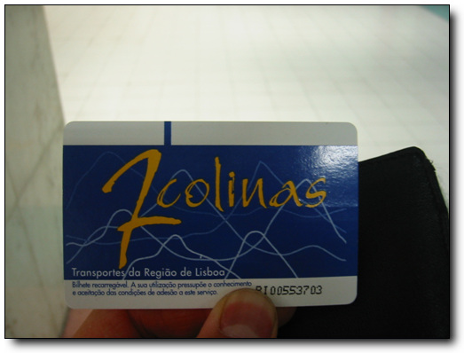

-이게 5일짜리 패스.우리 교통카드처럼 비접촉식이다.

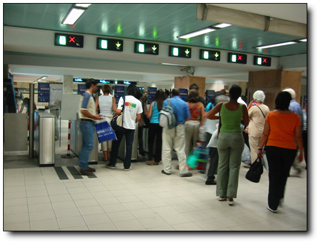

-지하철 개찰구 통과

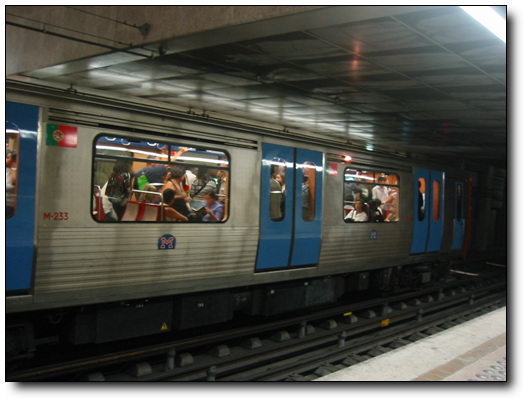

-전철은 이렇게 생겼다.

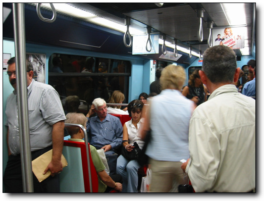

-내부는 이렇게 생겼고.좌석배치가 서로 마주보고 되어 있어, 그리 많은 사람이 탈 수 있는 구조는 아닌가 보다.

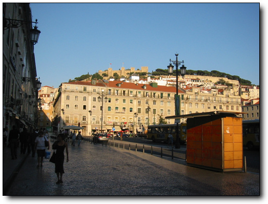

-목적지 로시우 역에서 내렸다.저 언덕 위에 보이는 성이, 리스본에서 가장 오래된 건축물인 세인트조르제 성이라고 한다.그리고 오른편의 광장이 피게라 광장.

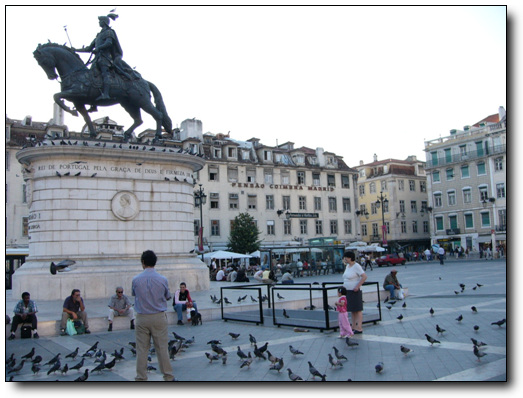

-저 동상이 피게라인가 보다.

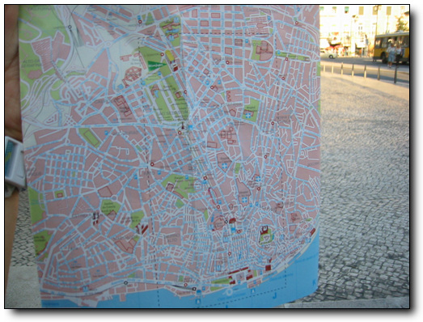

-그림자의 방향으로 방위각 판별 후, 이제 한손에 지도를 들고 지형지물과 지도정치를 하고, 본격적인 정찰 시작

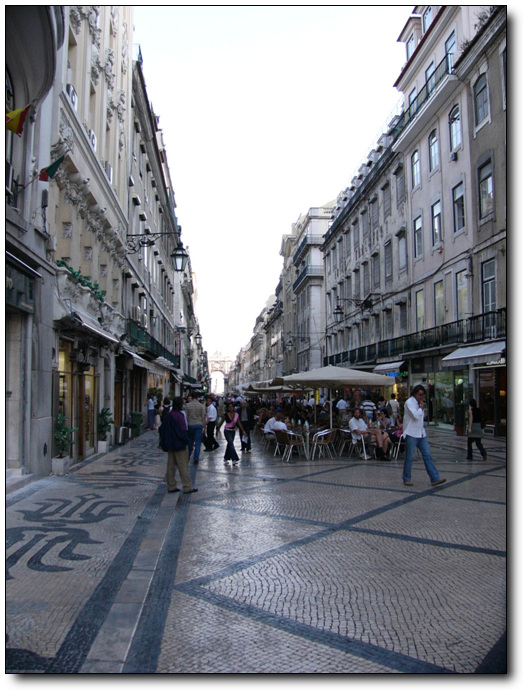

-광장 남쪽으로는 바이샤지구에 노천카페들이 운집해 있고, 저 멀리 개선문도 있군.

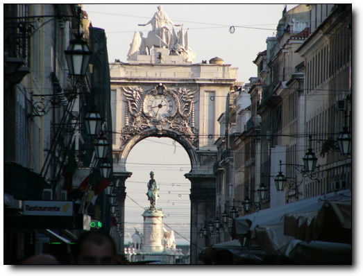

-저게 리스본의 개선문이란다.개선문 저 앞에 있는 것이 리스본에서 제일 큰 광장이라는 코메르시우 광장.

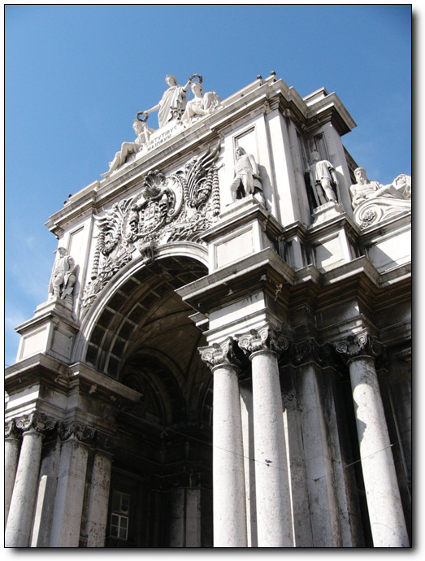

-개선문을 앞에서 봐 봤다.별거 없다

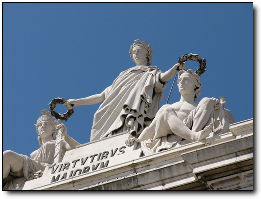

-자세히 더 봐 봤다.여전히 별거 없군.

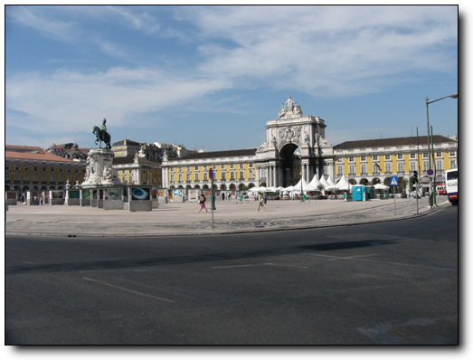

-더 멀찌감치 가서 봐 봤다.저 앞쪽에 말타고 있는 동상이 18세기 개혁을 추진했다고 하는 호세1세 왕이라고 한다.

다시 본래의 목적지 로시우 광장으로 갔다.

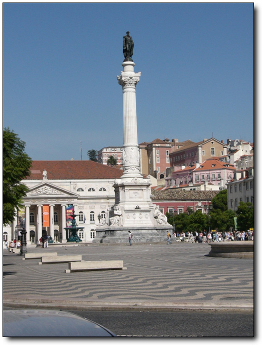

-이게 로시우 광장.로시우 광장 뒷편에 있는 저 건물이 국립극장이라고 한다.

저 동상은 초대 브라질 총독인 동 페드로4세라고 한다.

남의 나라 식민지로 지배하던 사람의 동상을 저렇게 크게 만들어 놓다니...

브라질 사람은 저 동상을 보면 어떤 감정을 가질까?

우리나라를 악랄하게 짓밟은 조선총독부 데라우찌 총독과 비슷하지 아닐까하는 생각을 잠시 가져본다.

그렇다면 혹시 일본에 가면 데라우찌 총독도 저렇게 국가적인 영웅으로 대접받고 있는 것은 아닐까?

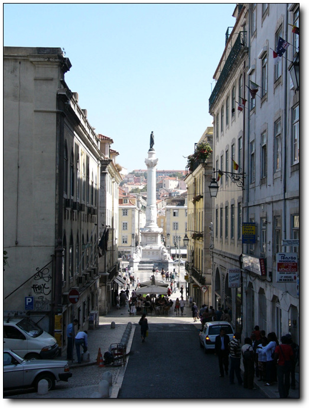

-어찌나 높이 지었는데, 다른 건물들보다도 더 높군.

-최대 번화가이자 교통의 중심지답게, 시내관광버스도 대부분 여기서 출발한다고 한다.

저건 5일짜리 패스로 안되고, 별도로 표 사서 타는 거라, 못 타 봤다.

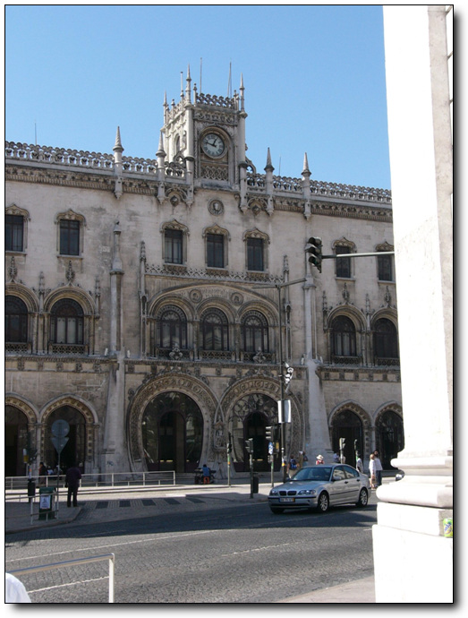

-로시우광장에서 왼쪽 조금 위로 가면 로시우 역이 있고.

-그 위로, 리스본의 샹제리제라 불리는 리베라데 거리가 시작되는 오벨리스크가 서있다.

저 오벨리스크는 스페인의 지배에서 벗어나 독립한 것을 기리기 위한 것이라 한다.

원래 나쁜 것은 더 잘 닮는 법.

스페인에게 당한 것을 그대로 배워, 브라질을 지배했었겠군.

스페인은 포르투갈을 식민지배했었고,

포르투갈은 브라질을 식민지배했으니,

브라질 가면은 포르투갈의 식민지배에서 벗어난 것을 기념한 것도 있겠군.

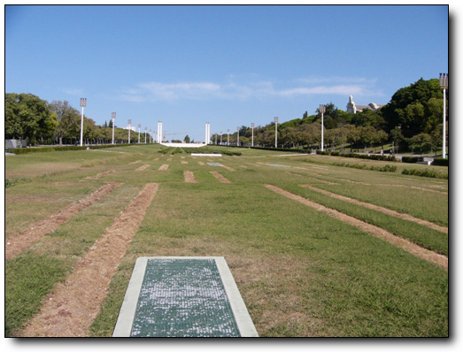

-리데바르데거리를 쭉 올라가면,뽕발 동상이 나오고,

그 다음이 이 에두와르드7세 공원이 나온다.

영국의 에드워드 7세가 방문한 것을 기념하여 만든 공원으로 아주 아름답다고 평이 되어 있던데,

내겐 그냥 좀 잘 만든 공원이다밖엔..

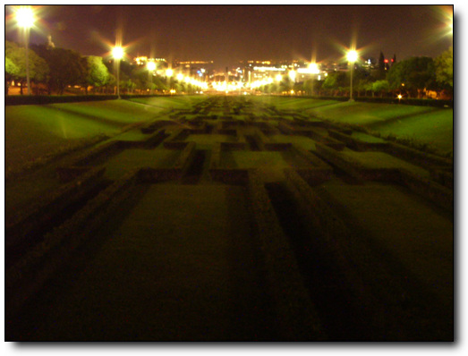

-밤에 보면 이렇다.

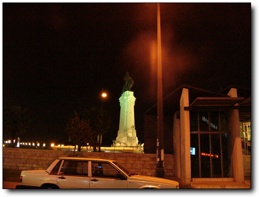

-이게 뽕발 후작 동상.이름이 좀 웃기긴 한데,

이 사람이 17세기 리스본에 대지진이 일어났을 때의 장관으로서 뛰어난 리더쉽으로

리스본 도시를 재정비한 사람이라고 한다.

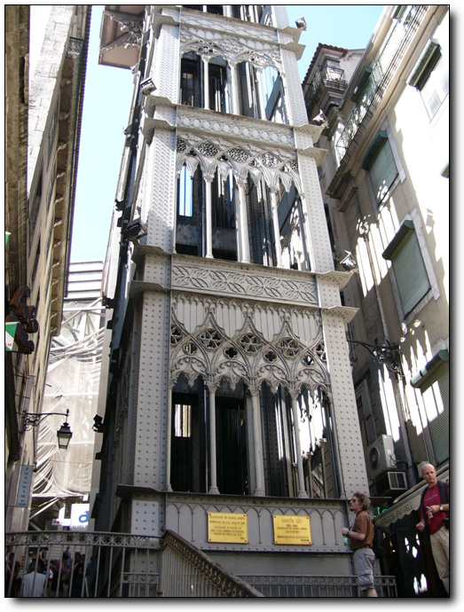

-로시우광장근처에 있는 또 다른 유명한 건축물.엘리베이터다.

에펠의 제자가 만든 거라고 한다.지대가 높은 바이루알뚜 지역으로 오르내리는 거다.

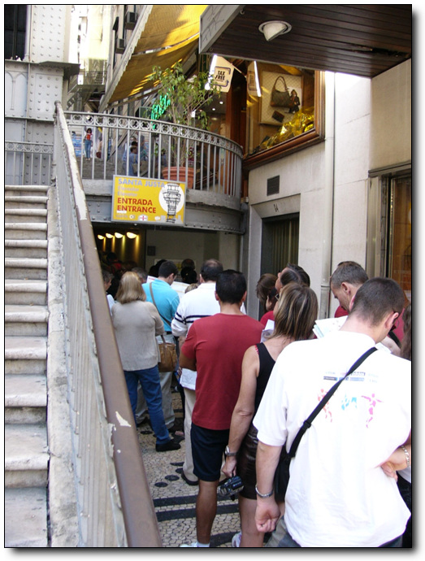

-타 볼려고 입구를 봤더니, 줄이 꽤 길군.담에 타야겠다.

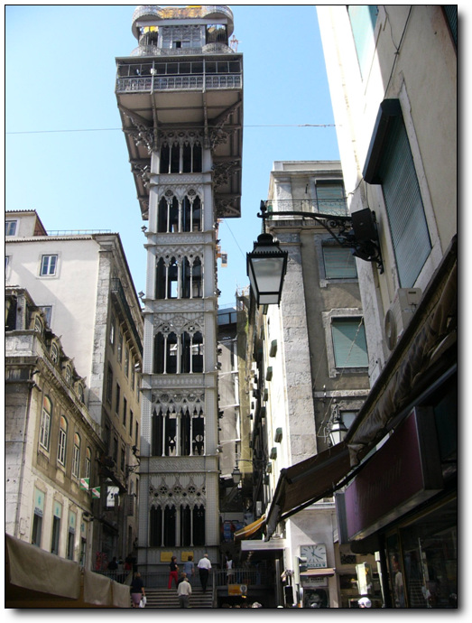

-크긴 큰 엘리베이터군.

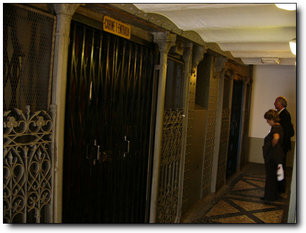

-사람이 없을 때 다시 왔다.승강기는 두개다.

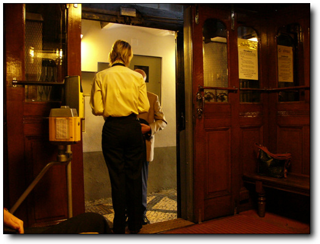

-안에는 차장과 개표기가 있다.내부는 오래된 엘리베이터인 만큼 나무로 되어 있군.

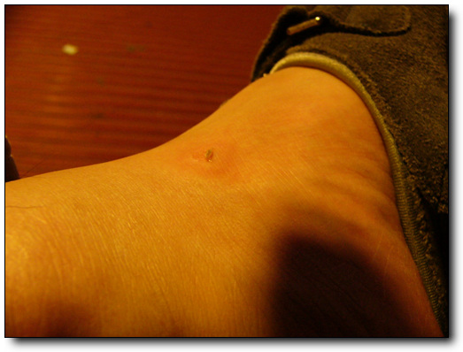

-왠지 발이 왠지 가렵다해서 봤더니, 오래 걸어서 그런가 발목의 껍질이 벗겨졌군.

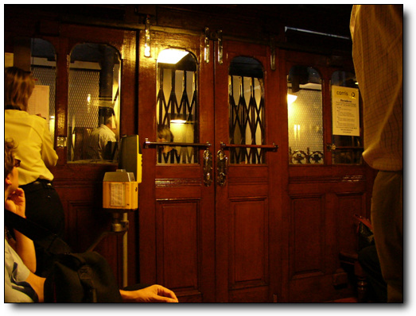

-엘리베이터인데, 운행시간이 정해져 있나 보다.한 10여분 기다린 후에야 올라간다.

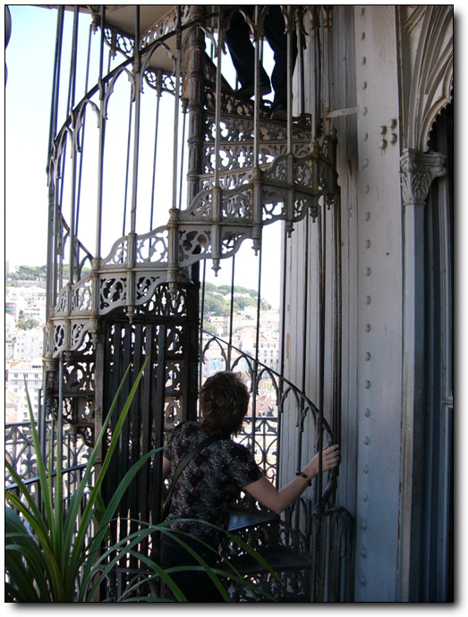

-한 5초 올라갔나? 10여분 기다린게 허무하군.위로 전망대가 있어 더 올라게 되어 있었다.

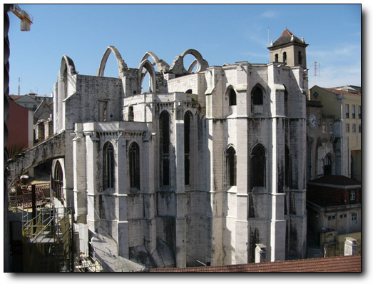

-17세기 대지진때 천정이 무너져내린 대성당이 아직 그 모습 그대로 보존되어 있다.

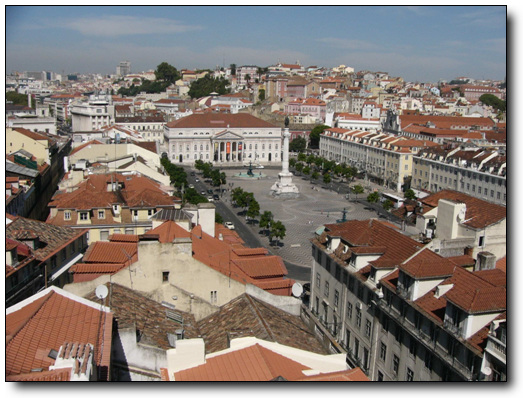

-로시우광장도 한눈에 보이고.

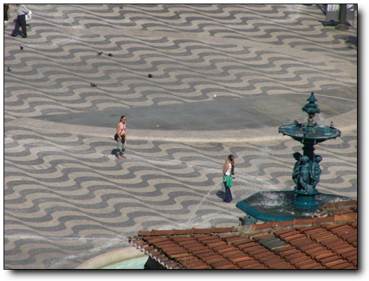

-분수대에서 사진찍는 아녀자도 보이는군.

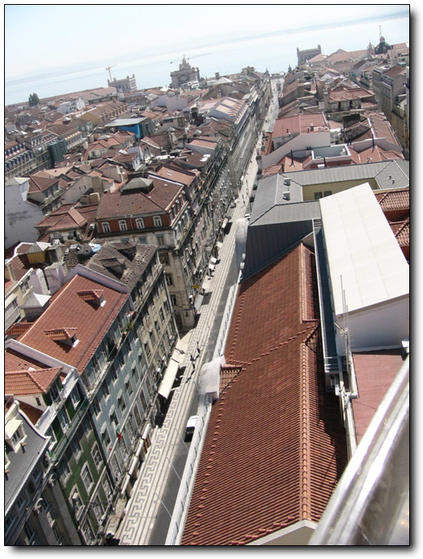

-떼조강도보인다.

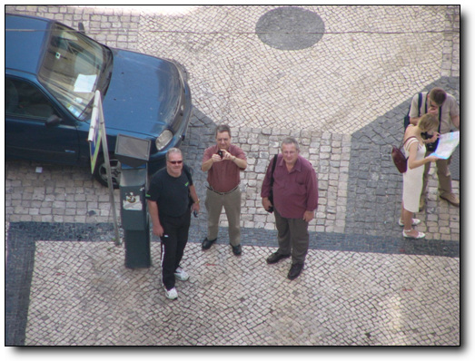

-내가 밑에서 사진 찍은 위치에서 엘리베이터를 찍는 사람도 보이는군.

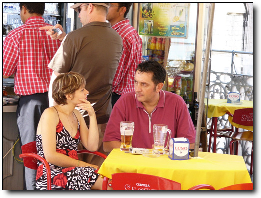

-전망대위에는 매점이 있는데, 관광객들이 여기서 백주대낮부터 술을 마시고 있군.

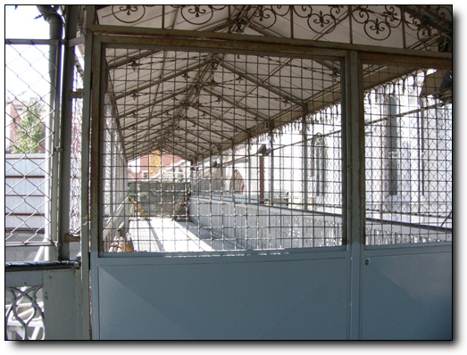

-이게 바이루알뚜지역과 연결되어 있을 줄 알았는데,공사중이다.다시 타고 내려가야 한다.

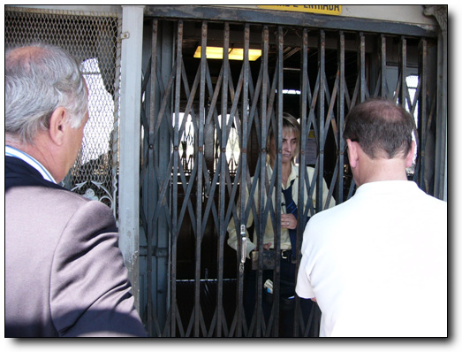

-내려가는 엘리베이터.아까 그 차장언니다.

