# 리스본의 vodafone 사무실

이번 출장에서 머무르게 된 곳, 포르투갈의 수도 리스본. 일을 하게 되는 곳 vodafone.

유럽의 주요 망사업자다. 우리로 치면 sk telecom 같은 거다.

우리 회사 전화기를 여기 포르투갈 vodafone에 납품을 하는데, 이곳 포르투갈에서 발생한 문제점을 고치기 위해 온 것이다. 이렇게 하니 내가 직접 고치는 것 같은 어투인데, 그냥 여기서 문제점과 원인을 찾아, 한국에다 보고하고, 어디어디 고쳐보자 하는 말과 함께 수정된 코드 받아 그것 가지고 테스트하여 제대로 되나안되나 검증하는게 주된 일이다.

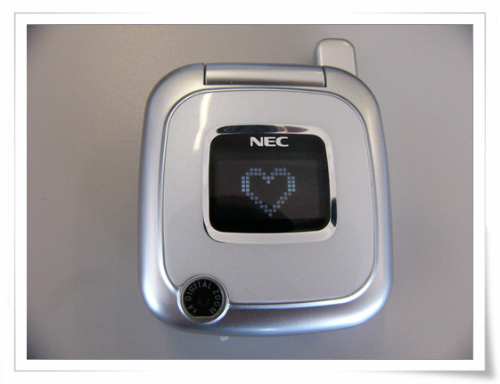

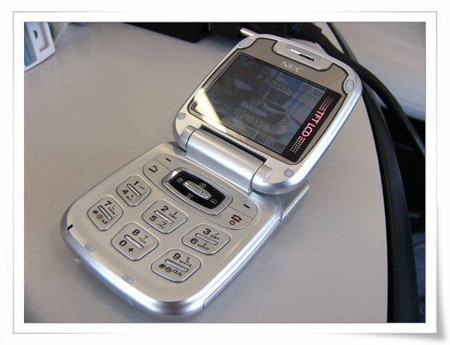

\- 이게 vodafone에 팔게 될 전화기

vodafone 이 회사는 내가 묵은 호텔 Tivoli Tejo 호텔 바로 앞에 있다.

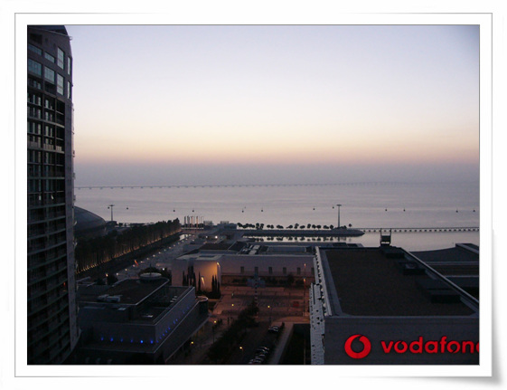

\- 내 방에서 이렇게 바로 보인다.

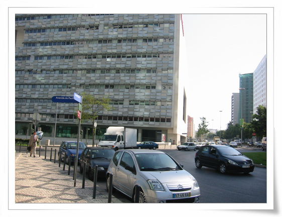

\- 이 건물이 vodafone 건물. 겉표면이 특이하다.

이곳 리스본의 보도 블럭은 다 저 모양의 돌로 깔려있다. 포트투갈에서 저 돌이 많이 나나 보다.

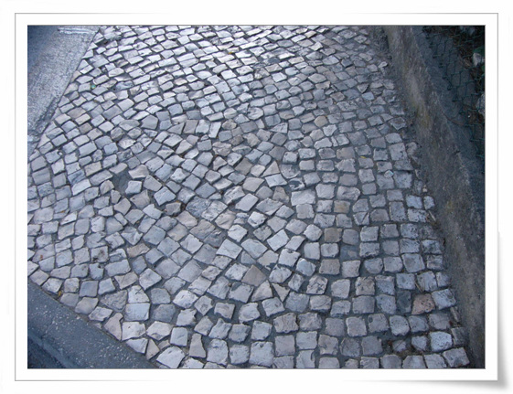

\- 인도가 이렇게 생겼다.

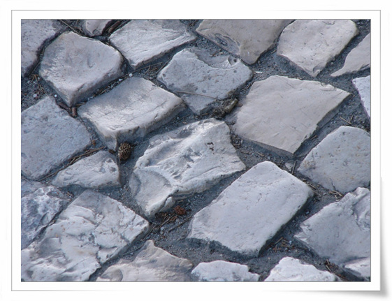

\- 더 자세히 보면 이렇다. 이게 무슨 돌일까?

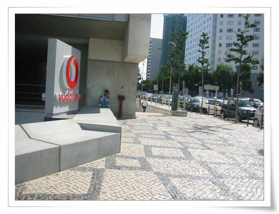

\- vodafone 입구다.

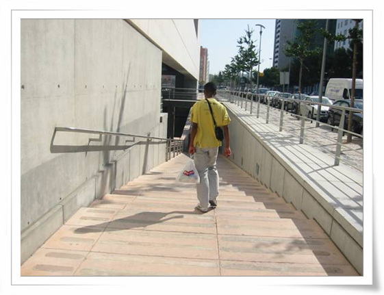

\- 정문은 이렇게 지하로 내려간다.

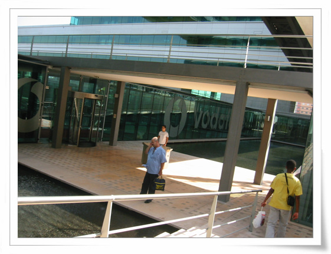

\- 내려가니, 하늘이 열려있는 지하라 시원하다.

포르투갈의 인구가 천만명이 조금 안된다. 서울인구보다도 적은 거다. 땅 덩어리는 남한만 한데 말이다. 그래서 그런가 수도인데도 빽빽하기다 보다는 시원시원하니 여유가 있어 보인다.

\- 안으로 들어가면 안내데스크가 나온다. 넓직하다.

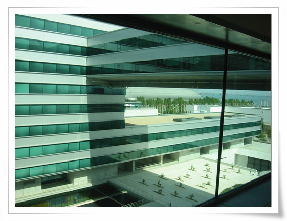

\- 내가 일하는 층 6층. 건물 구조는 포스코센터랑 비슷해 보인다.

\- 건물에 맘이 들어하며 여기에 눌러 앉고 싶어하는 병두씨

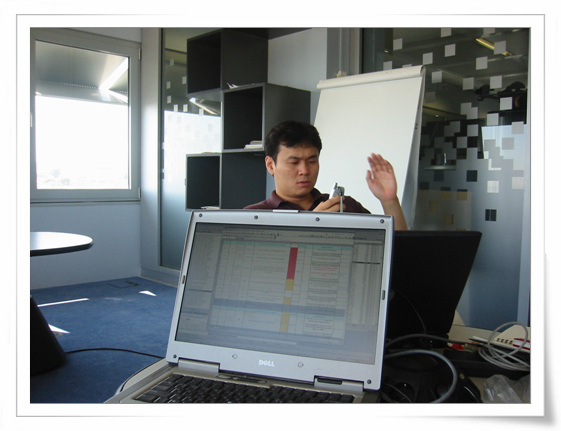

\- 작업 공간. 응접실로 쓰는 공간인 것 같다.

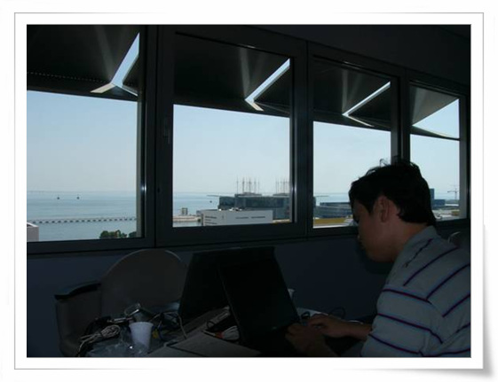

\- 고개를 뒤로 돌려보면, 앞에 떼조 강이 있다. 꽤나 큰 강이다. 이 강이 5Km 만 더 흘러가면 대서양이란다.

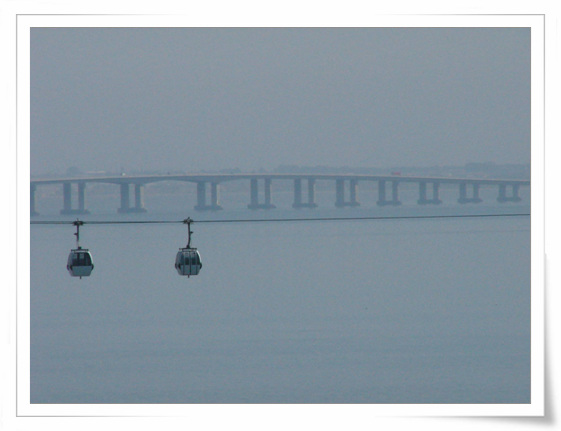

\- expo 공원이라서 그런가 강변으로 케이블도 다닌다.

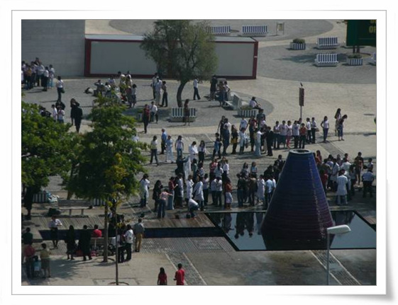

\- 창 밖에는 이 분수가 제일 잘 보인다.

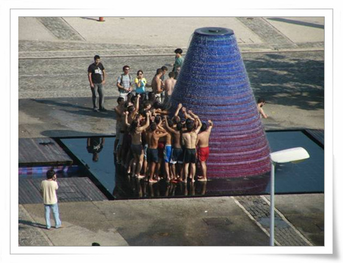

\- 오후가 되면, 남녀노소 이 분수 앞에서 물세례를 기다린다.

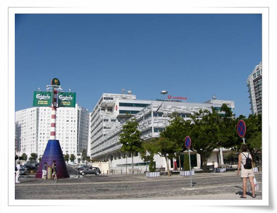

\- 창 밑으로 내려만 보다가, 직접 내려와서 봤다. 저 오른쪽 건물의 6층 통유리 창문이 내가 있는 곳이다.

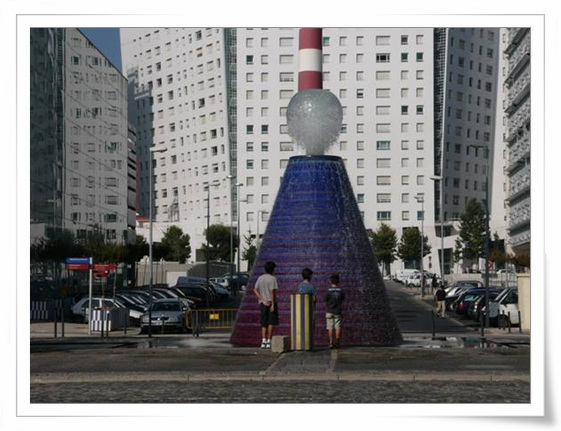

\- 화산 모양 분수

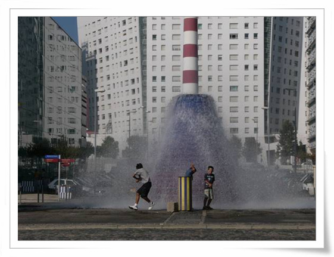

\- 다들 이 분수 피하는 재미로 구경을 하나 보다.

\- 병두씨는 나와는 달리 열심히 일하고 있군..

[null](../6166847.html#6166847_1)

