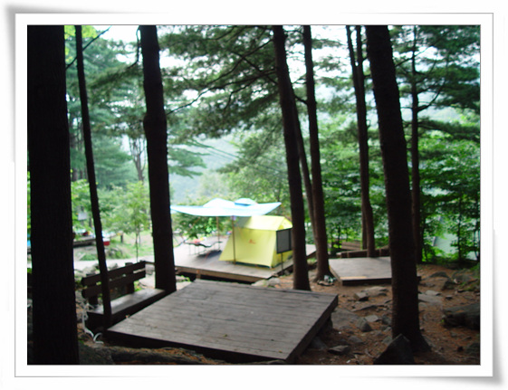
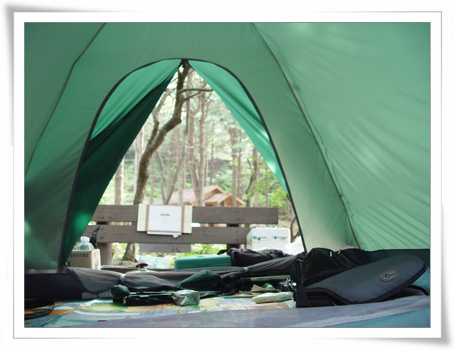
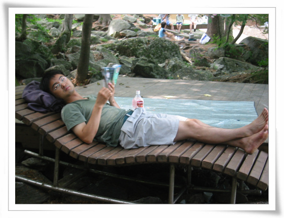
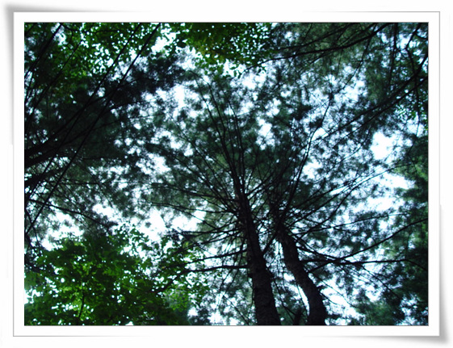
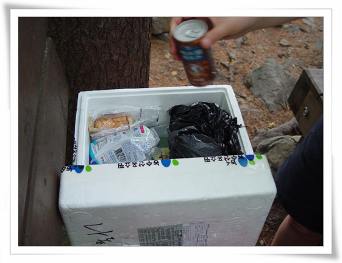
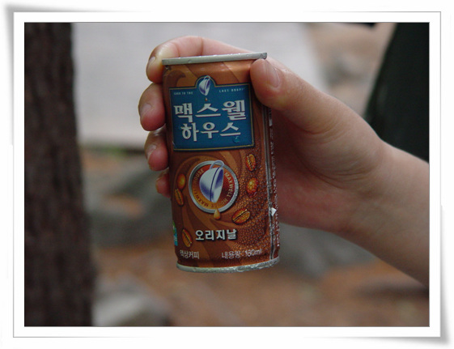
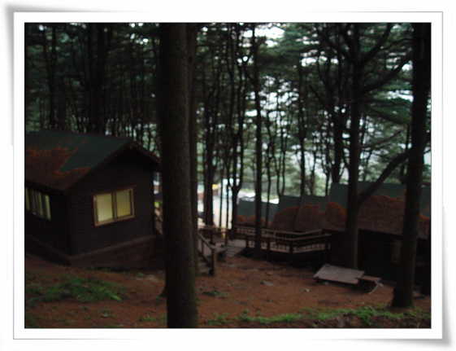
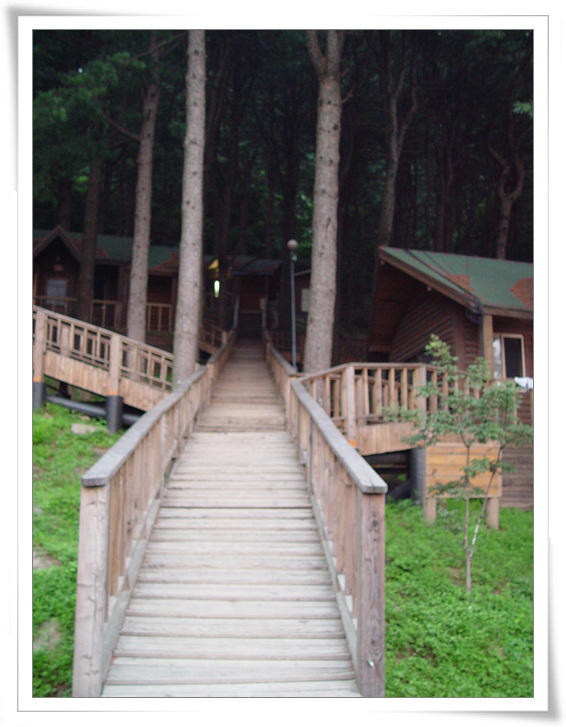

# 축령산 자연휴양림

휴가 이틀째.

한탄강 유원지에서 나온 후, 예상으로 잡은 곳이 포천의 열두개 계곡.

계곡이면 아마 그늘져 있을 것이고, 물도 시원할 거란 생각으로 그곳으로 갔다.

막상 포천 열두개 계곡은, 계곡 시작서부터 끝까지 온갖 민박집과 식당들도 가득했다.

그래서 그냥 지나쳐 길따라 무작정 갔다.

포천을 넘어 가평으로 가던 길에 나타난 표지판 '축령산 자연휴양림 44Km'.

'그래 축령산 자연휴양림이다'라고 하고, 그 길을 따라갔다.

경기도 남양주시에 위치한 축령산 자연휴양림.

야양데크사용료 4000원, 입장료 1000원x2, 주차비 3000원을 내고 들어갔다.

\- 야양데크는 이렇게 생겼다. 잎에 의자와 누울 수 있는 곡선 의자도 비치되어 있다.

\- 텐트를 치고 나니, 시원한 바람도 느껴지고 좋다.

\- 신선놀음하는 나.

\- 의자에 누워 하늘이 바라보니 잣나무로 가려진 하늘에 신선놀음하는 듯 하다.

\- 짠돌이 아이스박스.

홈쇼핑으로 배달되어 온 스티로폴 박스를 아이스박스 대용으로 사용했다.

\- 집에서 얼음을 채운지 이틀이 지났는데도, 음료수가 시원하다.

\- 야영장 근처에는 숲속의 집들이 있는데, 꽤 좋아보인다.

예전에도 이곳 축령산 자연휴양림의 숲속의 집을 이용해보고 싶었는데, 워낙에 경쟁이 치열하여 못 와봤다. 나중에 숲속의 집도 이용해 보리라.

축령산 자연 휴양림. 매우 만족이다.

깨끗하고, 넉넉한 화장실 갯수와 청결함. 그리고 샤워실도 있어 야영의 불편함이 거의 없었다.

[null](../6166861.html#6166861_1)

