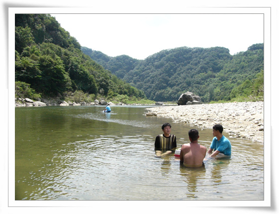
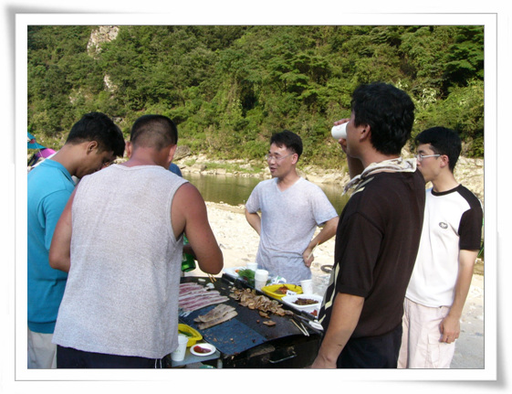

# 충주 삼탄 계곡

한창 불볕 더위가 기승일때 삼탄 계곡으로 갔다.

명목은 국민카정비방이라는 동호회 정기모임 참석차다.

그리 널리 알려져 있지는 않지만, 그 근처 현지인들은 자주 가는 곳이다.

그 덕에 붐비는 사람 구경만은 피할 수 있었다.

위치는 충주시와 제천시의 경계지점으로 생각되는 곳인데, 찾아가는 길 따위는 없어 외지인들의 발길이 뜸한 곳이라 꽤 괜찮은 곳이었다.

\- 내가 갔던 삼탄 계곡 들어가는 길. 합천 마을 입구쪽으로 쭉 5km 정도 들어갔다.

\- 여기가 우리가 놀던 곳. 저 앞의 사람들의 동호회 사람들이다.

\- 남한강의 상류 지류인데, 굽이굽이 흐르는 내천이 깨끗하다.

\- 이렇게 물속에 앉아 시원하게 먹는 것도 색다른 재미였고,.

\- 이렇게 투망을 던져

\- 고기 잡는 것도 재밌었다

\- 이제 본 게임. 삼겹살 철판 구이. 주방장은 국원이랑님과 스피드님.

\- 고기가 익어가니, 이제 젓가락을 들고 먹을 준비를 하고..

\- 맛있게 먹는다.

\- 마지막은 볶음밥. 삼겹살로 배를 가득채우고도 이 볶음밥의 유혹을 떨칠 수가 없다.

밤까지 먹고 놀고 하다, 일찌감치 잠을 자고 일어나, 상경 준비를 했다.

왔던 길로 돌아가다 보니 박하 사탕 촬영지라는 표지판이 보인다.

\- 삼탄계곡 바로 근처다. 박하사탕 1.6km

\- "나 돌아갈래"의 그 장소이다.

\- 영화 그 장면을 기념해 놓고 있다.

[null](../6166863.html#6166863_1)

