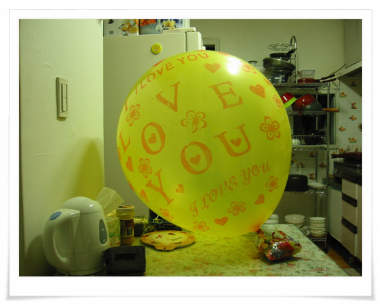

# 풍선다이어트 시작

나날이 증가하는 체중. 그리고 내장비만.

몇달전 내장비만이라는 책을 사서 보았다.

그 책을 보니, 내장비만의 증거로 제시된 하나가,

밥을 먹고 나서, 다른 사람들보다 배가 많이 나오면, 내장비만이라고 하는 거였다.

이유인즉슨, 배 내부에서 지방이 잔뜩 끼어 있으면, 배 근육이 제 모양을 유지하지 못하고, 배가 풍선처럼 부르게 된다는 것이다.

요즘 내가 그렇다. 밥만 먹으면, 허리띠를 늘려야 한다.

그래서 오늘 부터 시작하기로 한게, 풍선다이어트.

몇년전 호기심천국이라는 TV 프로그램에서 풍선다이어트를 실험했었는데, 진짜 효과가 있는 걸로 판평되었다.

그래서 인터넷으로 풍선 주문. 300개를 샀다.

\- 이 두 봉지합해서 300개란다.

그래서 오늘 하나를 불었다.

\- 풍선 하나 부는대도 꽤 힘들다. 다 불고나니 진짜 복부에 낀 지방이 조금 분해된 느낌이다.

[null](../6166873.html#6166873_1)

