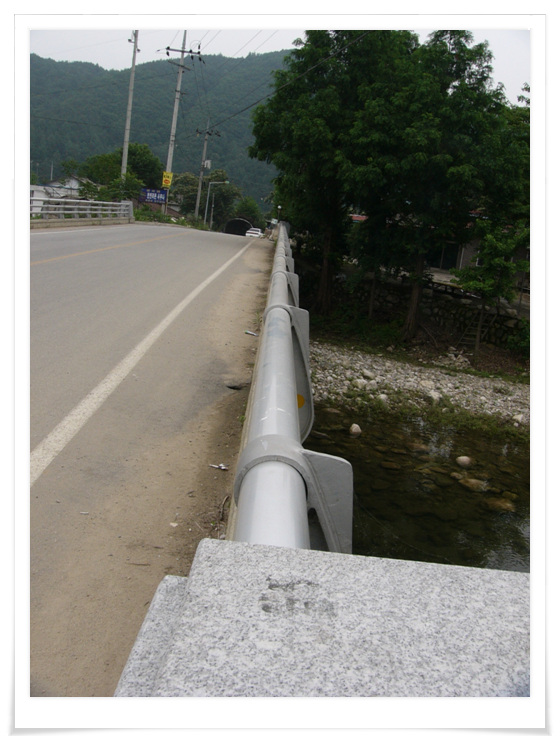
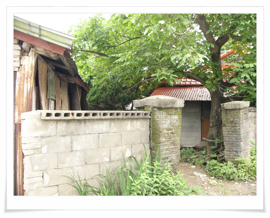

# 지덕노체

\- 내 예전 살던 마을 양평군 용문면 조현리에 있는 새마을운동 조형물.

지덕노체가 무슨 뜻인지 이제는 기억이 안난다. 저 뒷편 개울가에서 여름이면 수영하고 그랬었는데, 지금은 물도 많이 더러워지고, 수량도 많이 줄었군..

\- 학교갈때 건너던 돌다리였는데, 지금은 바뀌었군.

그 때 남자애들끼리는 이 난간 위로 걸어가는 걸 많이 하곤 했었다.

혹여나 발 잘못 디디면 4미터 정도 아래 개울가로 떨어지는 스릴이 있어서 그랬나 보다.

\- 유일하게 예전 모습 그대로 남아있는 집. 지금은 아무도 안 사나 보다.

[null](../6166875.html#6166875_1)

