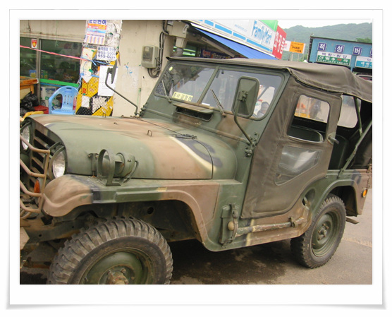
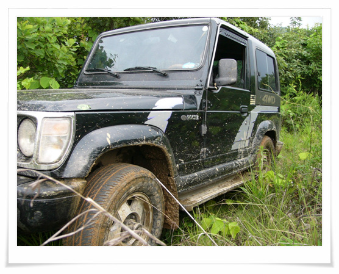

# 명차 록스타

나의 차 록스타.

이차를 몬지 이제 4년째가 된다.

93년식 7년된 중고차를 샀었다. 샀을 때 주행거리 14km에 적산계 고장나 있는 상태.

지금은 한 25만km정도는 뛰지 않았나 싶다.

구입가 170만원. 그 동안 수리비 230만원.

여러가지 에피소드가 있었다.

차 처음 사고 전국일주를 갔을 때 새벽 7번국도 산 중턱에서 모든 전조등이 안들어와 들어올 때까지 차 안에서 취침하고 있었던 일.

차 점검 받으러 간다고 하다가 음성에서 차가 피를 토하고 멈춰 서버린 일. 엔진 헤드가 터져, 그거 갈고 견인비도 들고 하여 꽤 돈이 들어갔다.

세번째 엔진 헤드가 금간 일은 장안동으로 퇴근하던길. 역시 큰 돈들여 갈았는데, 다시 또 엔진 나간 게 그 후 한달. 네번이나 엔진헤드를 갈았었다.

그러다 충주에 록스타의 명인이 산다는 소문에 충주로 가서, 체계적인 정비를 받고나서 이제 완벽한 명차의 면모를 과시하는 명차로 복귀했다.

\- 원조 록스타 1/4톤 찦차

군대 있을 때 이 차에 뿅가서 지금의 내 차를 산 것이다.

지금은 선탑자석에 관등성명이 붙이도록 규정이 바뀌었나 보다.

\- 내차 록스타. 원조 군용1/4톤에 비할 바는 물론 안되지만, 그래도 한국지형에 강하다.

[null](../6166877.html#6166877_1)

