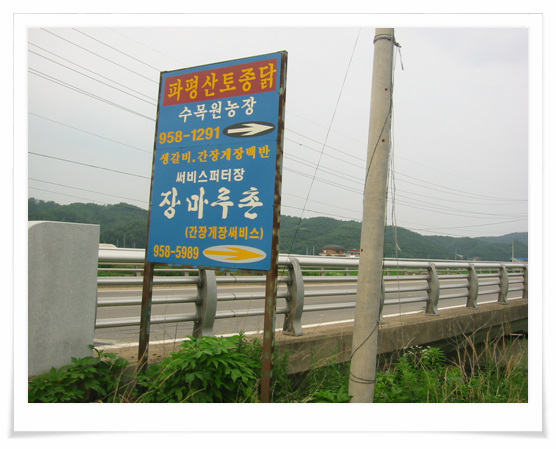
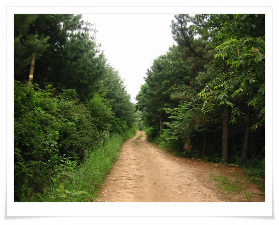
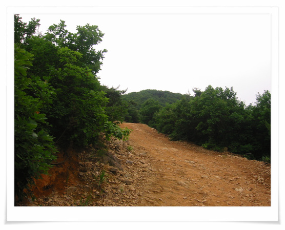
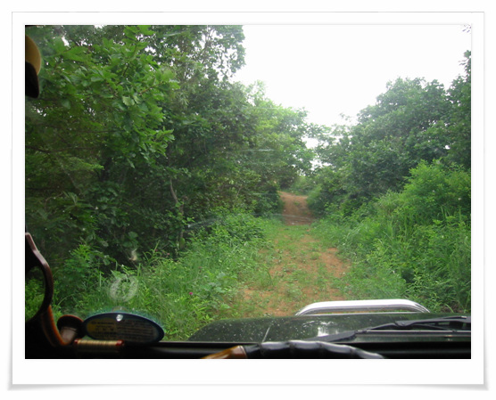
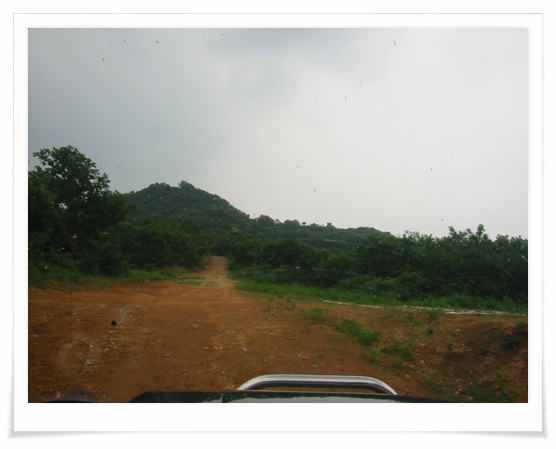
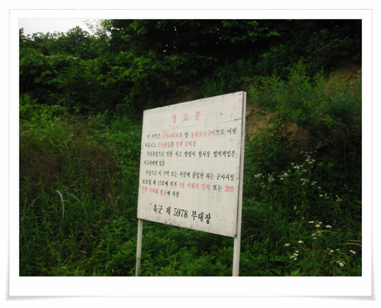
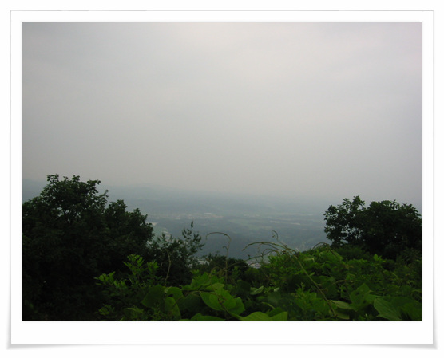
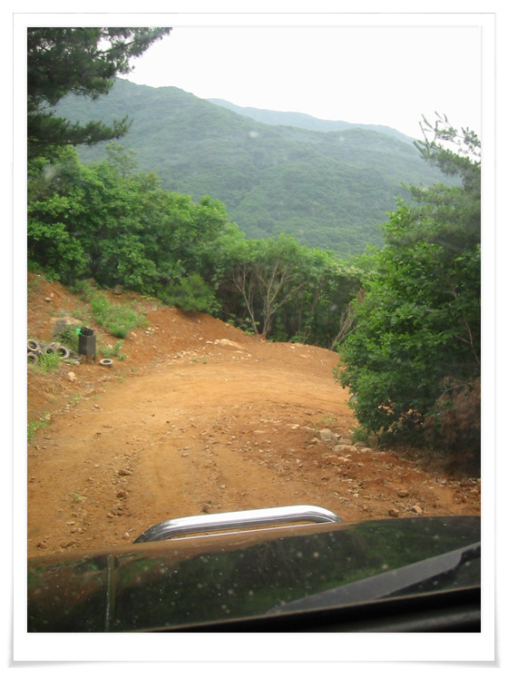

# 파평산

파주시 파평면에 있는 파평산

재미있는 오프라도 코스이지.

그 산을 5년만에 찾아갔다.

올라가는 위치는 법원리쪽이었는데, 5년만에 오다보니,

입구를 제대로 못 찾아, 산 반대편으로 올라갔다.

\- 올라가는 지점. 지도로 표시되지 않기에, 지도와 감으로 찾아 올라가야 한다.

\- 시작부는 워밍업차원으로 평탄한 오솔길이다.

\- 이제 쫌 길다운 길이 나타난다. 기어를 4륜으로 바꾸고, 다시 올라가기 시작

\- 풀밭도 있네.

\- 저기가 고지다.

\- 정상 바로 밑에 더 이상 오르지 말라고 경고문이 있군.

5년전에는 이 안에도 들어갔었는데..

\- 다 오르니, 역시 주변이 한눈에 다 보이는군.

\- 이제 내려가는길. 올라올때 4L 1단으로 겨우 올라온 길이라, 내려가는 것도 꽤 스릴이 있다.

[null](../6166878.html#6166878_1)

