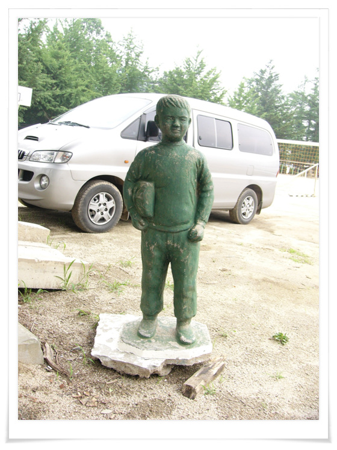
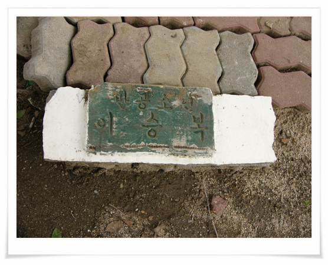

# 이승복 동상

내가 5학년의 일부를 다닌 초등학교 조현초등학교

경기도 양평군 용문면 조현리에 있다.

그 학교를 찾아가봤다.

그곳에 가본지 오래되지는 않았다. 대학4학년때 오토바이 VF-125를 산 후,

처음 가 본 곳이 그곳이었으니..

건물확장 공사중이었다.

그곳에서 본 이승복 동상

\- 공사중이라 해체되어 있는 "반공소년 이승복"

공사가 끝난 후 다시 원상복구되는지 궁금하군.

요며칠전 이승복기사 날조라는 것에 조선일보가 재판걸어 일부패소했다는 뉴스에 다시 한번 눈길이 간다.

공산주의와 자본주의의 차이점도 모르는 어린 애가 "나는 공산당이 싫어요"라는 말을 했을 거라는 것도 말이 안 맞고, 설령 했더라도, 어린애 목숨보다 사상이 더 중요한 것인가라는 것도 안타까워진다.

\- 학교에서 놀고 있는 애들. 내 20년 후배쯤 되겠구나..

[null](../6166879.html#6166879_1)

