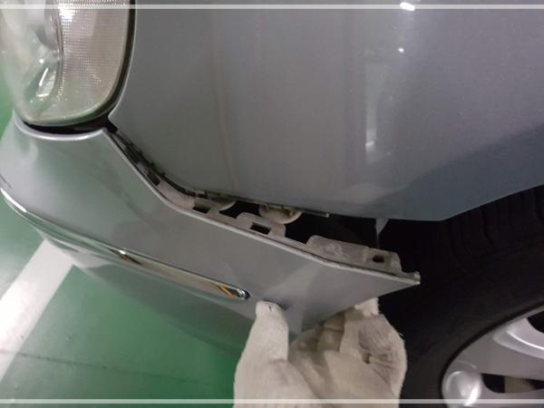
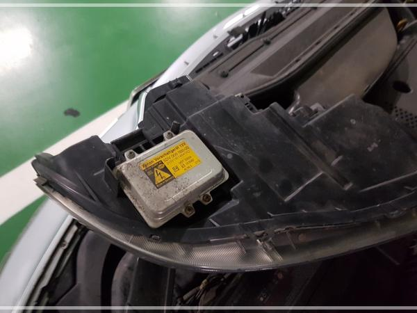

# 그랜저 TG HID 벌브 교체 DIY

운전석 쪽 전조등이 나갔다.

일반 전구가 아닌 HID는 처음이라 검색을 해 봤다.

HID 벌브 가격부터가 전구와는 비교가 안될 정도로 비싸더군.

그리고, 교체하는 것도 제법 난이도가 있어 보였다.

오픈 마켓에서 제일 싼 걸로 주문했다.

그리고 작업 시작.

헤드라이트를 탈거해야 한다.

1단계로 헤드라이트 상단으로 체결있는 있는 볼트를 전부 풀었다.

저것만 풀었다고 빠지지 않는다.  HID 벌프가 범퍼에 걸쳐 있어 범버도 벌려야 한다.

휠하우스 안 쪽의 나사 하나 풀고, 하방 45도로 힘껏 잡아댕겨 띁어냈다.

이제 헤드라이트 빠졌다.

뒷면에 있는 저 은색이 HID 벌브다.

나사 4개 풀고, 조심히 뽑아 낸다.

탈거한 벌브와 교체할 벌브.

조립은 분해의 역순.  새 벌브로 교체해서 운전석 헤드라이트 조립 완료.

운전석이 나갔으면, 조수석도 수명이 다 됐다는 것이므로, 같이 가는 것이 맞으나, 간만의 DIY로 체력 방전으로 운전석만 하고 작업 마무리.

끝.

