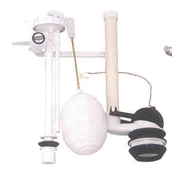
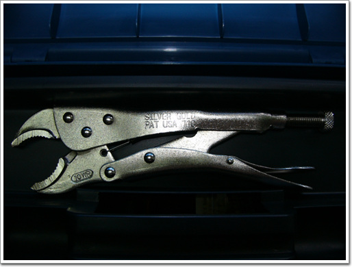
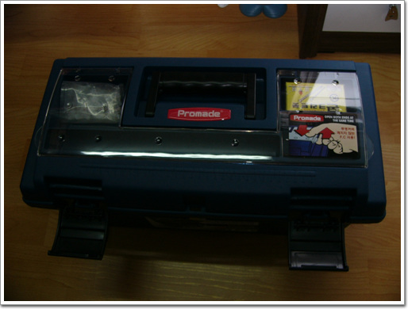

# 바이스 플라이어

집에 변기가 영 비실비실했다.

상부물수조에 물이 가득차고도 멈추질 않고 계속 물이 흘러가는거다.

이러다 한달 수도세가 걱정이 되었다.

고쳐야 했다.

사람을 부를까 내가 직접 고칠까 고민하다가, 인건비가 꽤 비싸 직접 고치기로 했다.

원인은 양변기 불탭에 삭아 제대로 잠그질 못하기 때문.

해결 방안은 내부 부속 교체.

\- 이건 철천지사이트에서 무단으로 가져온 이미지. 이게 내가 산 부속이다.

그래서 인터넷철물점 철천지에다 양변기 부속세트를 주문했다. 6900원.

그걸 교체하기 위해선 만만치 않은 작업이 필요했다.

우선은 양변기 상부 물수조를 들어내야 했다.

화장실 바닥에 누워 몽키스패너와 펜치로 풀려고 애쓰기를 여러번.

20년간 물에 통통 불어 녹슨 볼트와 너트는 이미 한몸이 되어 있었다.

상심이 가득한채 일단 접고, 해결 방안 모색.

해결 방안도 철천지에 나와 있더군.

해결 도구는 바이스 플라이어.

바이스그립이라고 불리는데, 특징은 펜치와 비슷한데, 한번 잡으면 고정되는 것이다.

그래서 모양이 날라간 볼트 같은 것들도 풀 수 있다는 공구다.

비교적 값싼 중국산으로 주문. 6000원.

배송료가 아까워 주문한 김에 공구상자도 갈이 주문했다.

\- 바이스플라이어. 자동차 정비소같은 데서 여러번 봤는데, 쓰임새는 이번에야 알았다.

\- 배송료 아까워 같이 산 공구함. 사고 보니 잘 샀다는 생각이 든다.

드디어 도착.

화장실 바닥에 다시 누워, 우선 WD-40으로 한번 뿌린 후, 바이스플라이어로 너트 해체 시작.

이게 웬걸, 볼트 자체도 딱 고정된 게 아니라서 너트와 같이 돌아간다.

고민중 철의 피로현상을 이용, 앞으로 취침 뒤로 취침을 수십화 반복. 볼트가 끊어졌다.

상부 해체 성공.

안에는 20년동안 들러불은 자국을 깨끗히 청소하고, 부속 교체하여 고치는데, 소요시간 총 3시간.

시원스레 물 내려가고, 정확히 멈추는 것을 확인하니 무척이나 뿌듯하다.

나중에 나도 철물점이나 하나 차려볼까나..

[null](../6166890.html#6166890_1)

