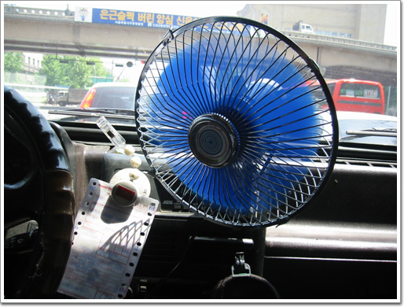

# 차에 선풍기를 달다

여름이 됐다. 적어도 나에게는..

추위는 남보다 덜 타는 대신, 더위는 꽤 많이 탄다.

그래서 여름에는 항상 선풍기를 끼고 산다.

내 차도 예외는 될 수 없지. 차를 처음 사고 나서 얼마안가서 산게 선풍기다.

겨울이 되면서 빼 놓았던 선풍기를 다시 달았다.

이런 선풍기 단 사람 흔치 않지..

\- 속도조절 스위치는 없어, 항상 강풍으로 시원한 바람을 쐴 수 있다.

처음 내 차에 타서 선풍기를 본 사람은 내 차에 에어콘이 없어서 그런 줄 안다.

에어콘이 있긴 하지만, 에어콘만으로 만족하지 못해 선풍기를 달았다.

에어콘과 함께 선풍기를 같이 돌리면 얼마나 시원하지 경험해보지 못한 사람은 아마 모를꺼다.

[null](../6166901.html#6166901_1)

