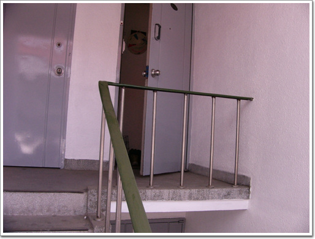

# 도둑 맞은 자전거

퇴근해보니, 자전거가 안보였다.

도둑맞은 것이다. 순간 온갖 짜증이 확 솟구쳐오르면서, 분통이 터지는 것이다.

도둑맞은 내 자전거는 made in corea 였다. 즉 좋은 거란 소리다. 그리고 사고나서 세번밖에 안 탔던 자전거였다.

그런데, 이걸 훔쳐가다니..

그리고 그 바로전날, 만원짜리 뒤의 짐받이 안장과 자전거용 끈도 사서 무려 1시간동안이나 달아놨는데,.

\- 바로 저 곳이 자전거가 있어야 곳인데..

\- 아직 자전거에 장착을 하지 못해 멀쩡이 집 안에 있는 짐 바구니.

이로써 지금까지 내가 도둑맞은 자전거는 총 3대다.

처음은 한 5년전쯤 장한평역 자전거 보관대에 묶어놓은 것을 도둑 맞았고,

두번째는 제작년 회사앞 서초구민체육센터에 묶어놓은 것을 도둑 맞았었다.

소 잃고 외양간 고친다고, 더 이상의 도둑을 막기 위해서 옥션에서 방범경보기와 창문안전잠금장치를 주문했다.

[null](../6166910.html#6166910_1)

