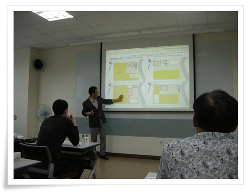

# 경기도 농업기술원 귀농귀촌준비반 2014-1기

작년 경기도기술학교에서 자동차정비 교육을 받으면서, 옆에서 왠 사람들이 밭을 갈고 있는 것을 보고 뭔가 싶어 알아봤다.

그게 경기도농업기술원에서 하는 귀농귀촌반 교육과정이라는 것을 알게 되었고 올 초 신청했다.

3월부터 6월까지 넉달동안 매달 마지막주쯤 금요일,토요일 이어서 총 8일 동안 하는 교육과정이다.

4달동안 총 네번의 금요일을 회사에 휴가를 내느라, 적잖이 뒤통수가 따가웠지만, 거뜬히 무시하고 꿋꿋이 휴가를 행사하여 무사히 교육을 마쳤다.

아주 유익하고, 보람찬 교육이었다.

특히 이번 교육을 받으면서 이제껏 공무원에 대해 부정적인 인식도 많이 가셨다.

농업기술원, 농업기술센터 쪽 공무원들은 사명의식도 뛰어나고, 농민들은 많이 생각하고 있는 듯 했다.

그러한 생각는 나뿐만이 아니라, 현지에서 농업을 하고 있는 농민분들도 그렇게 말씀하시더군.

\- 이론 교육을 받는 교육장과, 그 앞에 관리기로 밭갈기 실습을 했던 밭.

\- 교육장.

\- 교재.

\- 교육일정표.

\- 기술원에 있는 농기계들.

저것들 조작, 정비방법들도 배우고 싶은데 그건 다 평일에 하는거라 아쉽다.

\- 내가 가지고 싶은 경운기도 있고.

\- 관리기 이론 교육 시간.

\- 동력분무기 교육도 받고,

\- 이렇게 관리기에 로터리 연결해서 밭도 갈아본다.

\- 탐나는 트랙터.

\- 이앙기도 있고,

\- 굴삭기도 있다.

굴삭기도 탐나는군.

\- 장비실이 2층으로 되어 있다.

\- 관리기 주변 기기 분해 조립 실습 시간.

군대에서 K6 분해조립해 보던 때가 생각난다.

\- 식물 표본 만들기 실습도 해 본다.

\- 이런 재료로,

\- 이렇게 만들었다.

\- 식사는 기술학교 구내식당에서,..

원래 내가 짬밥을 좋아하긴 하지만 여기 식당 상당히 맛있다.

\- 농장 조경 이론 교육도 받고,

\- 직접 배치 실습도 해 본다.

역시 쉽지는 않다.

\- 이렇게 총 4달,  50시간을 통해 교육 수료했다.

상위 교육 과정을 들어보고 싶은데 다 평일밖에 없어 아쉽다.

이렇게 좋은 교육을 들을 수 있게 해 준 농업기술원과 거기서 일하시는 공무원분들께 감사한 마음을 느낀다.

