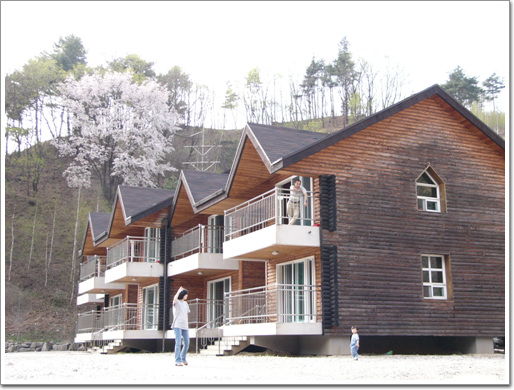
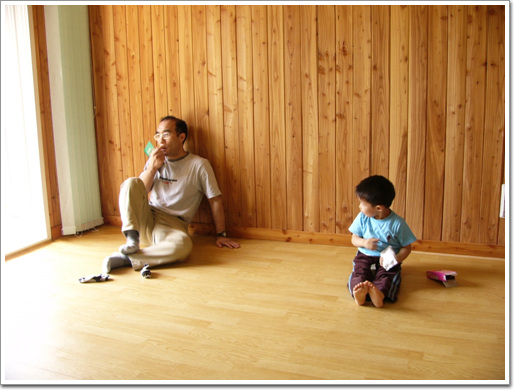
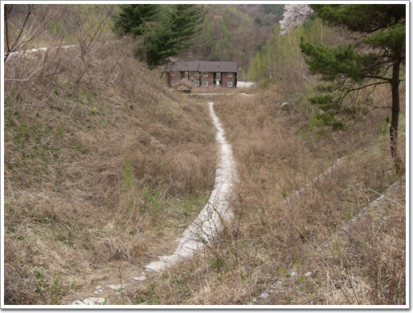
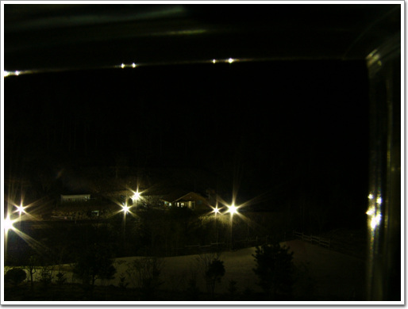
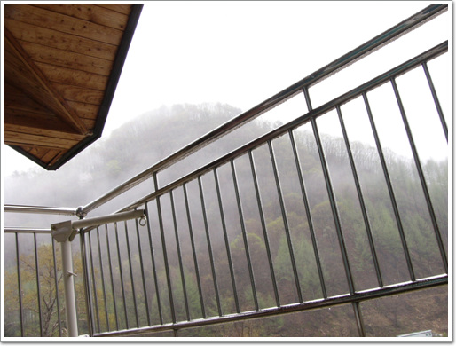
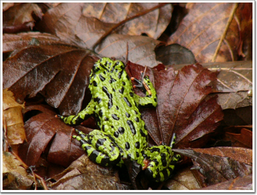

# 복주산 자연휴양림

봄날 어디를 놀러갈까 하다가, 날씨가 비가 온다고 하여, 가까운 곳으로 가기로 했다.

택한 곳은 복주산자연휴양림. 생긴 지 얼마 안된 휴양림같았다.

위치는 철원군 육단리에 있었다. 서울에서 그리 멀지 않은 곳이다. 방 수는 총 10개였고, 예약한 일요일은 다 비어 있었다. 7평짜리 파랑새 방. 44000원. 인터넷으로 예약하고, 당일 휴양림에 가서 지불하기로 했다.

춘천에 아내가 아는 노아와 탄돌네 식구가 살고 있기에, 같이 놀러가기로 하고, 일요일 아침 8시 반에 춘천으로 출발을 했다. 출발전 roadi.com에서 도로정체여부를 점검해 보니, 외곽쪽 나가는 도로들은 벌써 정체가 시작되고 있었다. 그래서 올림픽대로를 타고, 판교구리고속도로를 타고 퇴계원쪽으로 가서 경춘선을 탔다. 춘천에 도착한 시간은 11시. 노아네 식구와 점심으로 막국수를 먹은 후 휴양림으로 향했다.

홈페이지에서 뽑은 안내도에는 춘천에서 휴양림까지 1시간 20분이 걸린다고 하고, 가는 길은 춘천->사창리->와수리방면->육단리 이렇게 오라고 되어 있었는데, 한번에 찾아갈 수 있을까 내심 우려는 되었으나, 다행이 한번에 잘 찾아갔다.

복주산 휴양림. 나무는 그리 많지 않았지만, 한가로운 점이 참 맘에 들었다. 방 10개중 우리들만이 있었다. 즉 그 넓은 휴양림을 우리들만이 이용하고 있다는 것이다. 차 소리도 들리지 않고, 오직 바람소리, 새 소리 들만 들리는 점이 정말 자연속으로 왔다는 것을 느끼게끔 하였다.

휴양림답게 마당에는 숯불바베큐를 해 먹을 수 있는 것도 설치되어 있었는데, 다음에 오게 되면 숯과 고기, 철망을 사서 와야겠다..

\- 휴양림에 있는 숙소다. 2층 맨 오르쪽 방이 우리가 묵은 파랑새방.

\- 노아부자

\- 산책길을 따라 올라가다가 숙소를 찍어보았다.

\- 밤이 되니 약간 으시시하긴 했다. 저 앞의 관리사무소와 우리들밖에 없었으니..

\- 밤부터 내린 비는 다음 날까지 계속 왔다. 산속에서 한가로이 방에 누워 들리는 비소리는 몸과 마음을 다 정화시키는 듯 했다.

\- 비가 오니 개구리들이 일제히 밖으로 나와 몸을 적시고 있군..

[null](../6166914.html#6166914_1)

