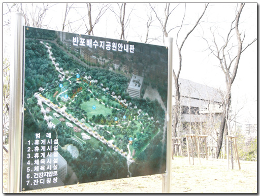

# 반포배수지 공원

오래간만에 서초역 근처에 있는 국립중앙도서관에 갔다.

이곳에 다닌지 어언 5년이 되어 간다.

백수시절 이곳에서 토익공부하고, 컴퓨터책도 보고, 잡지도 보고 했었다.

국립중앙도서관 바로 옆에 조그마한 언덕이 있다. 이 언덕에 언제 한번 가봐야지 하면서 결국 오늘 처음 가 봤다.

돈 많은 강남구답게 잘 가꾸어져있었다.

이름도 오늘 처음 알았다. 반포배수지 공원. 이 밑으로 배수시설이 있나 보다.

\- 올라가는 길

\- 올라가자 설명되어 있는 공원안내도

\- 그 조그만 언덕에 이렇게 넓은 평지가 있을 지는 예상을 못했다.

\- 이 길 역시 공원에 있는 길. 꼭 난지도 하늘공원 같은 느낌이다.

\- 내려가는길.

최근 디카를 하나 샀다. 파나소닉 FZ1. 200만화소, 12배광학줌이 되는 모델이다. 그 걸 이제야 처음 써보는 거다. 사진 찍어 보고 싶어서 올라와 본 것이기도 하다.

[null](../6166919.html#6166919_1)

