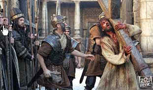

# 패션오브크라이스트를 보고

종교없는 내가 부활절 하루 전인 어제 이 영화를 봤다.

오늘이 부활절이라는 것도 부활절 구국 기도회라는 한심스런 뉴스를 보고서야 알았다.

처음에 패션오브크라이스가 영어 그대로 '그리스도의 열정' 인 줄 알았는데, 나중에서야 이 passion이 수난이라는 것을 알았다. 그래서 이 영화는 두시간 내내 예수의 고난에 대해서 사실적으로 나왔다.

이 영화가 개봉하기도 전에, 미국에서 유태인들이 상영 반대를 하였다는 것에서 알 수 있듯이, 유태인들이 예수를 죽인 것이 잘 나오더군.

기독교인이였다면, 이 영화를 보면서 눈물을 흘리며 아멘, 할렐루야를 되뇌였을지도 모르겠지만, 내겐 그저 덤덤한 영화였을 뿐이었다. 그저 예수가 얼마나 처첨한 형벌을 받다 죽었는지 그 뿐이었다.

사실적인 형벌장면-쇠못이 막힌 채찍으로 두들겨 패, 살점이 뜯겨나가는 장면들-에서도 그저 아프겠구나라는 생각과, 그 형벌을 이겨낸 예수의 위대함보다는 얼마전 사실이 드러난 안기부에 의한 간첩조작 사건으로 고문중에 숨진 최종길교수가 더 먼저 생각났었다. 인간이 인간에게 얼마나 잔인할 수 있는지..

때마침 그저께 이라크에 피랍됐다 풀려난 목사 9명도 영화 보는 내내 생각났다.

이라크에선 지금 항미독립투쟁중인데, 그 시기 점령국의 종교를 선교하고자 이라크에 들어갔던 그 목사들은 대체 어떤 생각을 갖고 있었던 걸까?

그리고, 왜 자기들이 목사라고 떳떳이 밝히지 못하고 NGO 의사라고 속였을까?

그리고 또 왜 풀려났을 때 울었을까?

삶에 그리 미련이 많은 자들이 무슨 선교를 하며, 천국을 전파하는지 한심스러웠다. 그곳에서 목사라고 밝히고, 혹시 죽는다면, 그야 말로 그네들이 말한 순교로서 천국으로 직행을 하는 것인데 왜 그 좋다는 천국을 마다했을까?

어제는 또 부활절 구국기도회가 열렸다. 물론 구국기도회답게 성조기가 날리며, 친북, 좌익 세력 척결과 한민동맹 강화를 외치며, 인공기를 소각하는 행사를 벌였다고 한다.

이 영화를 보면서 기독교라는 종교에 대해 한번 더 생각하는 계기가 됐다.

유목민족의 종교답게 피를 원하는 종교같다는 생각이 든다.

믿음,소망,사랑이라는 말도 자기 신만의 믿음, 자긴 신에게만의 소망, 같은 신을 믿는 자신들끼리만의 사랑.

[null](../6166920.html#6166920_1)

