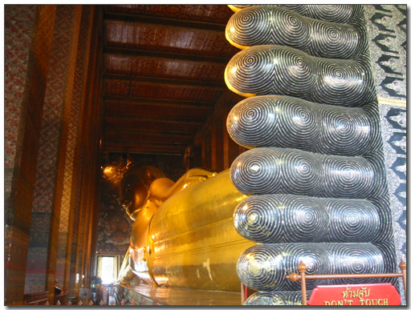

# 와트포와 와트캐사프리오 구경

불교국가와 어딜 가든지 절이 있다.

너무나 많은 관광지가 있어, 오히려 찾아가 보고싶기도 전에 질린 것 같기도 하다.

와트포. 누워있는 부처, 와불상으로 유명한 절이다.

길이 48m, 높이 15m나 된다는군.

입장료 20바트(600원)을 내고 들어갔다.

먼저 그 유명한 와불상을 보러 본당에 들어갔다.

\- 와불상. 크기도 크기지만, 저 발바닥에 정교하게 자개로 입혀진 것도 인상적이다.

\- 발바닥의 자개

\- 부처얼굴. 예전 국사시간에 배웠던가? 고구려, 백제, 신라의 부처 표정이 다 다르고,

고려, 조선 시대때의 표정또한 다르다고.. 나라마다도 표정은 다 다르군.

와불상 못지 않게 내 관심을 끈 것은 일렬로 쭉 늘어선 시주함 비슷한 거다.

수십개의 항아리에 동전을 집어 넣을 수 있게 되어있다.

20바트(600원)을 내면 25사탕(10원)짜리 동전 50개로 바꿔준다.

그러면 그 동전으로 시주함에 넣을 수 있는 것이다.

\- 시주함. 큰 돈이 아니고, 시주하는 재미도 있어서인지 많은 사람들이 하고 있는 중이다.

\- 20바트 집어넣고, 저 한 컵 가져가면 된다.

동전을 넣을 때 내는 쟁그랑하는 소리가 마치 경소리마냥 들린다.

우리도 이런 방법을 도입하면 좋지 않을까 싶다.

무작정 시주함 설치해 놓고 돈 넣기를 기다리기 보다는,

이렇게 작은 동전으로 바꾸어 주고, 동전으로 시주를 하게 하면,

모르는 관광객이라도 한번 해보고 싶을텐데..

암튼 나도 20바트 바꾸어 그 시주함에 쭉 넣었다.

와불상말고도 와트포는 그 자체로 아름다운 절이었다.

\- 서양인을 본뜬 수호신 상

\- 곳곳이 있는 정교한 탑

다음 간 곳은 와트캐사프리오. 입장료가 무려 200바트(6000원)이나 하는 곳이다.

왕궁과 같이 이어진 곳으로, 경비도 군인들이 직접 서고 있다.

들어가기에 앞서 복장검사도 하여, 슬리퍼나 반바지는 입장이 안되기 때문에,

옷 빌려주는 곳에서 옷을 빌려 입고 들어가야 하는 곳이다.

\- 에메랄드 불상이 있는 본당. 건물안에서 사진촬영을 할 수 없고, 외부에서만 할 수 있었다.

\- 선착장 부근에서 본 나무. 물속에 있는게 신기하다

[null](../6166926.html#6166926_1)

