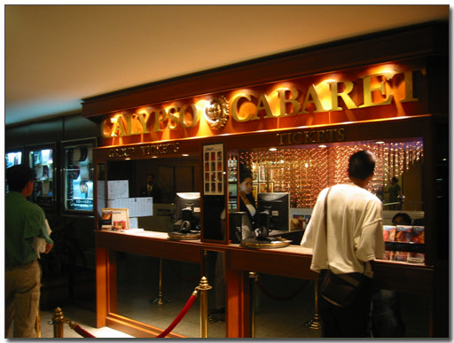
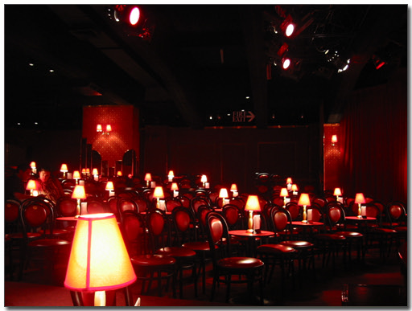
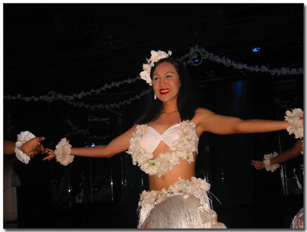
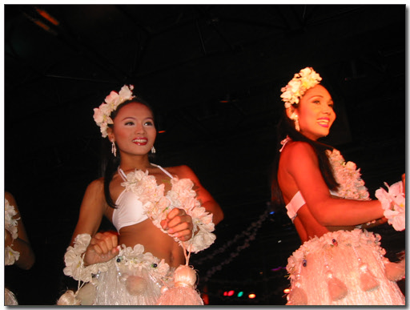
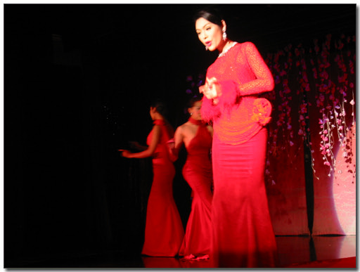
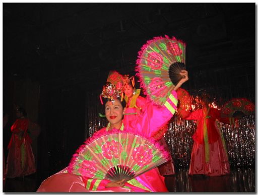
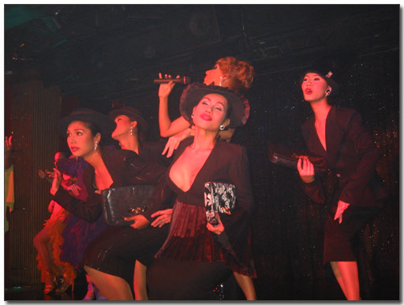

# 칼립소 쇼

방콕관광의 진수는 칼립소 쇼라고 한다.

이 쇼는 지난 번 태국갔었던 동함이 꼭 보라고 추천한 거다.

여자보다도 더 이쁘게 생긴 트랜스젠더들의 공연이다.

그래서 거금 투자해서 함 봐보기로 했다.

여행안내책자를 보니, 칼립소 쇼가 어른 800바트(2만5천원)이라고 한다.

꽤 비싸다. 이 큰 돈을 주고 볼까 말까 고민을 했는데,

역시나 먼저 이 쇼를 본 동함이 싸게 볼 수 있는 방법을 알려주었다.

goodmorning travel이라는 우리나라 여행사를 통해서 예매하면 400바트(13000원)에

볼 수 있다는 거였다. 방콕에 본점이 있었다. 전화를 했다.

다행히 한국사람이 있었다. 직접 와서 표를 살 수 있다는 거였다.

위치는 수쿰빗거리 쏘이 13에 있는 수쿰빗스위트 건물 14층에 있다고 했다.

점심시간을 이용하여 그쪽으로 갔다.

가서 샀다. 생각보다도 훨씬 사람들이 친절했다.

시간은 밤 9시 45분꺼다.

칼립소 쇼가 무언가 하면, 영화 '쇼걸'에 나오는 것과 비슷한 쇼다.

흔히들 라스베가스 쇼라고들 한다. 라스베가스 쇼를 본 일이 없기 때문에 잘은 모르겠다.

아, 비슷한 거 본 일은 있구나.

예전 다음에서 괌으로 놀러갔을때 봤던 라스베가스식 쇼.

그때 봤을 때는 생각보다도 재미없었던 것 같았는데..

값도 꽤나 비쌌었다. 한 6만원 정도 들었었던 것 같다.

\- 칼립소 입구에 있는 매표소. 여기서 사면 800바트(25000원)이다.

칼립소의 위치는 아시아호텔 지하다. 전철 라차트위 역에서 바로 내리면 있는 곳이다.

9시 45분에 입장을 하였다.

좌석은 한 300여석 되어 보이는 생각보다는 작은 곳.

좌석이 정해져 있었는데, 내 좌석은 무대 바로 앞.

좌석 착석과 동시에 음료 하나가 제공되는데, 6개 중에서 고를 수 있었다.

맥주로 골랐다.

\- 좌석수, 한 300여석의 그리 크지 않은 규모다. 그리고 평일이라서 그런가 사람도 반 밖에는 안찼다.

한가지 부족했던 점은, 사운드다. 생각보다는 음향시설이 부족한 듯한 느낌이었다.

공연은 한국, 중국, 일본, 인도, 그리고 서양 무용등을 했다..

\- 이건 하와이식 무용

\- 이쁘게 생긴 엉아들..

\- 샹송을 멋있기 립싱크하는 모습

\- 아리랑에 맞춰 부채춤

\- 이건 무슨 뮤지컬의 한장면을 공연하는 것 같은데, 잘은 모르겠다..

제일 완쪽의 고개 쑥 내민 엉아가 프리마돈나인 것 같다. 제일 많이 출연했다.

공연은 1시간 정도 되었는데, 꽤 재미있어 1시간이 금방 지나갔다.

출현자들이 전부 다 여자보다 더 이쁜 것은 아니었고,

일부는 얼굴은 그냥 곱상한 남자얼굴에 몸매만 여자몸매인 것 같기도 했다.

처음에는 트랜스젠더라는 이미지때문에, 혹시나 있을지도 모르는 종아리의 굵은 털과 목젖을 찾아보기도 했지만,

얼마 안 있어, 그냥 공연 자체를 즐기게 되었다.

[null](../6166930.html#6166930_1)

