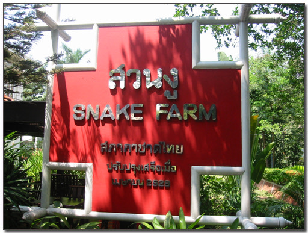
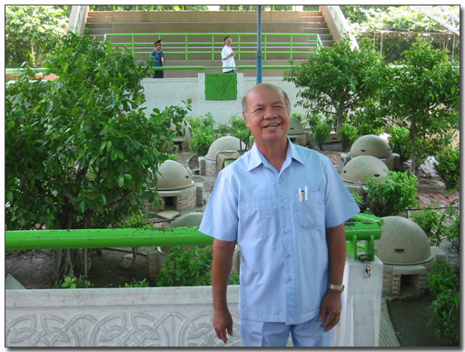
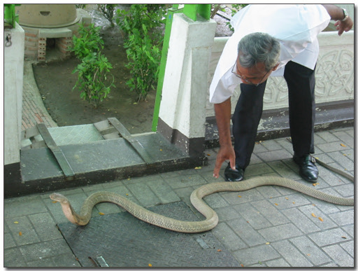
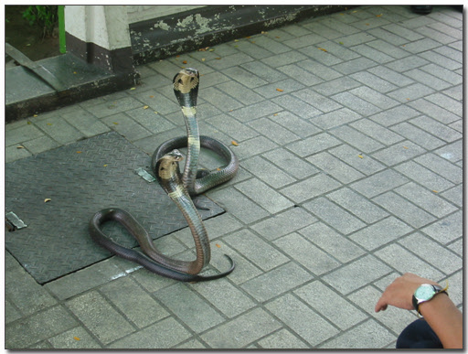
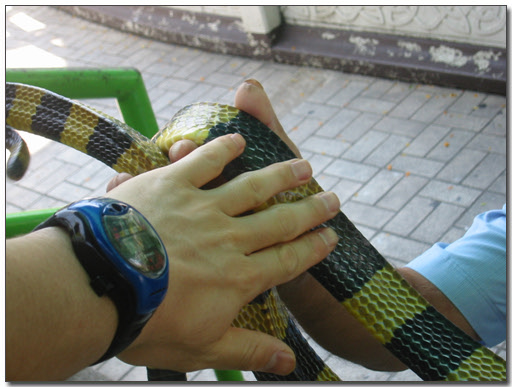
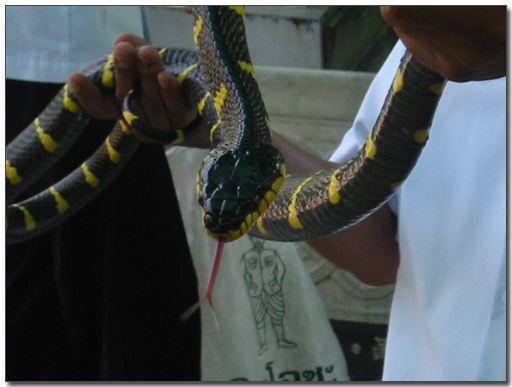
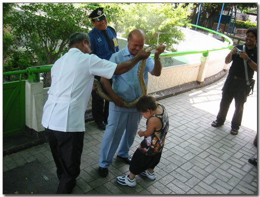

# 뱀 농장

방콕 시내에 있는 뱀농장이다. 국립독연구병원인가하는 곳의 부설농장이다.

여기서 독사들을 키우고 있는 것이다.

솔직이 내가 파충류, 특히 비암을 좋아하긴 하지만,

방콕에서 이 뱀농장을 꼭 보고 싶어하고 싶었던 것은 아닌데,

먹고자 하는 람부탄과 망고스틴도 이미 섭렵을 했기에, 더 이상의 방콕에서의 낙이 없어서,

낙을 찾고자, 소시적 뱀가지고 놀던 기억을 되살려 이곳을 찾은 것이다.

뱀농장이라길래 난 아나콘다도 있을 줄 알았다. 불행히도 없더군.

위치는 내가 묵은 호텔에서 꽤 가까웠다. 걸어서 10분정도 가니, 뱀농장이 있었다.

시간은 점심시간때 갔다.

\- 오늘의 뱀쇼 진행을 맞은 사회자. 전체적인 설명은 영어로 했다.

\- 저 뒤에 있는 우주선 모양의 것이 뱀 집이다.

\- 첫 출연자 킹코브라. 길이는 2미터 정도 됐다.

\- 두번째 출연자 그냥 코브라

\- 비단구렁이. 직접 만져봤다. 소시적 군대에서 술담그려고 잡았던 독사보다 훨씬 부드러웠다.

\- 내 디카는 2배줌밖에 안된다. 이렇게 가까이 보였다는 것은, 뱀 머리에 바로 붙어 찍어다는 것이다.

\- 마지막에는 관람객들에 뱀으로 감아주는 체험이 있었다. 지금은 어린애가 하는 중.

\- 나도 했었는데, 안타깝게 시리 날 찍어줄 사람이 없어, 날 찍지는 못했다.

[null](../6166931.html#6166931_1)

