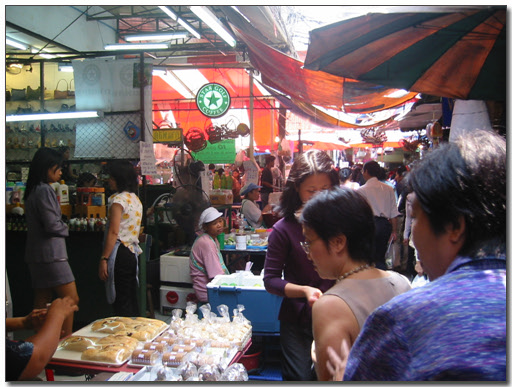
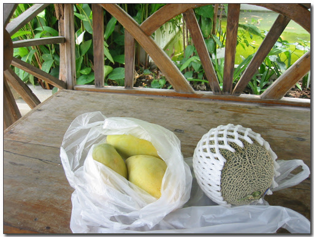
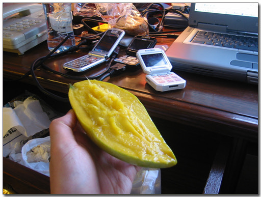
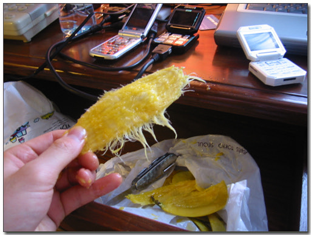
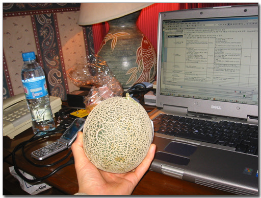
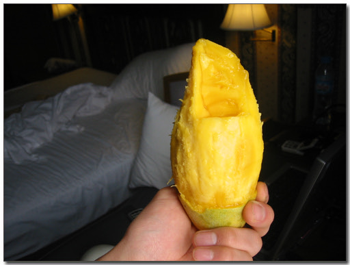
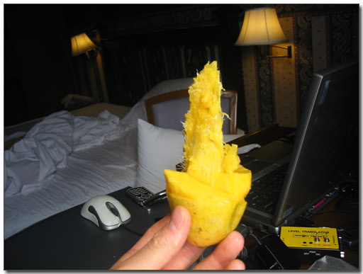
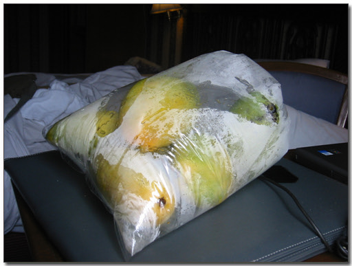

# 망고 킬러

어제는 대통령 탄핵 가결됐다는 소식을 이곳 태국에서 들었습니다.

열불이 나는 일이죠.. 태국 뉴스에서도 꽤 시간이 우리나라 탄핵가결 소식이 들리더군요.

태국어를 몰라, 무슨 말을 하는지는 모르겠지만..

세번째 온 이곳 방콕. 별 재미가 없습니다. 이곳에 밀림이 있는 것도 아니고 황량한 사막도 있는 것이 아닌, 그냥 빌딩들 많이 있는 관광 대도시. 내가 좋아하는 스타일은 아님. 중국처럼 혹시 불법DVD 많이 있나 찾아봤는데, 유명영화밖에 없더군요. 그것도 가격 150바트. 우리나라돈 4000원정도 하는 거죠. 중국에서는 10원, 우리나라돈 1500원이면 됐는데,..

이번 출장의 목적을 먹는데 두기로 했습니다. 그렇다고 제가 태국음식을 좋아하지는 않습니다. 중국음식이 딱 내 입맛인데, 태국음식은 좀 시큼하면서도, 식은 음식들 위주라, 얼큰한 탕을 좋아하는 내게는 잘 안맞더군요.

얼마전 집들이하느라 메론을 하나 샀는데, 자그만치 하나에 16000원. 그래서 여기 남국에 왔으니 그 비싼 남국 과일들을 마음껏 먹기로 하고, 시장에서 과일을 사서 먹고 있습니다. 아직 과일들이 제철이 아닌지, 별로 없더군. 내가 좋아하는 람부틴과 망고스틴은 아예 보이지도 않아 심히 안타까웠습니다.

\- 과일을 사기 위해 시장을 어슬렁 거리고..

\- 망고와 메론을 샀다. 메론 3개에 70바트(2200원), 메론 80바트(2500원)

\- 일은 뒷전이고, 우선 망고를 꺼내들고 먹기 시작합니다.

\- 순식간에 뼈다귀만 남은 망고

\- 이번엔 메론. 네가 바로 그 비싼 메론이렸다!

\- 우선 아껴먹기 위해, 조금만 떼서 먹다보니, 어느새 이 큰 메론도 순식간에 사라지고..

\- 다시 망고를 꺼내들고, 다른 방식으로 먹기 시작

\- 왜 이리 빨리 없어지지?

\- 다시 망고 구입. 이번엔 다른데서 샀는데, 5개에 100바트(3000원)에 샀다. 이건 아껴먹어야지..ㅋㅋ

[null](../6166935.html#6166935_1)

