# 금강산 마지막 날 - 해금강과 삼일포

해금강과 삼일포

2박 3일의 여행 중 마지막 3일째. 3일차는 실제 금강산 여행은 오전밖에 안되는 셈이다. 오후에는 출국 및 버스 타고 남한에 입국하기 때문이다.

3일차는 두 가지 선택이 있다. 만물상을 볼 것인가, 아니면 해금강과 삼일포에 갈 것인 가였다. 만물상은 금강산중에서도 오지로서, 예전부터 길이 험하여 만물상에 가는 이가 적었다고 한다. 그래서 금강산 거의 어지간한 봉우리에는 불교식 이름이 붙어져 있고, 곳곳에 사찰이 있었는데, 만물상만큼은 불교식 이름도, 암자도 없었다고 한다. 만물상은 기암괴석으로 유명하다고 한다. 반면 해금강과 삼일포는 예전부터 금강산 유람의 마지막 코스였다고 한다. 그래서 힘든 코스는 없이 아름다운 경치와 그동안 쌓인 여독을 여기서 풀만한 곳이라 한다.

어디를 갈까 고민하다가 삼일포로 정했다. 건성으로나마 산을 봤으니, 이제 바다와 호수도 보고 싶었다. 아침에 호텔을 나설 때 짐을 다 싸고 체크아웃을 해야 한다. 관광 종료 후 곧장 출국심사장으로 이동하기 때문이다. 짐을 다 싸고 버스에 실고 꽤나 번잡하더군.

출발은 항상 온정각에서 출발한다. 호텔에서 출발한 버스는 온정각으로 가, 거기서 다시 만물상 갈 사람들과 해금강 갈 사람들로 나뉘어 버스를 갈아탔다. 우리가 갈 해금강과 삼일포는 아이젠이 필요 없으므로, 반납했다.

차는 우선 해금강으로 출발하였다. 버스타고 가는 시간은 한 40여분. 제법 긴 시간이다. 이곳 북에서는 이러게 긴 이동 시간이 오히려 더 좋았다. 아무래도 관광지외의 다른 모습들도 볼 수 있을 테니까..

기대를 저 버리지 않고, 버스는 서너 마을을 지나갔다. 처음에는 도로 금강산관광 전용 도로라서 멀리서 밖에 볼 수 없었는데, 점차 마을길로 가게 되었다. 이곳 고성 땅이 북한으로서는 최남단 마을이고, 군사분계선과 가까이 있다보니, 군부대들도 많이 보였다. 우리의 군대 모습은 우선 산골짜기에 위치해 있고, 부대 주위를 담장으로 잘 안보이게 했을 뿐 아니라 철조망으로도 휘감아 놓았는데, 이곳 북한의 부대는 그런 담 같은 게 아예 없었다. 그 점이 제일 신기했다. 인민군들은 탈영도 안하나? 부대의 막사도 일반 집들처럼 생겼었고, 군대 차량들도 전혀 은폐시설 없이 있었다. 단지 포들만이 포상에 들어가 있어, 공중 폭격으로부터 방호되도록 되어 있었다. 부대의 모습은 열악해 보였다. 물론 남한 부대에 비해서다. 북의 다른 민간인 마을들도 열악한 상황이니, 그다지 부대만 낙후됐다라고 는 볼 수 없겠지만..

버스가 마을을 지나고 있는 시간이 8시쯤 되었는데, 그 시간이 애들 등교하는 시간인 것 같았다. 남색 옷에 붉은 색 스카프를 맨 아이들이 걸어가고 있는 모습이 보였다. 등교하는 거리는 그다지 가까워보이지는 않았다. 걸어온 방향을 보니, 민가가 보이지 않은 걸로 봐서는 적어도 4,5 km는 걸어오지 않았을까 싶었다. 마을 입구에는 '김일성 원수를 받들어 미제를 까부수자'라는 구호와 '목숨 받쳐 당 지도부를 지켜내자' 뭐 이런 구호들이 적혀있고 그림도 그려져 있었다. 버스 바로 옆으로 학교도 있었는데, 기억나는 게, 그 학교 앞에서 우리를 감시하는 북한군이 서 있었는데, 그 군인 바로 옆에서 우리를 유심히 쳐다보고 있는 애였다.

해금강은 민간인 통제구역이었다. 우리로 치면 민통선이겠지.. 그래서 해금강 입구에는 3중 철조망이 있었다. 그 곳에서 북한군으로부터 인원점검을 받고 민통선 안 쪽으로 들어섰다. 처음 맞이한 것은 소나무밭. 모래밭 좌우로 소나무가 쫙 펼쳐져 있었다. 이런 곳에 관광버스가 경유를 연소하며 가는 게 미안스러웠다. 이 깨끗한 공기를 보존하기 위해 천연가스 버스 같은 것으로 운행하면 좋겠다라는 생각은 들지만, 북에 천연가스 공급소를 만들고 운행하는 게 아마도 운영비가 몇 배 더 많이 들지도 모르겠다.

주차장에 버스가 정차한 후, 걸어가면서 구경을 했다. 이곳이 민통선 안쪽이라서 그런지 상대적으로 볼 수 있는 공간은 제한적인 것 같았다. 조장들도 이곳 해금강에서는 그리 많은 설명이 없었다. 그래서 그냥 경치 좋네라는 것 이상의 느낌은 없었던 것 같다.

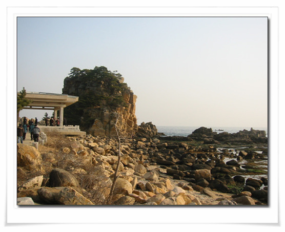

-해금강에 도착했다. 저 바위가 아마 만물상 바위던가? 잘 모르겠다.

\- 환경관리선생들

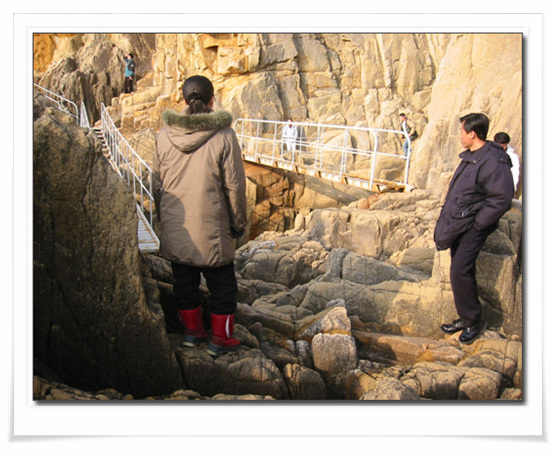

\- 환경관리선생들의 복장은 다 이런 복장이다.

\- 이런 철다리가 놓여 있는 좀 더 쉽게 해금강의 모습을 볼 수 있다.

북에 오기전 통일 전망대에서 북쪽을 바라본 적이 있었다. 거기서 멀리 보이는 해금강이 보이긴 했었는데, 바로 그 그곳에 서 있다는 좀 색다른 느낌이었고, 남쪽 저 멀리 보이는 곳이 남한이라는 것도 특별한 느낌이었다. 북한에서 남한 땅을 보다니. 망원경으로 보면, 통일전망대도 보인다고 하는데, 망원경이 없어 구별은 되지

않았다.

\- 저 멀리 보이는 땅이 남한 땅이다. 북에 보는 남한 땅은 묘한 느낌이다.

\- 실제 사용하는 것인지 모르겠지만, 배도 있다.

금강산관광 마지막 날이어서 그런지, 사람들이 환경관리선생들에게 말을 많이 걸었다. 아마도 대부분으로 사람들이 금강산 자체보다는 북한, 그리고 북한사람을 더 보고 싶었을지도 모르겠다. 해금강 중에서도 유명한 곳이 바다만물상과 해금강문, 그리고 해금강인데, 우리가 본 것은 아마 바다만물상의 일부인 것 같다. 군사적인 이유로 다 공개된 것은 아닌 것 같다. 해금강의 금강문에 쓰인 여러 글발들을 보고 싶었는데, 그것은 이 이유로 볼 수 없었다.

\- 환경관리선생과 대화하는 어떤 아저씨.

\- 남남북녀답게 뛰어난 미모로 9명의 아저씨들로부터 눈길을 한 눈에 받고 있는 환경관리 선생

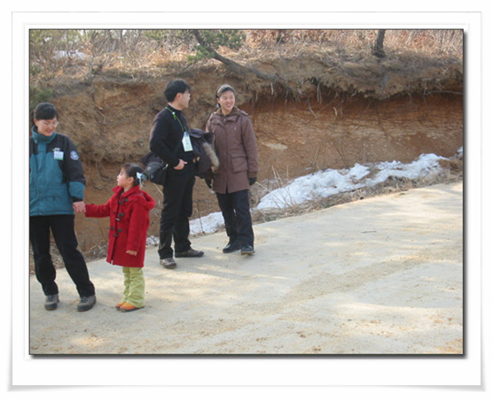

\- 역시 대화하는 남한관광객과 환경관리선생

버스는 이제 삼일포로 향했다. 삼일포는 해금강에서 4km 정도 밖에 떨어져 있지 않은 곳이었다. 둘레는 8km, 수심은 10여 미터가 되어 여러 담수어종이 자라고 있다고 한다. 솔밭 길과 민통선을 나가, 한 10여분 가니 삼일포다. 삼일포라는 이름은 옛날 화랑들이 하루만 놀러 왔다가 이곳이 너무 좋아 삼일동안이나 놀고 갔다하여 붙여졌다 한다. 그래 이 다녀간 화랑들의 자취가 삼일포 한가운데 있는 섬인 단서암에 "술랑도 남석행"이라고 씌어져 있었다는데, 이 글씨가 유명하여 탁본해달라는 요구가 많아, 고생하던 주민들이 글씨를 짓이겨 물속에 처넣어 버려, 지금은 물이 적을 때만 몇 글자 보인다고 한다.

\- 버스로 이동하는 동안 설명해주시는 조장님.

\- 버스에서 내려 삼일포 구경 시작

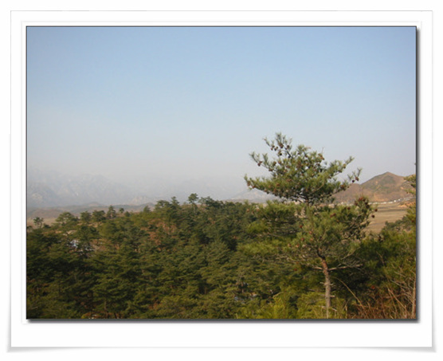

\- 멀리보이는 금강산과 고성평야

이곳 삼일포에는 구룡연의 목란관처럼 북한상점이 있었다. 단풍관이라는 곳이었는데, 마지막 날이고 해서 여기서 북한상품도 살 겸해서 들어갔다. 단풍관의 김정일 장군의 생모 김정숙이 삼일포를 찾은 것을 기념하여 지은 것이다. 먹을거리도 몇 가지 있었다. 장진단감자와 감자지짐, 감자튀김, 삼일포호수가 조개, 소고기 남새 꼬치구이와 막걸리를 팔았다. 모두 각각 1달러씩. 싼 가격은 아니다. 우리는 장진단감자와 감자지짐, 꼬치구이와 막걸리를 먹었다. 한 10여 평 되는 공간에 원형테이블 2개만이 있어, 거기서 다들 서서 먹었다. 테이블에는 냅킨이 있는데, 시험지로 흔히 쓰는 갱지 잘라놓은 거였다. 막걸리는 도수가 꽤 높아, 많이 먹지 못하고 두어모금정도 마셨다.

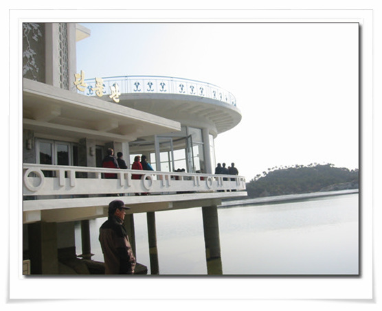

\- 단풍관

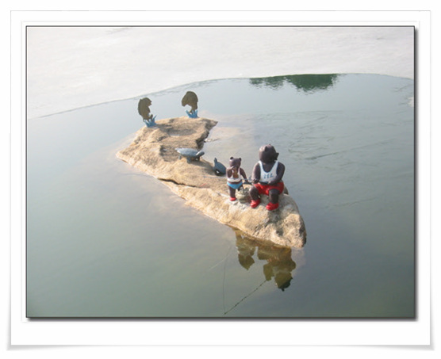

\- 호수에는 삼일포라는 메리야스를 입은 곰돌이 부자가 낚시도 하고 있다.

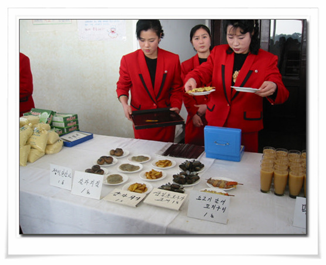

\- 단풍관에서 파는 음식들

\- 원탁에 앉아 음식을 맛보고

\- 시선을 끈 갱지로 된 냅킨

그 공간에 특산품도 같이 팔았는데, 여기서 우리는 꿀과 술을 샀다. 산 것 까지는 좋았는데, 포장이 영 엉성하더군. 병으로 한 7병 정도 산 것 같았는데, 갱지에 둘둘 말아서, 그대로 비닐봉지에 다 집어넣어 주는 거였다. 들고 다니느라 좀 힘들었다.

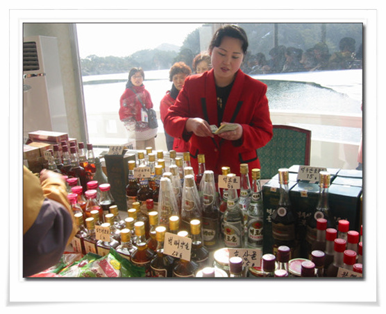

\- 상품 판매에 눈코 뜰새 없이 바쁜 점원들

삼일포 경관에 조금은 어울리지 않은 현대식 전망대 충성각이 있는데, 이 충성각이 삼일포 관광의 마지막이었다. 이곳 충성각에는 삼일포의 전체 모습이 다 보였다. 1947년 김일성 주석이 아내 김정숙과 이곳 삼일포를 거닐다가 김정숙이 김일성의 총을 받아 호수 속에 매달아 놓은 과녁을 단방에 맞히면서 혁명의 완성을 맹세하여, 그 충성을 기리기 위해 충성각을 지었고, 이 충성각도 북의 성지중의 하나라고 한다.

\- 장군대 오르기 전 바라본 단풍관

\- 장군대에 오르는 길

\- 장군대 바위에 적힌 김일성동지만세

\- 저게 무선대였던가? 비래정인었던가? 기억이 잘 안난다.

\- 사선정과 와우도. 호수중간에 떠있는 정자가 사선정이고, 오른쪽의 섬이 소가 누워있는 형태라 하여 와우도라 한다.

\- 좀 더 가까이 본 사선정

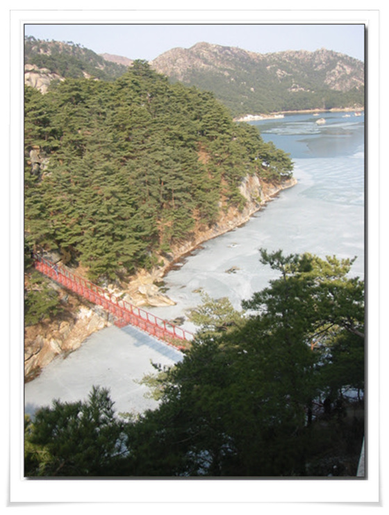

\- 충성각에서 내려다 본 출렁다리와 삼일포 전경

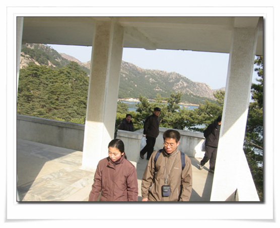

\- 이 전망대가 충성각이다.

\- 불요불굴의 공산주의혁명투사 김정숙 여사

\- 소나무 중간에 박힌 흰색 물체. 전봇대 대신 전기를 저렇게 나무에 박아 연결되어 있었다.

삼일포 관광에 주어진 시간이 그리 많지 않았다. 짧은 시간을 대충 보고 다니 금강산관광 2박 3일의 일정을 모두 끝나고 귀국할 준비를 할 시간이었다. 온정각에서 점심을 먹은 후, 회사 사람들에게 줄만한 것들을 사기 위해 상점코너로 갔다. 살만한 게 없더군. 도라지, 버섯, 인삼, 뱀술, 뭐 이런 식의 상품밖에는 없었다. 제일 만만한 호박엿으로 골랐다. 북에서 제배한 호박을 가지고 남한에서 만든 것이라 하였다. 엿에 원산지 표시가 안 되어 있으니, 뭐 확인할 도리는 없었다.

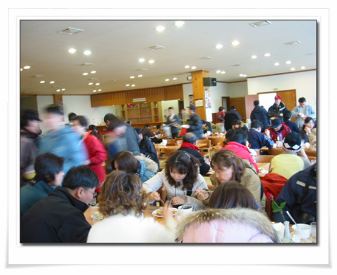

\- 마지막 식사 점심. 꽤나 혼잡했다.

온정각에서 떠날 때 온정각의 모든 직원들이 다 나와 환송을 해 주었다.

출국심사하기 위해, 버스에 실어놓은 짐들을 다시 다 꺼내어 들고 심사대로 가는 것도 꽤나 귀찮더군. 출국심사대를 통과하여 다시 버스에 타고 나와, 북한군 지프차의 호위를 받으며 남으로 향했다. 군사분계선을 넘어가는 동안, 북측에서도 동해북부선 공사가 한창이었다. 하지만 일하는 사람들의 태도는 영 아니었다. 열명정도가 모여 있으면서 한두 명 삽질하다 쉬고, 조금 삽질하다 쉬고 그런 식이었다. 사회주의고 굳이 열심히 일할 필요가 없기 때문이겠지만, 경쟁사회에 익숙해져 있는 눈으로 보기에는 너무나 비능률적이었다.

비무장지대를 지나 다시 남한으로. 남측 통문을 지나니 우리 육군이 손을 흔들어 주더군. 남북출입국사무소에 도착하여 입국신고 및 세관 검사를 함으로써 2박 3일간의 금강산 관광 끝.

2박 3이이라는 시간은 짧을 수밖에 없는 시간이었다. 친절했던 직원들과 조장들이 기억에 남는다. 특히 조장들. 나이는 20대 중반에서 30대 초반까지 이루어져 있는데, 직업 때문만은 아니라 정말 금강산을 좋아하고, 이 남북교류사업에 긍지를 느끼며 일하는 분들이었다. 못사는 북한에 대한 우월감을 가질 만도 하고, 우리와 너무나 다른 사고방식에 약간의 이질감도 느낄 만 한데, 정말이지 이 나라와 금강산에 대한 애정 없이는 이처럼 친절하고 남북관계를 진심으로 걱정하지는 못 할 것 것이다. 어찌 그 시간 안에 다 볼 수가 있겠는가. 아쉽기는 하지만, 다음에도 또 다시 금강산에 와 봐야겠다. 겨울 금강산에 왔으니, 나머지 계절, 봄여름가을에도 와 봐야겠다.

