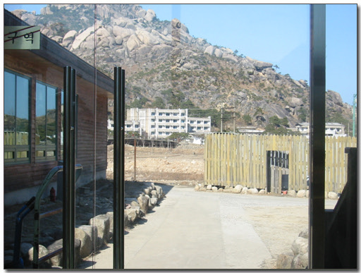
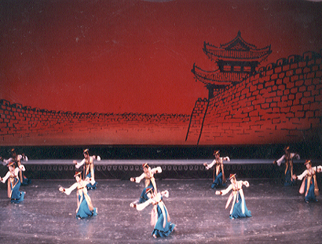
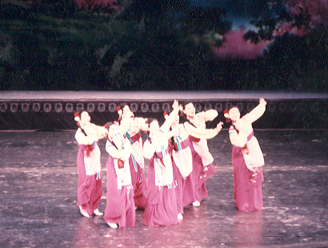
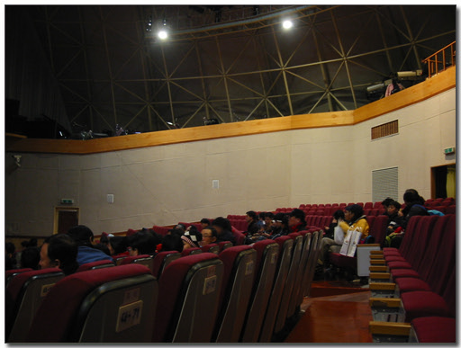
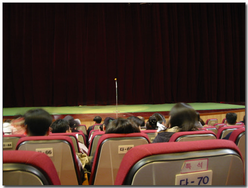
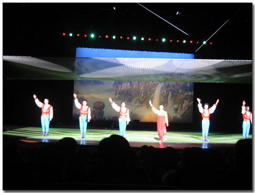
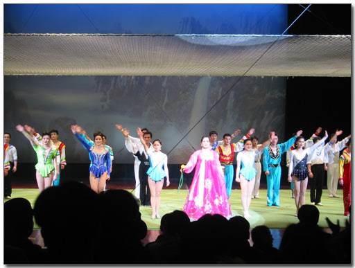
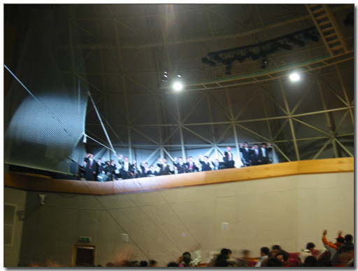
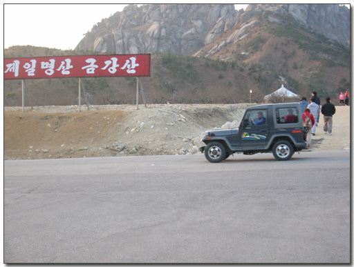

# 금강산에서 평양모란봉교예단 공연

금강산에서 평양모란봉교예단 공연

오전동안 구룡연과 상팔담을 구경한 후 점심때 온정각으로 내려왔다. 금강산 등산 시각은 채 4시간 정도 밖에 안되는 셈이다. 일정이 할아버지, 할머니도 무리없도록 짜여진 듯 하다. 이 점이 아쉽긴 하다. 젊은 사람들은 오전, 오후 다 구경하는 게 더 좋지 않을까 생각되는데,.

금강산에 오기전에 가졌던 생각이 한 반 이상은 할아버지, 할머니겠거니 여겼었다. 그런데 할아버지 할머니는 별로 없었다. 열명도 채 안 돼 보였다. 하긴 금강산 관광이 이제 5년이 다 되어가니, 금강산을 애타게 기다리던 할아버지 할머니들은 다 구경하셨겠지. 3,40대 아저씨 아줌마들이 제일 많았다. 산이 좋아 산을 찾는 사람들인 것 같았다. 국내산들을 다 둘러보고 난 후 , 금강산에 온 사람들인듯 싶다.

\- 문 밖으로 보이는 온정리. 북한 주민이 살고 있는 저 마을은 이렇게 눈으로만 볼 수 있다.

2일차의 일정은 오전에 구룡연과 상팔담, 그리고 오후에 온천과 평양모란봉교예단 관람이다. 온천과 평양모란봉교예단은 선택사항이지만, 선택하지 않고 그 시간에 따로 할 수 있는 것은 없었다. 공식적으로 호텔로 들어가는 버스도 없고, 그렇다고 구역 밖으로 나갈 수도 없었다.

점심을 배불리 먹은 후 온천에 들어갔다. 이틀 연속으로 들어가니, 전날만큼의 감동은 덜했다. 2시 반에 들어가서 한 시간 반가량을 온천에 있었다. 역시 냉온탕 번갈아 가며 온갖 시설을 다 이용했다. 대낮에 하는 온천욕이고, 날씨도 청명한 상태에서 노천욕을 해서인지, 나중 끝나고 나오니, 얼굴 벌겋게 익었다. 햇볕에 탄 거다.

평양모란봉교예단 공연은 문화회관에서 4시 반에 시작하였다. 일반석 25달러, 특석 30달러. 한 시간 반 공연치고는 그리 만만치 않은 가격이다. 특석을 끊었다. 남한에서 서커스는 쇠퇴하여 남아있는 것은 내가 알기로 동충서커스 밖에 없고, 그 나마 명맥이 끊길 위기에 있다고 하는데, 여기 북한은 그렇지 않았다. 교예단이라 하면 우리나라의 국가대표체조선수 혹은 현대 무용가 수준을 대접을 받는다고 한다. 이 평양교예단은 1952년 만들어져 80년대부터 해외 공연활동을 하여 국제대회에서 여러 차례 수상을 한 우수교예단이라 한다.

\- 예전 TV를 통해 소개되었던 평양교예단의 군무와 칼춤(통일부홈페이지서 펀 사진임).

사실, 내가 교예단에 기대했던 것은 서커스보다는 군무나 칼춤 같은 거였다. 2000년도인가 이 평양교예단이 서울에서 공연을 했었는데, 그 때 서커스뿐만 아니라 이런 춤도 했었다고 한다. 가끔 일요일 아침에 하는 '지금 북녁에서(?)' 이런 프로그램에서 북한 방송 틀어주다보면, 현란한 동작과 춤이 눈을 사로잡았었다. 그리고 최승희식의 무용이 과연 어떤 것인가도 보고 싶었고,.. 그리고 평양모란봉교예단이라는 이름에서 연상되는 게 있었으니, 바로 '꽃봉오리예술단'이다. 예전 KBS 개그콘서트에서 했던 코너. 북한처녀들의 그 북한말을 들어보고 싶었다.

\- 공연을 하는 문화회관 내부

\- 막이 오르기를 기다려며..

교예단공연에 앞서 현대 직원이 간단한 당부의 말을 했다. 다 끝나고 인사할 때는 사진 찍어도 되니, 그 전에는 찍지 말아 달라는 거였다. 이 정도면 기억도 안 났을 텐데, 부탁을 할 때 '여러분이 터트린 플래시에 공연하고 있는 동포가 다칠 수 있습니다'라고 했다. '동포'라는 단어에 절대 하지 말아야겠다 여겼다. 시작은 인사로 시작했다. 무대복장을 하고 다들 나와 손을 인사를 하고, 맨 나중에 사회하는 여자가 고운 한복을 입고 나와 인사말을 하였다. '동포 여러분 반갑습니다!'. 글자로는 표현이 안 된다. 정말이지 그 곱고도 높은 옥타브의 목소리로 말을 하는데, 가슴을 뚫고 들어와 심장과 오장육부를 한번씩 휘감아 도는 듯한 전율이었다. 북한말 특유의 지나치게 과장된 감정의 악센트는 정말이지 남자들이라면 빠져들지 않을까 싶다.

실제 공연 자체는 기대에는 못 미쳤다. TV를 통해 온갖 위험한 스턴트묘기나 대형 공연에 익숙해져서 인가, 그냥 박수는 치는데, 손에 땀을 쥐게 한다든가하는 느낌은 그다지 없었다. 그래도 널뛰기를 하면서 공중 점프하는 것과 남자 세 명이 그네에 타고서 철봉을 왔다갔나 날라다는 것, 그리고 선원 복장을 하고, 철봉에서 원숭이처럼 자유롭게 노니는 게 그나마 재미있었던 것 남는다. 무엇보다도 하나 시작할 때마다 소개를 하는 그 한복입은 꽃처녀의 그 간드러지는 목소리가 가장 기억에 남는다.

\- 끝나고 인사하는 단원들

\- 맨 앞의 한복입는 꽃처녀가 바로 간드러진 목소리도 설명을 해 주었다. 제일 기억에 남는다.

\- 교예단 공연할 때 음악은 생음악으로 하더군. 2층에서 관현악단이 실제로 연주를 하고 있었다.

1시간 반 가량의 교예단 공연은 끝났다. 관광 2일차에는 저녁의 자유가 있었다. 온정각에서의 한식뷔페, 현대에서 운영하는 횟집인 고성횟집에서 자연산회, 그리고 북한식당인 금강원. 이 세가지중 마음에 드는 데를 갈 수 있었다. 금강원은 1인당 25달러. 횟집은 대중소로 파는데, 소가 50달러였다. 금강원가고 싶은 마음도 있었지만, 음식중 평양냉면이 나온다는 말에 그냥 횟집으로 가기로 했다. 예전 북경에 출장갔을 때 그 곳에서 해당화라는 북한식당에서 평양냉면을 맛보았었는데, 입맛에 맞지 않아서였다. 우리가 일상적으로 먹는 그런 냉면 맛이 아닌, 뭔가 많이 빠진 듯한 아주 심심한 맛이었었다. 그래서 자연산회나 먹어볼까 하고 횟집에 가서 '소'를 시켜먹었다. 결과는 선택실패였다. 남한에 비해서도 싼 가격이 아닌데, 그렇다고 반찬들이 그렇게까지 잘 나오는 것도 아니고, 자연산이라는 회도 아주 신선하지도 않았다. 내가 원래 회에 민감하게 반응하는 위를 가졌었는데, 이 날 회를 먹고, 배탈이 나서 다 원상회복하는데 3일정도 걸렸다. 다음에 오면 금강원으로 가야겠다.

\- 이북에서 본 명차 록스타. 역시 산악지형에 강한 차 록스타다. 금강산관광을 위한 관리차량으로 북에 제공된 것이라 한다. 언젠가는 나의 명차 록스타를 가지고서도 이곳에 올 수가 있겠지..

