# 금강산 올라 가는 길

금강산 올라 가는 길

금강산에서 맞는 아침이다.

창 밖으로 역시나 멋있는 산과 멀리 보이는 장전항(북한지명으로는 고성항) 읍내가 보인다. 7시 40분까지 차량 탑승 완료다. 꽉 짜여진 일정대로만 움직여야 하기 때문에, 6시 반쯤에 있어나, 호텔 1층에 있는 뷔페에서 아침을 먹었다. 식당은 좌석수 한 150여석 정도 밖에 안됐기 때문에, 4인용 테이블에 합승하여 식사를 하였다. 이점은 그다지 좋지 않더군. 명색이 호텔인데.. 아침 먹은 후, 산에 오를 준비를 하고 버스에 올랐다.

\- 점심과 저녁을 먹는 식당 온정각. 식당,상점,문화회관이 모여 있다.

\- 온정각 뒤로 보이는 수정봉

\- 훼미리 마트도 있군.

버스는 우선 온정각에 들렀다. 겨울 산에 오를 준비로 아이젠 대여를 하기 위해서였다. 대여료는 1달러. 7달러를 우선 내고 빌리고, 반납할 때 6달러를 받는 식이었다. 나는 안 빌렸다.

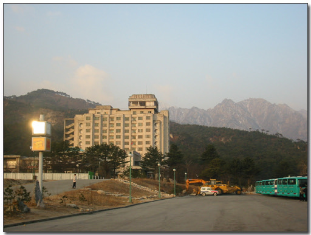

\- 김정숙 휴양소

온정각에서 보이는 저 건물이 김정숙 휴양소라고 한다. 예전에 남북 이산가족 상봉을 할 때 이용했던 장소라고 한다. 별로 이용하는 객은 없어 보였다. 지난밤에 봤을 때 객실 3개만이 불이 켜져 있었었다. 저 길로 계속 올라가면 금강산려관도 있다고 하는데, 이는 남측에 공개되어 있지는 않았다. 여행가기전 사서 읽고 있던 책은 유홍준의 "나의 북한 문화유산답사기"였는데, 작가는 금강산려관에서 묵었었더군. 귀빈 자격으로 방북했었으니. 특별한 대접을 받았겠지만, 그 점이 꽤나 부러웠다.

\- 온정각에는 얼마전 자살한 정몽헌 회장의 추모비와 묘지(진짜인지는 모르겠음)도 있었다.

오늘의 금강산 일정은 구룡연 코스다. 온정각에서 버스로 20여분만 가는 되는 가까운 곳에서부터 시작했다.

버스는 지나가는 첫 길은 금강송이 먼저 우리를 맞았다. 미인송이라고도 하고, 색깔이 붉어 적송이라고 불리기도 한다고 한다. 애국가에서 나오는 남산위의 저 소나무와는 다르고, 곧고 곁가지도 별로 없이 쭉 뻗어 있었다.

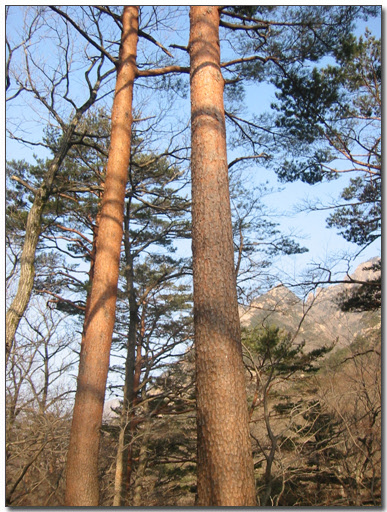

\- 금강미인송, 또는 적송. 꽤나 잘생긴 소나무다.

군데군데 흠집 같은 게 있었는데, 이는 일제 때 송진채취를 당한 자국이라고 한다. 입구까지 가는 길은 군데군데 군대 막사들이 있었기 때문에, 이 길 역시 곳곳에 감시하는 군인들이 배치되어 있어 눈으로만 구경하였다. 이 금강송이 있는 이 소나무 밭이 창터솔밭이라고 하였다. 창터솥밭이 끝날 즈음 나타난 게 신계사터. 남아있는 것은 주춧돌과 3층 석탑만이 보였다. 역시 버스 창가로 몇 초간 보는 것으로 끝났다. 이 절은 한국 전쟁 때 불타 없어졌다고 한다.

신계사를 지나니 집 한 채와 배 밭이 나타났다. 배 밭 관리하는 사람이 사는 집이라고 하였다. 한 100여 평 되는 배 밭이었는데, 김일성이 예전 이곳을 들렀다가 배 맛을 보고 감탄하여, 금강산을 찾는 사람들 모두 이 맛을 맛보게 하리라 하여 이곳에 배 밭을 만들고, 관리하게끔 하였다고 했다. 하지만 우리는 배 맛을 볼 수는 없었다. 물론 지금이 겨울철이라 배가 안나오기도 하지만, 가을이라고 해서 남측 관광객에게 줄 것 같아 보이지는 않아 보이는군. 집은 초가집 비슷했는데, 부부가 살고 있는지 신발 신고 있는 아저씨와 몸빼 바지를 입고 빨래 널고 있는 아줌마가 보였다.

이윽고 구룡연 입구에 도착하여, 모두 하차를 하였다. 조장은 여기에서 모두 개인 용변을 보라고 하였다. 왜냐면 산 올라가는 도중에 있는 간이 화장실은 북에서 운영하는데, 그 간이 화장실은 유료라서라고 한다. 서서 누는 것은 1달러, 앉아서 누는 것은 4달러란다. 꽤나 비싼 편이지. 그래서 모든 사람들이 이곳에서 용변을 마쳤다.

화장실 용어가 우리와 조금 달랐는데, 화장실을 위생실이라 불렀다.

\- 구룡연 등산 시작 지점. 이곳에서부터 걸어 올라간다.

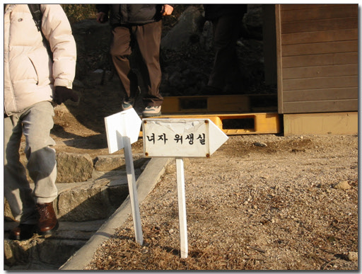

\- 위생실에서 볼 일도 보고. 북한은 두음법칙을 쓰지 않는다.

\- 코스 설명을 간단히 듣고,.. 설명해주시는 우리 조장이 박순옥씨이다.

\- 멀리 집선봉과 함께 맑은 하늘이 보인다. 이 기간중 날씨 좋은 것이 참 행운이었다.

조별로 모여 다들 간단한 몸 풀기와 코스 설명을 듣고 난후, 걸어올라 가기 시작했다. 왼편에 보이는 첫 봉우리가 집선봉이라고 하였다. 신선들이 모인 봉이라는 뜻이라고 하는데, 조장이 들려준 설화를 까먹어서 더는 기억이 안 난다.

조금 갔을 바로 나타난 다리가 있었으니, 그 다리가 목란다리다. 다리 못 미쳐 유명한 바위 또한 있었으니 오선암. 다섯 신선들의 바위라는 뜻인데, 예전 다섯 마을 원님들이 모여 신선놀음을 하고는 그 기념으로 바위에 한자로 새겼는데, 홍수로 바위가 뒤집혀 한자로 적힌 부분은 하단으로 이동하여, 다시 한글로 오선암으로 새겨놓았었다.

\- 목란다리

\- 오선암. 꽤 큰 바위다.

\- 오선암 뒷면. 한자로 뭔가 적혀있는게 원래의 '오선암'이란 글자다. 홍수때 뒤집혔다고 한다.

목란다리 위에 현대식 시멘트 건물이 있었으니, 바로 목란관이다. 북한에서 운영하는 음식점인데, 막걸리와 지짐류를 판다고 했다. 생김새가 금강에 어울리지는 않았다. 꼭 남한의 청계산 자락쯤에 즐비해 있는 음식점들과 다를 바 없는 모습이었다. 지으려면 산에 어울리게 한옥으로나 지었으면 괜찮았을텐데하는 생각이 든다. 그 목란관 앞에서 기념품매매점이 위치해 있었고, 이 역시 북한에서 운영하는 상점이다. 올라갈 시간에서 운영을 안했고, 사람들이 하산할 때에 운영을 하였다.

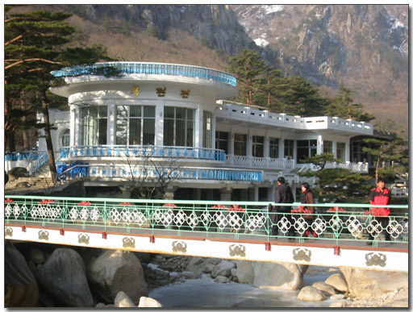

\- 북한 식당, 목란관

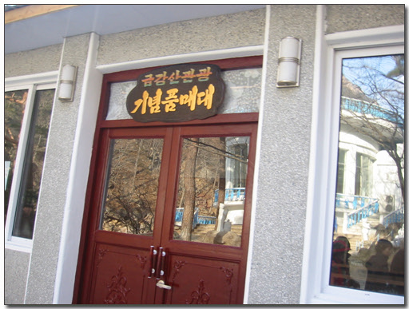

\- 목란관 앞의 기념품 상점

목란관을 뒤로하고 산길로 들어서면 처음 보게 되는 옥류동. 그 옥류동 가기 바로 앞서 글씨 새겨진 바윗돌이 있었다. 1973년 김일성 주석이 금강산에 왔을 때, 이 후식터에서 교시를 한 곳으로 이후 성역화 되어 있었다. 사진 찍으려고 바윗돌 옆에 서려는 순간 다급한 목소리로 외치는 제지가 있었다. 바위 옆에 깔린 자갈을 밟아서는 안 된다는 것이었다. 그 자갈을 밟으면 50달러 벌금을 내야 된다는 것이었다. 그 자갈을 깐 이유가 밟지 말라는 뜻이라는 거였다. 남한과는 조금 다른 의미더군. 우리에게 자갈은 올라가도 좋다는 의미인데..

옥류동 초입에 들어섰다. 전후좌우 봉우리가 있어 위로 하늘과 산만이 보이는 절경이었다. 겨울이라 계곡물은 얼어 있었는데, 얼어있는 그 색깔도 비취색이었다. 금강산의 물에는 게르마늄 성분이 많아, 그 색깔이 옥빛을 띤다고 한다.

옥류동 초입 양지다리를 건너면 옥류천 건너편 큼지막한 바위에 "지원"이라는 붉은 글씨가 있었다. 북에서 새긴 글씨들 거의가 한글인데, 이 글자만큼은 한자로 되어 있었다. 김일성 주석 어렸을 때 아버지 김형직이 먼 뜻을 가지라며 지원이라는 말을 해 주었는데, 그 '지원'을 김형직 60돌 기념으로 새긴 거라고 한다. '지원'이라는 글씨 밑에서 소나무가 자라고 있었는데, 바위 미세한 틈에 뿌리를 내리고 자라고 있는 거였다. 물어보니 화강암이 갈수기에는 물을 내 뿜기 때문에 소나무가 자랄 수 있다고 한다.

\- 교시주신 곳. 자갈 위로 올라갔다가 벌금낼 뻔 한 곳

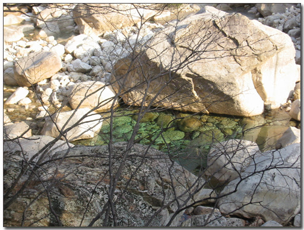

\- 금강산 계곡의옥빛 물 색깔.

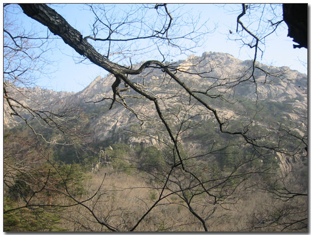

\- 길 왼쪽편에 있는 관음봉

\- 북한의 국화. 목란. 나무에서 난이 핀다고 하여 목란이라 한데, 이 것 역시 무슨 의미로 여기 심어진 것인데 기억은 안나는군..

\- 이제부터가 옥류동 계곡

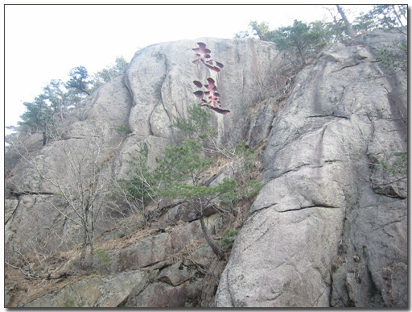

\- 먼 뜻을 가져라. 지원.

\- 지원이라는 글자 바로 밑에 암석 틈에서 자라고 있는 소나무

그리고, 조장이 알려준 또 하나의 조심해야 될 것이 있었는데, 북한의 조형물이나 선전 문구를 손가락으로 가리키지 말라는 거였다. 손가락질로 받아들이기 때문이란다.

산길을 따라 올라가, 금수다리를 건넜을 때 조장은 옥류천 건너 보이는 옥녀봉 줄기의 큰 바위를 가리키면 저게 개구리 바위라고 설명을 해 주었다. 온 정리의 우물 안 개구리중 대표가 금강산 구경을 왔다가 금강간의 빼어난 경치를 보고 놀라 눈을 튀어나오고 다시 우물로 돌아갈 생각을 않고 눌러 앉았다고 한다. 가지고 있던 유홍준의 책에서는 이 이야기를 꽤나 안타까워하더군. 전설다운 상장과 은유가 없어 '개떡 같은 얘기'라고 평을 하더군.

다시 만경다리 건너면, 계곡은 또 다른 절경이 펼치지는 데, 특이한 바위들이 많았다, 그 때마다 조장은 토끼바위, 악어바위, 옥황상제 바위 등등 그 설명을 해 주었다.

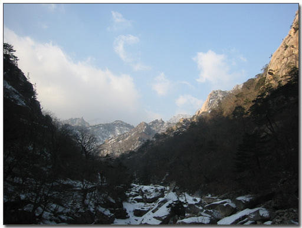

\- 하늘도 맑고, 날씨도 따뜻하고, 더할 나위 없는 곳이다.

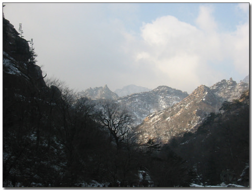

\- 제일 뒤에 있는 봉우리가 금강산 제일봉인 비로봉. 아직은 남측에 비로봉은 공개되어 있지 않다.

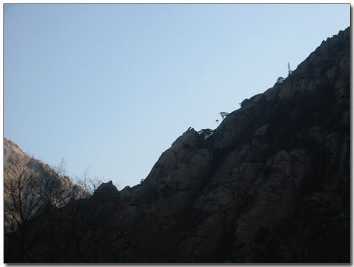

\- 악어바위. 정말에 악어가 위로 입을 벌리고 있는 모양이다.

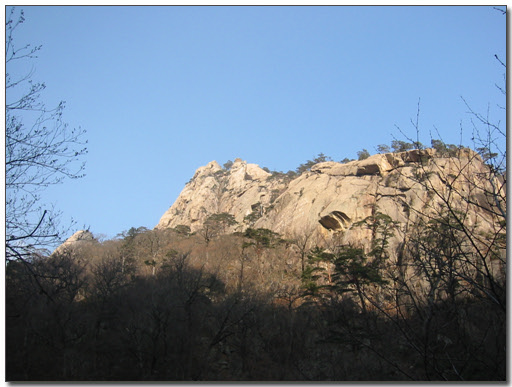

\- 왼쪽에서 두번째 있는 바위봉우리가 개구리바위다. 카메라가 2배줌밖에 안되어 잘 안나왔는데, 실제 보면 개구리랑 똑같이 생겼다.

\- 원쪽 있는 큰 바위가 토끼바위

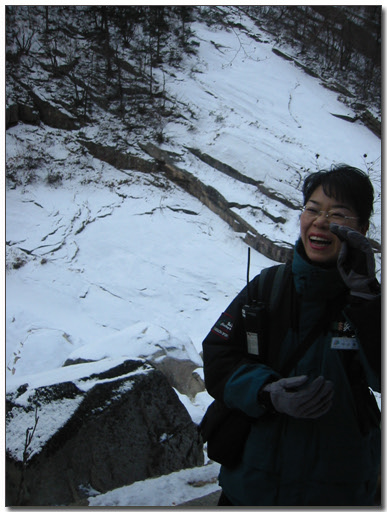

\- 각 바위들에 대해 설명을 해 주시고 있는 우리조 조장, 박순옥씨

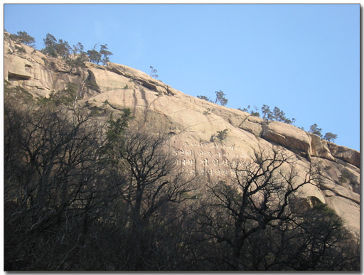

\- 경관 좋은 큰 바위에는 여지없이 글씨가 새겨져 있다.

금강산에는 8개의 금강문이 있는데, 바위 등으로 자연스럽게 이루어진 문들이라고 한다. 이 금강문을 통과해야 비로소 본격적인 경관이 나타난다. 금강문 바위 옆에는 한글로 금강문이라 적혀 있었다. 그 글자말고 희미해진 여러 글자들이 있었다.

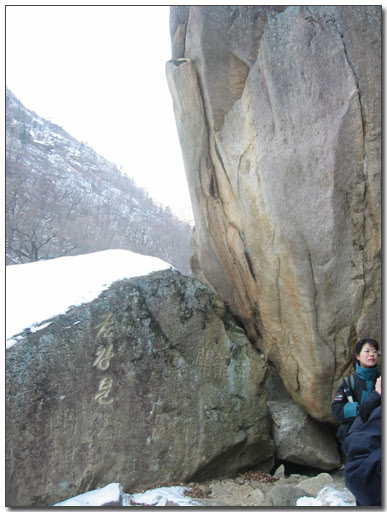

\- 금강문 입구

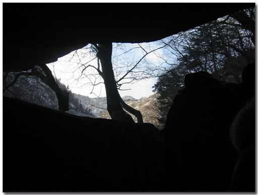

\- 금강문에서 나오면서

\- 금강문을 다 나왔다. 이제 본격적인금강산이다.

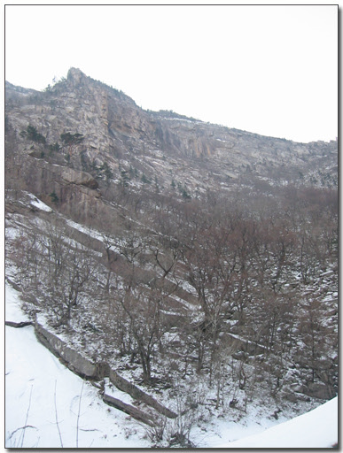

\- 커다란 성벽처럼 병풍을 두른 산

금강문을 나와 금문교를 건너면 옥류동 문대바위와 함께 커다는 담이 나온다. 바로 옥류담. 금강산의 많은 소중에서 가장 큰 것으로 물의 깊이도 5미터가 넘는다고 한다.

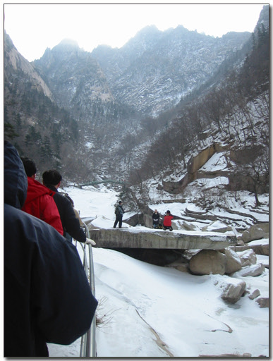

\- 저기 사람들 사진 찍는 데가 바로 옥류담 앞이다.

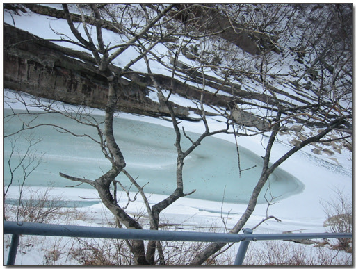

\- 옥류담. 제일 큰 소다.

\- 옥류담 위에 있는 봉우리. 세존봉이지, 천하봉인지 이름이 헷갈린다.

옥류담을 뒤로 했을 때 나타난 게 련주담. 두개의 못이 이어져 있었다. 옛날 선녀가 흘리고 간 두 알의 구슬이 못으로 변해 그 색깔의 옥빛이라고 한다.

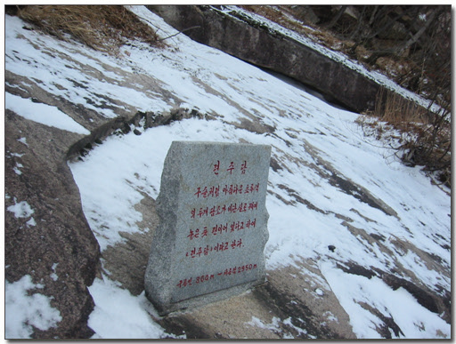

\- 련주담

련주담 위에는 비봉폭포와 무봉폭포 나왔다. 걸어가면 끊임없이 나오는 경관에 정해진 시간이 아쉬웠다.

\- 왼쪽이 비퐁폭포, 오른쪽이 무봉폭포. 둘다 지금은 얼어 붙어 있는 상태다.

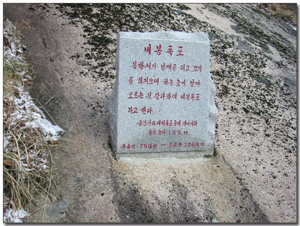

구룡연 코스는 상팔담코스 갈 사람과 구룡폭포만 볼 사람으로 나뉘었다. 가다보면 두 계곡이 만나는 곳이 있는데, 이 곳에서 다리를 건너게 되면 상팔담을 한눈에 내려다볼 수 있는 구룡대로 올라 가는 길이다. 그 상팔담 코스은 나만 갔다. 그 길은 경사가 70도 정도라고 하여 아이젠 없이는 못가게 했다. 역시나 꽤나 가파른 길이었다. 하지만 구룡대 정상에 올랐을 보이는 경관은 올라오느라 힘들었던 것을 싹 가시게 했다. 상팔담은 8개의 소가 이어진 것인데, 나뭇군과 선녀 전설이 바로 이곳이라 한다. 여름 물 많을 때 보면 더욱 더 좋았을 경치였지만, 얼어붙은 상팔담도 충분히 감탄이 나오게 했다. 대신 8개의 소 구별을 잘 안 되더군. 상팔담의 마지막 소가 밑으로 떨어지는데 이 떨어지는게 폭포가 되어 구룡폭포라 한다. 원래 제대로 구경하는 순서는 구룡폭포를 본 후, 이곳 구룡대에 올라 상팔담을 구경하는 것인데, 순서가 조금 바뀌었다. 산은 올라가는 과정도 좋지만, 역시 정상에서 내려다보는 것이 좋다라는 생각이 들더군. 상팔담 전망이 이 정도인데 금강산 정상 비로봉에서 보게 되면 얼마나 좋을까 싶다.

\- 상팔담 오르는 길. 초입인데도 꽤 가파른 길로 시작된다.

\- 철계단이 많다. 철계단이 있기 전에는 이 구룡대에 오르는 이가 거의 없었다 한다.

\- 바로 저기가 고지. 상팔담을 내려다볼 수 있는 구룡대다.

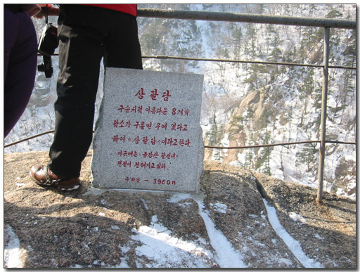

\- 선녀가 목욕하는 상팔담. 얼어있어 8개인지 확인은 잘 안되는군.

\- 구룡대에서 둘러보는 맛에 취해, 내려가고 싶다는 생각이 잘 안들었다.

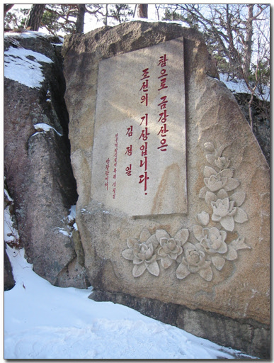

\- 역시 김정일 장군도 이곳 상팔담에다가도 글을 새기셨군요.

상팔담에서 내려와 아내가 기다리고 있는 구룡폭포로 갔다. 뛰어갔는데, 그래도 20여분은 걸리더군.

보이는 게 얼어붙어 있는 구룡폭포. 장마철 물이 콸콸 쏟아지는 장면을 보면 더욱 장관이겠다 싶었다. 그 폭도옆에도 역시 여러 글자들이 새겨져 있었는데 제일 눈에 들어오는게 '미륵불'이란 한자이다. 불기 2946년 서기 1919년에 서화가였던 김규진이라는 사람이 쓴 것으로 높이가 19미터나 된다. 이 미륵불이라는 글씨와 구룡폭포를 구경할 수 있는 위치는 맞은 편에 있는 구룡각이다. 1961년 지어진 정자로 이곳 구룡연 코스의 종착지인 셈이다. 이곳에도 남녀 두명의 환경관리선생이 있었는데, 몇시간이나 근무하냐고 했더니, 남측 관광객이 와서 갈 때까지 쭉 있는 거라 한다. 그럼 한 4시간가량을 있는 셈이다. 난로도 없이 4시간동안 있을려면 꽤나 춥겠다라는 생각이 든다.

\- 저 밑에 있는 게 구룡각. 구룡폭포를 바로 앞에서 볼 수 있는 각이다.

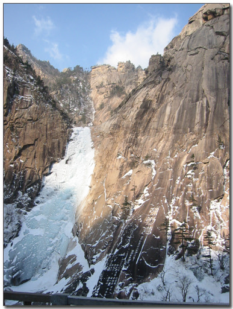

\- 구룡폭포와 옆에 새겨진 미륵불, 글씨 옆의 작은 글씨들은 시주한 사람들의 명단이라고 한다.

슬슬 배가 고프더군. 금강산도 식후경이라는 이래서 나왔다 보며, 이 기막힌 곳에서도 배가 고프니 이제 내려가서 밥 먹어야겠다라는 생각이 들더군.

내려오는 길에 환경관리선생님과 잠깐 이야기를 나누었다. 신혼부부냐고 묻길래 그렇다고 하자, 요즘 남한서는 세 쌍 결혼하면 한 쌍 이혼하지요? 싸우지 말고 잘 살라는 덕담을 해 주었다. "백년해로하시라요!"라면서. 아직도 그 정겨운 목소리가 생각난다.

\- 백년해로하시라는 덕담을 말 해주시는 환경관리선생

\- 북한 남자중에서 제일 인물이 되어 보이는 환경관리 선생

주차장까지 다 내려와서, 4시간동안 참았던 소변을 보고 나니, 화장실 앞에 웬 봉고차가 있었다. 번호판을 보니, 평양 차였다. 여기도 우리처럼 직할시와 도 별로 번호를 하였다. 아, 우리는 올해부터 전국번호판이구나. 암튼 여기에서 평양차 보고, 번호판 강원이라고 적혀있는 것도 보니 묘한 기분이더군.

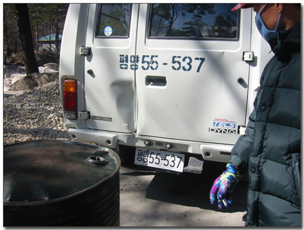

\- 평양55-537. 평양에서 순시온 중앙정부 관료 차인가?

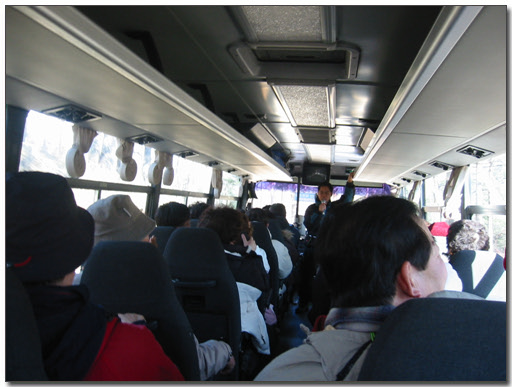

\- 하산길. 다른 조 조장이 '그리운 금강산' 가곡과 북한노래 하나를 불러었다. 아줌마들의 반응이 뜨거웠다.

