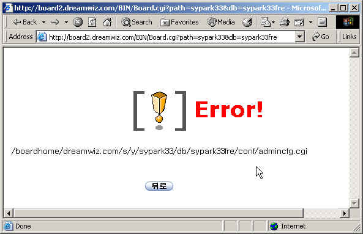

# 괜찮은 메일 어디 없나요?

제 홈페이지에서 쓰는 게시판의 화면입니다. 안나오고 있지요..

드림위즈에서 제공하는 게시판인데, 이렇게 안 나온 지 한달이 넘었네요..

고객센터에 문의메일을 수차례 보냈는데, 자동응답메일이라는 전혀 쓰잘데기없는 답메일만 주고, 다시 물어봐도 사람이 쓴 메일은 안 오더군요.

나중에 드림위즈에 근무하고 있는 예전 회사 동료에게 물어보니, 그 게시판 제공하는 업체와 계약이 끝났던가 어쨌던가 해서 안 된다고 하더라는 말만 들었지요. 그래서 날아간 데이터에 아쉬워하고 있는 처지이지요.

그리고 제가 개인적으로 쓰는 메일이 드림위즈메일입니다.

야후메일을 쓰다가, 부족한 메일용량과 UI의 허접함이 별로여서, 드림위즈를 주 메일로 바꾸었지요.

그때만 해도, 용량 30M에다가 POP3에 SMTP까지 제공해주어서 상당히 만족하며 썼었지요.

IT 거품이 가라앉으면서, 드림위즈도 다른 인터넷업체와 마찬가지로 별다른 특성이 없는지, 이것저것 유료화면서, smtp도 없어지고, pop3로 없어지고 그랬지요. 그래도 이미 다른 친구들이 나를 이 드림위즈 메일로 등록해 놓을 상태로 계속 쓰고 있었지요.

메일확인할때마다 dreamwiz에 로그인을 하는 불편정도는 뭐 이 회사도 먹고 살아야할테니, 이 정도 수고야 뭐 해야지... 하면서..

요즘에는 들어갈 때마다 슬슬 짜증이 나더군요. 첫화면에 유난히도 많은 플래시 광고들. 그것도 화면가득이 떠서 그 광고보기 전까지는 로그인하기도 힘들게 한 광고와, 100여 통 와 있는 inbox에는 스팸들.

허구한 날 스팸신고를 해도 처리는커녕 전혀 필터링도 안해주는게, 드림위즈도 이제 더 이상 유지보수에도 여력이 없는 회사라는 게 느껴지더군요.

이제 메일을 바꿔야할때가 됐나 봅니다. 괜찮은 메일 어디 없나요?

[null](../6166944.html#6166944_1)

